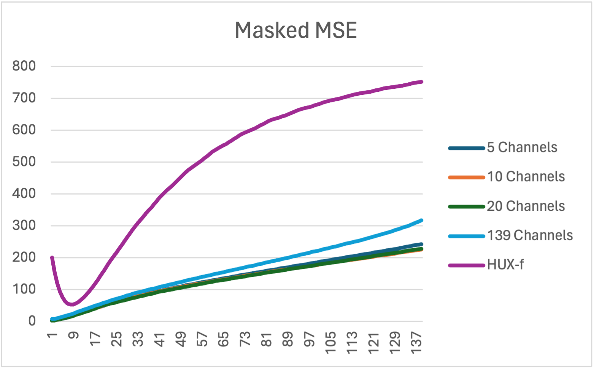
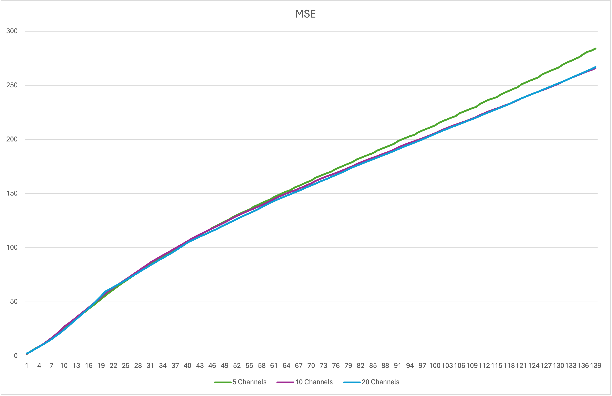
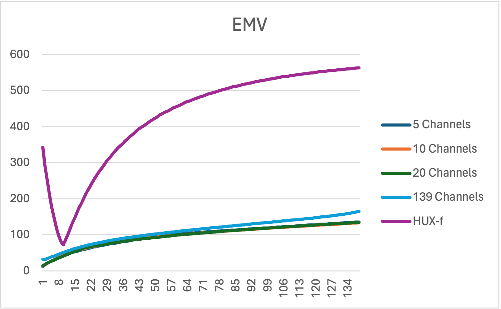

## Convincing numerical proof for 5 > 10 > 20 > 139 > HUX

### 1. Per-slice MSE

### 2. UQI (Universal Image Quality Index) (Per sample and per radii)

### 3. EMV (Earth Mover's Distance) (Per sample and per radii)

### Target Conference

- ICMLA: July 15th

### TODO