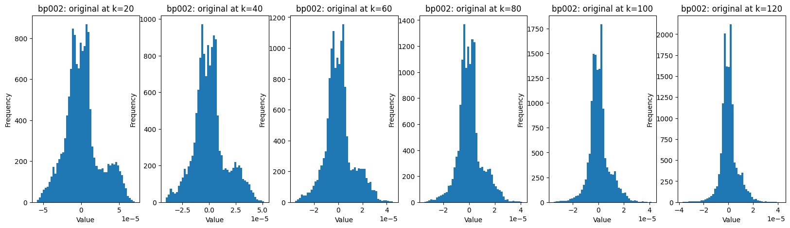
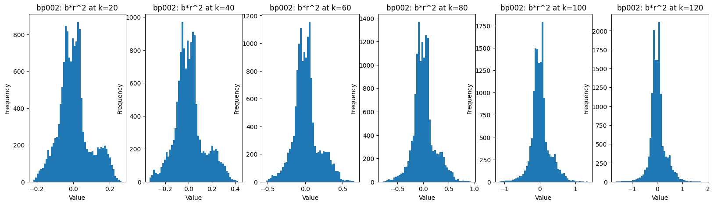
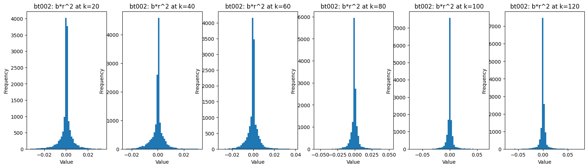
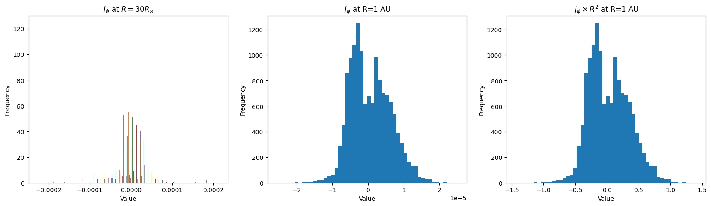
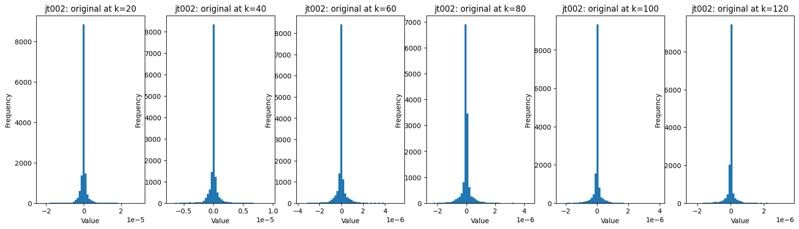

## Multimodal SFNO with/without Physics loss

- So far we've worked with $$v_r$$ which its distribution is invariant to distances
- We'll be working with $$B_r$$, $$J_r$$, $$B_{\theta}$$, $$J_{\theta}$$, ...
- Required for scaling: how do their distributions change?

### $$B_{\phi}$$

### $$B_{\theta}$$

### $$J_{\phi}$$

### $$J_{\theta}$$

### Conclusion
Distributions don't change with $$R$$. Scaling not required for non-radial datacubes. Required for radial datacubes: $$B, J$$, and $$\rho$$

## NASA/NSF Grants

1. Feb 4, 2026 (Deadline) Collaborations in Artificial Intelligence and Geosciences (CAIG) (NSF 25-530)
2. Feb 5, 2026 (Deadline) Artificial Intelligence, Formal Methods, and Mathematical Reasoning (AIMing) (NSF 24-554)
3. Feb 5, 2026 (Deadline) Computer and Information Science and Engineering: Future Computing Research (Future CoRe) (NSF 25-543)
4. May 31, 2026 (Deadline) <a href="https://solicitation.nasaprs.com/ROSES2025">Research Opportunities in Space and Earth Sciences 2025 (ROSES-2025)</a> - <a href="https://science.nasa.gov/researchers/solicitations/roses-2025/">Blog</a> - <a href="https://nspires.nasaprs.com/external/viewrepositorydocument/cmdocumentid=1041497/solicitationId=%7b2A1D139B-B9C7-CE8C-2E81-223FD08460F9%7d/viewSolicitationDocument=1/Table%202%20ROSES-2025_Amend_33.html">Table</a>
