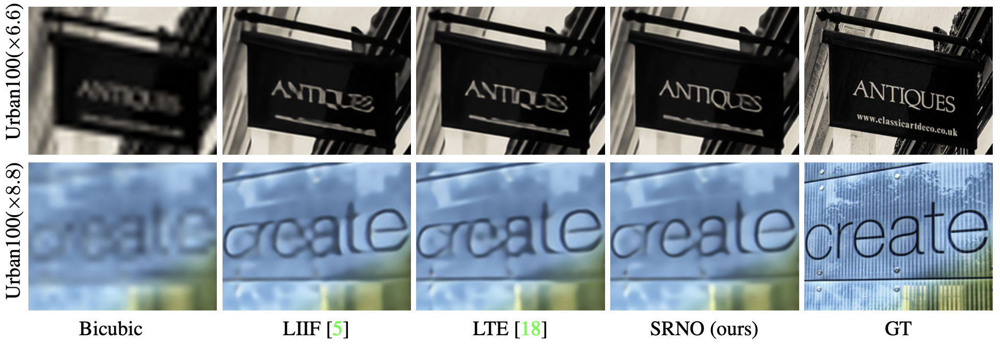
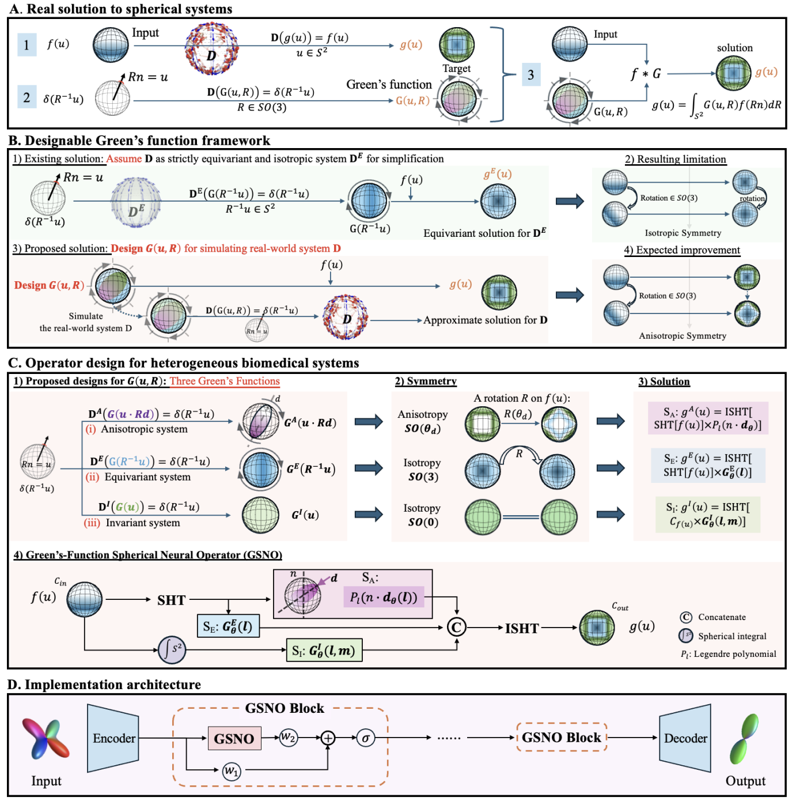
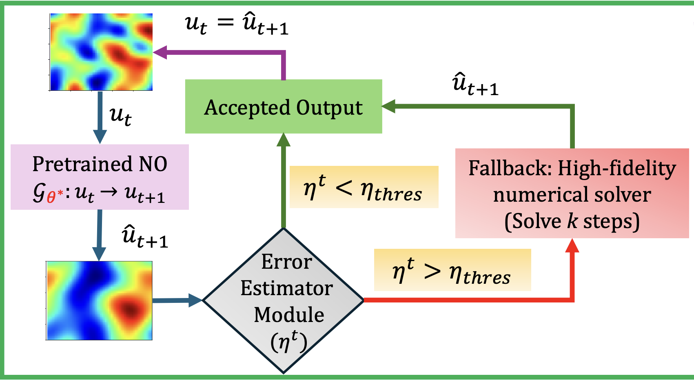

# NSF CAIG 2026 Proposal Ideas

## References presented in CSSI 2025 to minimally experiment with:

Can elaborate on in the previous work as a subsection

1. GNOT: A General Neural Operator Transformer for Operator Learning <a href="https://proceedings.mlr.press/v202/hao23c/hao23c.pdf">Paper</a> - <a href="https://github.com/HaoZhongkai/GNOT">Code</a>

## New References to both mention and minimally experiment with:

1. Neural Operators + Diffusion Models <a href="https://arxiv.org/pdf/2409.08477">Paper</a> - <a href="https://vivekoommen.github.io/NO_DM/">Code</a>

    - Neural operator as a prior: A trained neural operator (e.g., FNO/SFNO) first predicts the future state; this gives a fast but over-smoothed, low-frequency-accurate forecast that serves as a conditioning signal (prior) for the diffusion model.

    - Diffusion for spectral refinement: A score-based diffusion model, conditioned on the operator’s output, iteratively denoises noise toward the data distribution, progressively adding back missing high-frequency details that the operator cannot learn due to spectral bias.

    - Stable long rollouts: During autoregressive forecasting, each operator prediction is diffusion-corrected before being fed back, which stabilizes long-time rollouts and preserves the correct energy spectrum over time.

2. CNO: Convolutional Neural Operator <a href="https://www.sam.math.ethz.ch/sam_reports/reports_final/reports2023/2023-11.pdf">Paper</a> - <a href="https://github.com/camlab-ethz/ConvolutionalNeuralOperator">Code</a>
    - Says that CNNs shouldn't have been ignored and are usable for PDEs and learning between function spaces
    - CNO is a U-Net that obeys the laws of signal processing, which turns a CNN from a grid-based approximator into a true function-to-function operator learner.
    - Nonlinear activations create high frequencies
    - `upsample → activation → low-pass filter → downsample`
    - Not sure if its suitable for the proposal, but definitely should be experimented with
    - Differences:

    | Aspect           | FNO                    | CNO                    |
    | ---------------- | ---------------------- | ---------------------- |
    | Convolution      | Global (Fourier space) | Local (physical space) |
    | Inductive bias   | Global correlations    | Local physics          |
    | Aliasing         | Can still happen       | Explicitly controlled  |
    | Compute          | FFT-heavy              | Pure CNN ops           |
    | Interpretability | Abstract               | Familiar CNN           |

3. SRNO: Super resolution Neural Operator <a href="https://openaccess.thecvf.com/content/CVPR2023/papers/Wei_Super-Resolution_Neural_Operator_CVPR_2023_paper.pdf">Paper</a>
    - Solves the super resolution problem by treating images as functions
    

4. LNO: Laplace neural operator - <a href="https://arxiv.org/pdf/2303.10528">Paper</a>
    - leverages the Laplace transform to decompose the input space. Unlike the Fourier Neural Operator (FNO), LNO can handle **non-periodic** signals, account for transient responses, and exhibit exponential convergence.

5. GSNO: Green's-function spherical neural operator <a href="https://arxiv.org/pdf/2601.03561">Paper</a>
    - Green’s function = response to a unit impulse
    - Learn how influence propagates across space. Output = sum of responses to all input points
    
    - Differences:

    | Aspect                  | SFNO                   | GSNO                         |
    | ----------------------- | ---------------------- | ---------------------------- |
    | Mathematical foundation | Convolution theorem    | Green’s function theory      |
    | Symmetry                | Full SO(3) equivariant | Mixed symmetry               |
    | Invariance              | implicit at best     | enforced                   |
    | Expressivity            | Global & smooth        | Global + local + directional |
    | Stability               | High                   | Higher in real data          |
    | Interpretation          | “Spectral CNN”         | “Physical response operator” |

6. ANCHOR: Adaptive Numerical Correction for High-fidelity Operator Rollouts <a href="https://arxiv.org/pdf/2512.19643">Paper</a>
    - Tries to prevent error accumulation for autoregressive prediction
    - A pretrained SFNO predicts the next 5 time steps in one shot; the last predicted state is fed back as input to generate the next block of 5, repeated autoregressively to reach long horizons. The hybrid framework monitors error growth online and can intervene if drift accumulates.
    - The neural operator (e.g., SFNO) is the fast time-advancer; an error estimator tracks physical residuals during rollout, and when errors exceed a threshold, a numerical solver (i.e., HUX) corrects the state before handing control back to the operator (solver-in-the-loop).
    
