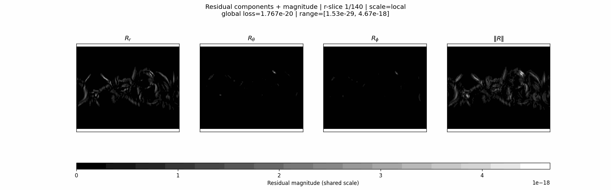
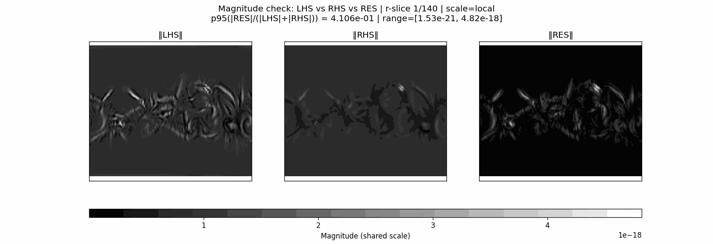
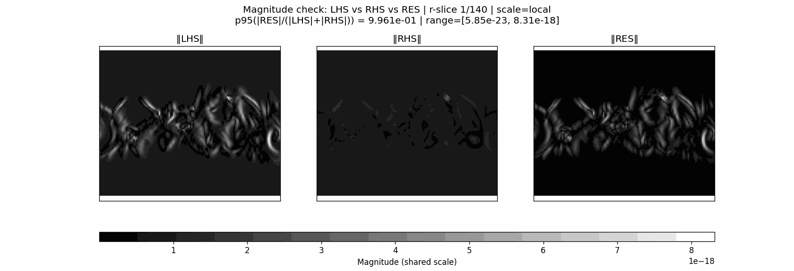
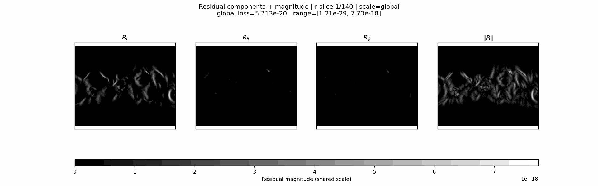
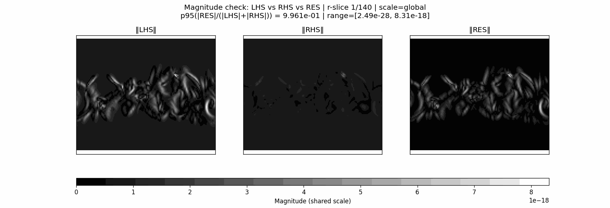

# Numerical analysis of equation 6 residuals on MAS

## 1. CR1833 - MKS system

### 1.1. $$\frac{\partial v}{\partial t}=-\Omega_{\text{rot}}\frac{\partial{v}}{\partial \phi}$$ (w.r.t coordinates, no r/$$\theta$$-scaling)

```
Term budgets (masked interior)
          term |        rms |    mean|x| |     p95|x| |     p99|x| |     max|x|
-------------------------------------------------------------------------------
        dt_v_r | 1.153e+00 | 5.583e-01 | 2.700e+00 | 4.750e+00 | 7.864e+00
        dt_v_t | 3.017e-07 | 1.524e-07 | 6.592e-07 | 1.240e-06 | 3.360e-06
        dt_v_p | 5.066e-07 | 2.281e-07 | 1.031e-06 | 2.234e-06 | 5.791e-06
      dt_v_mag | 1.153e+00 | 5.583e-01 | 2.700e+00 | 4.750e+00 | 7.864e+00
         adv_r | 1.550e+00 | 9.358e-01 | 3.505e+00 | 5.763e+00 | 1.515e+01
         adv_t | 4.936e-07 | 2.442e-07 | 1.024e-06 | 2.071e-06 | 1.328e-05
         adv_p | 7.166e-07 | 3.180e-07 | 1.451e-06 | 3.194e-06 | 9.794e-06
       adv_mag | 1.550e+00 | 9.358e-01 | 3.505e+00 | 5.763e+00 | 1.515e+01
         lhs_r | 1.702e-19 | 5.611e-20 | 3.450e-19 | 8.755e-19 | 4.823e-18
         lhs_t | 1.292e-25 | 1.978e-26 | 7.704e-26 | 3.455e-25 | 1.965e-23
         lhs_p | 9.693e-26 | 1.668e-26 | 6.952e-26 | 3.072e-25 | 1.341e-23
       lhs_mag | 1.702e-19 | 5.611e-20 | 3.450e-19 | 8.755e-19 | 4.823e-18
     lorentz_r | 3.753e-29 | 2.838e-30 | 6.663e-30 | 5.243e-29 | 7.530e-27
     lorentz_t | 2.372e-28 | 2.155e-29 | 6.519e-29 | 3.811e-28 | 4.623e-26
     lorentz_p | 1.694e-28 | 1.581e-29 | 3.578e-29 | 3.726e-28 | 3.113e-26
   lorentz_mag | 2.939e-28 | 2.972e-29 | 8.668e-29 | 5.804e-28 | 4.647e-26
       gradP_r | 1.745e-19 | 5.742e-20 | 3.691e-19 | 9.155e-19 | 1.826e-18
       gradP_t | 3.369e-20 | 6.457e-21 | 2.566e-20 | 1.302e-19 | 3.120e-18
       gradP_p | 2.735e-20 | 6.098e-21 | 2.737e-20 | 1.207e-19 | 2.125e-18
     gradP_mag | 1.798e-19 | 6.054e-20 | 4.100e-19 | 9.163e-19 | 3.553e-18
     gravity_r | 3.134e-20 | 7.779e-21 | 4.011e-20 | 1.457e-19 | 4.943e-19
     gravity_t | 0.000e+00 | 0.000e+00 | 0.000e+00 | 0.000e+00 | 0.000e+00
     gravity_p | 0.000e+00 | 0.000e+00 | 0.000e+00 | 0.000e+00 | 0.000e+00
   gravity_mag | 3.134e-20 | 7.779e-21 | 4.011e-20 | 1.457e-19 | 4.943e-19
        visc_r | 8.044e-21 | 1.223e-21 | 3.853e-21 | 2.930e-20 | 5.438e-19
        visc_t | 4.641e-22 | 1.171e-22 | 5.899e-22 | 2.210e-21 | 1.261e-20
        visc_p | 2.029e-22 | 3.658e-23 | 1.319e-22 | 8.836e-22 | 7.699e-21
      visc_mag | 8.060e-21 | 1.277e-21 | 4.052e-21 | 2.938e-20 | 5.438e-19
         rhs_r | 1.516e-19 | 4.967e-20 | 3.257e-19 | 8.297e-19 | 1.522e-18
         rhs_t | 3.362e-20 | 6.453e-21 | 2.565e-20 | 1.299e-19 | 3.119e-18
         rhs_p | 2.729e-20 | 6.087e-21 | 2.732e-20 | 1.205e-19 | 2.125e-18
       rhs_mag | 1.576e-19 | 5.339e-20 | 3.469e-19 | 8.364e-19 | 3.431e-18
    residual_r | 5.677e-20 | 1.247e-20 | 5.796e-20 | 2.210e-19 | 3.980e-18
    residual_t | 3.362e-20 | 6.453e-21 | 2.565e-20 | 1.299e-19 | 3.119e-18
    residual_p | 2.729e-20 | 6.087e-21 | 2.732e-20 | 1.205e-19 | 2.125e-18
  residual_mag | 7.140e-20 | 1.794e-20 | 8.581e-20 | 3.094e-19 | 4.670e-18
         jxb_r | 1.125e-20 | 8.508e-22 | 1.998e-21 | 1.572e-20 | 2.257e-18
         jxb_t | 7.111e-20 | 6.459e-21 | 1.954e-20 | 1.143e-19 | 1.386e-17
         jxb_p | 5.080e-20 | 4.739e-21 | 1.073e-20 | 1.117e-19 | 9.332e-18
       jxb_mag | 8.811e-20 | 8.911e-21 | 2.599e-20 | 1.740e-19 | 1.393e-17
```

```
  RMS(LHS)   = 1.702e-19
  RMS(RHS)   = 1.576e-19
  RMS(RES)   = 7.140e-20
  RMS(RES)/RMS(LHS) = 4.194e-01
  RMS(RES)/RMS(RHS) = 4.529e-01
  Pointwise relative residual  |R|/(|LHS|+|RHS|):
    p50=2.621e-01  p90=8.708e-01  p95=9.592e-01  p99=9.963e-01  max=1.000e+00
```







### 1.2. $$\frac{\partial v}{\partial t}=-\Omega_{\text{rot}}\frac{1}{r \sin \theta}\frac{\partial{v}}{\partial \phi}$$ (w.r.t arc-length)

```

Term budgets (masked interior)
          term |        rms |    mean|x| |     p95|x| |     p99|x| |     max|x|
-------------------------------------------------------------------------------
        dt_v_r | 2.339e-11 | 9.281e-12 | 4.715e-11 | 1.088e-10 | 3.965e-10
        dt_v_t | 4.055e-18 | 2.119e-18 | 9.276e-18 | 1.616e-17 | 7.466e-17
        dt_v_p | 6.559e-18 | 3.090e-18 | 1.425e-17 | 2.861e-17 | 7.800e-17
      dt_v_mag | 2.339e-11 | 9.281e-12 | 4.715e-11 | 1.088e-10 | 3.965e-10
         adv_r | 1.550e+00 | 9.358e-01 | 3.505e+00 | 5.763e+00 | 1.515e+01
         adv_t | 4.936e-07 | 2.442e-07 | 1.024e-06 | 2.071e-06 | 1.328e-05
         adv_p | 7.166e-07 | 3.180e-07 | 1.451e-06 | 3.194e-06 | 9.794e-06
       adv_mag | 1.550e+00 | 9.358e-01 | 3.505e+00 | 5.763e+00 | 1.515e+01
         lhs_r | 2.679e-19 | 9.110e-20 | 5.268e-19 | 1.099e-18 | 8.315e-18
         lhs_t | 1.305e-25 | 2.299e-26 | 9.186e-26 | 3.468e-25 | 1.965e-23
         lhs_p | 1.081e-25 | 2.486e-26 | 1.209e-25 | 3.845e-25 | 1.341e-23
       lhs_mag | 2.679e-19 | 9.110e-20 | 5.268e-19 | 1.099e-18 | 8.315e-18
     lorentz_r | 3.753e-29 | 2.838e-30 | 6.663e-30 | 5.243e-29 | 7.530e-27
     lorentz_t | 2.372e-28 | 2.155e-29 | 6.519e-29 | 3.811e-28 | 4.623e-26
     lorentz_p | 1.694e-28 | 1.581e-29 | 3.578e-29 | 3.726e-28 | 3.113e-26
   lorentz_mag | 2.939e-28 | 2.972e-29 | 8.668e-29 | 5.804e-28 | 4.647e-26
       gradP_r | 1.745e-19 | 5.742e-20 | 3.691e-19 | 9.155e-19 | 1.826e-18
       gradP_t | 3.369e-20 | 6.457e-21 | 2.566e-20 | 1.302e-19 | 3.120e-18
       gradP_p | 2.735e-20 | 6.098e-21 | 2.737e-20 | 1.207e-19 | 2.125e-18
     gradP_mag | 1.798e-19 | 6.054e-20 | 4.100e-19 | 9.163e-19 | 3.553e-18
     gravity_r | 3.134e-20 | 7.779e-21 | 4.011e-20 | 1.457e-19 | 4.943e-19
     gravity_t | 0.000e+00 | 0.000e+00 | 0.000e+00 | 0.000e+00 | 0.000e+00
     gravity_p | 0.000e+00 | 0.000e+00 | 0.000e+00 | 0.000e+00 | 0.000e+00
   gravity_mag | 3.134e-20 | 7.779e-21 | 4.011e-20 | 1.457e-19 | 4.943e-19
        visc_r | 8.044e-21 | 1.223e-21 | 3.853e-21 | 2.930e-20 | 5.438e-19
        visc_t | 4.641e-22 | 1.171e-22 | 5.899e-22 | 2.210e-21 | 1.261e-20
        visc_p | 2.029e-22 | 3.658e-23 | 1.319e-22 | 8.836e-22 | 7.699e-21
      visc_mag | 8.060e-21 | 1.277e-21 | 4.052e-21 | 2.938e-20 | 5.438e-19
         rhs_r | 1.516e-19 | 4.967e-20 | 3.257e-19 | 8.297e-19 | 1.522e-18
         rhs_t | 3.362e-20 | 6.453e-21 | 2.565e-20 | 1.299e-19 | 3.119e-18
         rhs_p | 2.729e-20 | 6.087e-21 | 2.732e-20 | 1.205e-19 | 2.125e-18
       rhs_mag | 1.576e-19 | 5.339e-20 | 3.469e-19 | 8.364e-19 | 3.431e-18
    residual_r | 2.121e-19 | 5.527e-20 | 2.774e-19 | 9.841e-19 | 7.254e-18
    residual_t | 3.362e-20 | 6.453e-21 | 2.565e-20 | 1.299e-19 | 3.119e-18
    residual_p | 2.729e-20 | 6.087e-21 | 2.732e-20 | 1.205e-19 | 2.125e-18
  residual_mag | 2.165e-19 | 5.816e-20 | 2.972e-19 | 1.004e-18 | 7.734e-18
         jxb_r | 1.125e-20 | 8.508e-22 | 1.998e-21 | 1.572e-20 | 2.257e-18
         jxb_t | 7.111e-20 | 6.459e-21 | 1.954e-20 | 1.143e-19 | 1.386e-17
         jxb_p | 5.080e-20 | 4.739e-21 | 1.073e-20 | 1.117e-19 | 9.332e-18
       jxb_mag | 8.811e-20 | 8.911e-21 | 2.599e-20 | 1.740e-19 | 1.393e-17
```

```
  RMS(LHS)   = 2.679e-19
  RMS(RHS)   = 1.576e-19
  RMS(RES)   = 2.165e-19
  RMS(RES)/RMS(LHS) = 8.083e-01
  RMS(RES)/RMS(RHS) = 1.374e+00
  Pointwise relative residual  |R|/(|LHS|+|RHS|):
    p50=3.235e-01  p90=9.640e-01  p95=9.837e-01  p99=9.979e-01  max=1.000e+00
```





### 1.3. $$\frac{\partial v}{\partial t}=0$$ simplest assumption

```
Term budgets (masked interior)
          term |        rms |    mean|x| |     p95|x| |     p99|x| |     max|x|
-------------------------------------------------------------------------------
        dt_v_r | 0.000e+00 | 0.000e+00 | 0.000e+00 | 0.000e+00 | 0.000e+00
        dt_v_t | 0.000e+00 | 0.000e+00 | 0.000e+00 | 0.000e+00 | 0.000e+00
        dt_v_p | 0.000e+00 | 0.000e+00 | 0.000e+00 | 0.000e+00 | 0.000e+00
      dt_v_mag | 0.000e+00 | 0.000e+00 | 0.000e+00 | 0.000e+00 | 0.000e+00
         adv_r | 1.550e+00 | 9.358e-01 | 3.505e+00 | 5.763e+00 | 1.515e+01
         adv_t | 4.936e-07 | 2.442e-07 | 1.024e-06 | 2.071e-06 | 1.328e-05
         adv_p | 7.166e-07 | 3.180e-07 | 1.451e-06 | 3.194e-06 | 9.794e-06
       adv_mag | 1.550e+00 | 9.358e-01 | 3.505e+00 | 5.763e+00 | 1.515e+01
         lhs_r | 2.679e-19 | 9.110e-20 | 5.268e-19 | 1.099e-18 | 8.315e-18
         lhs_t | 1.305e-25 | 2.299e-26 | 9.186e-26 | 3.468e-25 | 1.965e-23
         lhs_p | 1.081e-25 | 2.486e-26 | 1.209e-25 | 3.845e-25 | 1.341e-23
       lhs_mag | 2.679e-19 | 9.110e-20 | 5.268e-19 | 1.099e-18 | 8.315e-18
     lorentz_r | 3.753e-29 | 2.838e-30 | 6.663e-30 | 5.243e-29 | 7.530e-27
     lorentz_t | 2.372e-28 | 2.155e-29 | 6.519e-29 | 3.811e-28 | 4.623e-26
     lorentz_p | 1.694e-28 | 1.581e-29 | 3.578e-29 | 3.726e-28 | 3.113e-26
   lorentz_mag | 2.939e-28 | 2.972e-29 | 8.668e-29 | 5.804e-28 | 4.647e-26
       gradP_r | 1.745e-19 | 5.742e-20 | 3.691e-19 | 9.155e-19 | 1.826e-18
       gradP_t | 3.369e-20 | 6.457e-21 | 2.566e-20 | 1.302e-19 | 3.120e-18
       gradP_p | 2.735e-20 | 6.098e-21 | 2.737e-20 | 1.207e-19 | 2.125e-18
     gradP_mag | 1.798e-19 | 6.054e-20 | 4.100e-19 | 9.163e-19 | 3.553e-18
     gravity_r | 3.134e-20 | 7.779e-21 | 4.011e-20 | 1.457e-19 | 4.943e-19
     gravity_t | 0.000e+00 | 0.000e+00 | 0.000e+00 | 0.000e+00 | 0.000e+00
     gravity_p | 0.000e+00 | 0.000e+00 | 0.000e+00 | 0.000e+00 | 0.000e+00
   gravity_mag | 3.134e-20 | 7.779e-21 | 4.011e-20 | 1.457e-19 | 4.943e-19
        visc_r | 8.044e-21 | 1.223e-21 | 3.853e-21 | 2.930e-20 | 5.438e-19
        visc_t | 4.641e-22 | 1.171e-22 | 5.899e-22 | 2.210e-21 | 1.261e-20
        visc_p | 2.029e-22 | 3.658e-23 | 1.319e-22 | 8.836e-22 | 7.699e-21
      visc_mag | 8.060e-21 | 1.277e-21 | 4.052e-21 | 2.938e-20 | 5.438e-19
         rhs_r | 1.516e-19 | 4.967e-20 | 3.257e-19 | 8.297e-19 | 1.522e-18
         rhs_t | 3.362e-20 | 6.453e-21 | 2.565e-20 | 1.299e-19 | 3.119e-18
         rhs_p | 2.729e-20 | 6.087e-21 | 2.732e-20 | 1.205e-19 | 2.125e-18
       rhs_mag | 1.576e-19 | 5.339e-20 | 3.469e-19 | 8.364e-19 | 3.431e-18
    residual_r | 2.121e-19 | 5.527e-20 | 2.774e-19 | 9.841e-19 | 7.254e-18
    residual_t | 3.362e-20 | 6.453e-21 | 2.565e-20 | 1.299e-19 | 3.119e-18
    residual_p | 2.729e-20 | 6.087e-21 | 2.732e-20 | 1.205e-19 | 2.125e-18
  residual_mag | 2.165e-19 | 5.816e-20 | 2.972e-19 | 1.004e-18 | 7.734e-18
         jxb_r | 1.125e-20 | 8.508e-22 | 1.998e-21 | 1.572e-20 | 2.257e-18
         jxb_t | 7.111e-20 | 6.459e-21 | 1.954e-20 | 1.143e-19 | 1.386e-17
         jxb_p | 5.080e-20 | 4.739e-21 | 1.073e-20 | 1.117e-19 | 9.332e-18
       jxb_mag | 8.811e-20 | 8.911e-21 | 2.599e-20 | 1.740e-19 | 1.393e-17
```

```
  RMS(LHS)   = 2.679e-19
  RMS(RHS)   = 1.576e-19
  RMS(RES)   = 2.165e-19
  RMS(RES)/RMS(LHS) = 8.083e-01
  RMS(RES)/RMS(RHS) = 1.374e+00
  Pointwise relative residual  |R|/(|LHS|+|RHS|):
    p50=3.235e-01  p90=9.640e-01  p95=9.837e-01  p99=9.979e-01  max=1.000e+00
```





