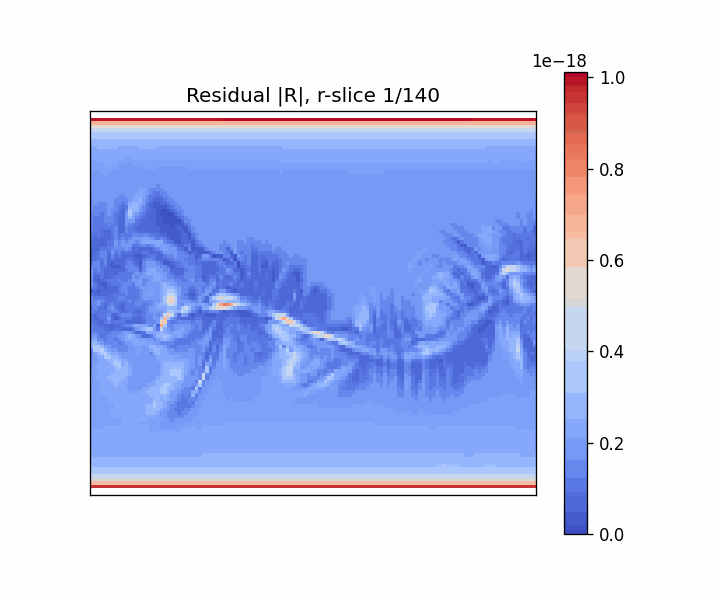
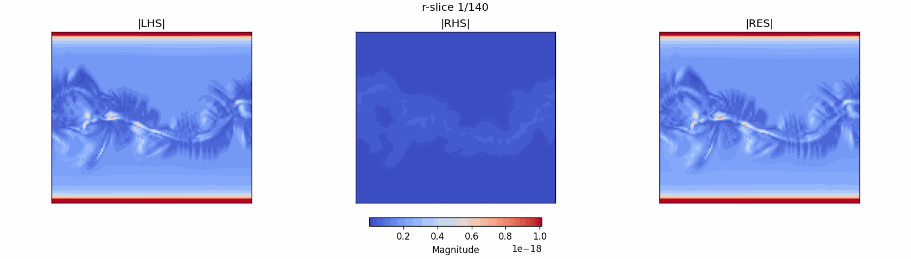

## What is MAS satisfying regarding equation 6?

The original equation:

$$
\rho\left(\frac{\partial {v}}{\partial t}+{v} \cdot \nabla {v}\right)=\frac{1}{c} {J} \times {B}-\nabla P+\rho {g}+\nabla \cdot(\nu \rho \nabla {v})
$$

For static approximation, $$\frac{\partial {v}}{\partial t} = -\Omega_{\text{rot}}\frac{\partial{v}}{\partial \phi}$$ yields:

$$
\rho\left(-\Omega_{\text{rot}}\frac{\partial{v}}{\partial \phi}+{v} \cdot \nabla {v}\right)=\frac{1}{c} {J} \times {B}-\nabla P+\rho {g}+\nabla \cdot(\nu \rho \nabla {v})
$$

## ChatGPT & `mas.F90`:

ChatGPT read the `mas.F90` code (available <a href="https://github.com/predsci/MAS/blob/main/src/mas.F90">here</a>) and says:


1. *MAS does not solve your equation in primitive non-conservative form exactly as you wrote it. It evolves the conservative MHD system in spherical coordinates and relaxes it to steady state.*

2. *Momentum is computed through upwind/characteristic formulations (ADVCT, getvdgv, etc.).*

3. *There are comments like: "JL" Use characteristic formulation instead of momentum*.

4. *MAS data are already in the rotating Carrington frame. So applying $$-\Omega\frac{\partial}{\partial \phi}$$ again is double counting rotation.*

5. *REMOVE rotation term completely (set $$\frac{\partial v}{\partial t}=0$$) Do NOT use Pete’s substitution. That substitution would be correct only if: You had time snapshots in inertial frame And wanted to transform to rotating frame. That is not your case.*

6. *What MAS solves:*

To match MAS output 100%, implement:

$$
\mathbf{R} =
\frac{\partial(\rho\mathbf{v})}{\partial t}
+ \nabla\cdot(\rho\mathbf{v}\mathbf{v})
+ \nabla P
- \frac{1}{4\pi}(\nabla\times\mathbf{B})\times\mathbf{B}
- \rho\mathbf{g}
- \nabla\cdot\big(\nu\,\rho\,\nabla\mathbf{v}\big)
$$

MAS satisfies:

$$
\mathbf{R} = \mathbf{0}
$$

That is what you must test.

For one snapshot $$\frac{\partial(\rho\mathbf{v})}{\partial t}=0$$.


### Results

CR1833 - cgs system - float64 precision



$$
\frac{\partial (\rho \mathbf{v})}{\partial t}
+
\nabla \cdot
\left[
\rho \mathbf{v}\mathbf{v}
+
\left(
P + \frac{B^2}{8\pi}
\right)\mathbf{I}
-
\frac{\mathbf{B}\mathbf{B}}{4\pi}
\right]
=
\rho
\left(
-\frac{GM}{r^2}\hat{\mathbf{r}}
\right)
$$



```
{
    'RMS_LHS': 8.127513975013675e-14, 
    'RMS_RHS': 3.4052838147545416e-21, 
    'RMS_RES': 8.127513974929381e-14, 
    'RMS_RES/LHS': 0.9999999999896285, 
    'RMS_RES/RHS': 23867361.47315371, 
    'rel_p50': 0.9744117526074956, 
    'rel_p90': 0.9999482947384384, 
    'rel_p95': 0.9999931845302668, 
    'rel_p99': 0.9999999853551336, 
    'rel_max': 0.9999999998371278
}
```