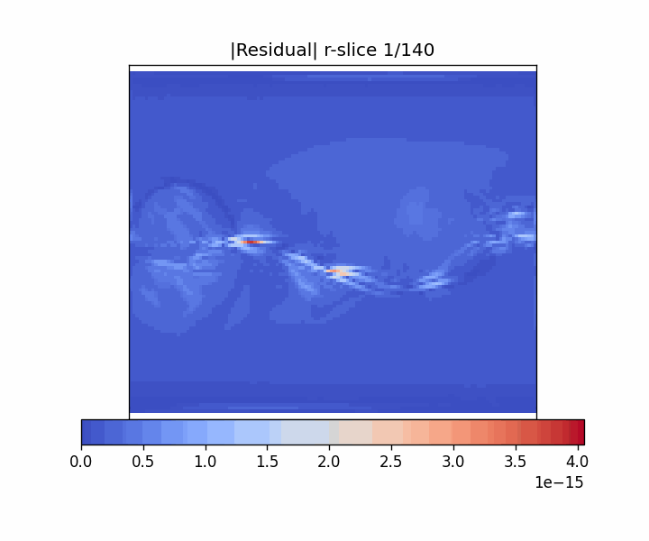
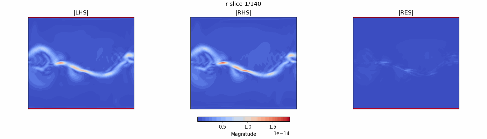
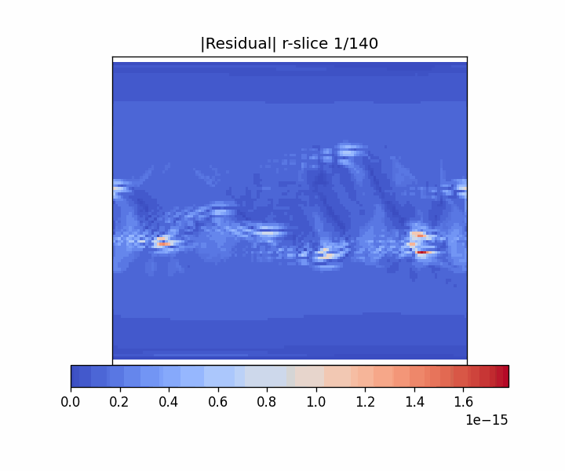
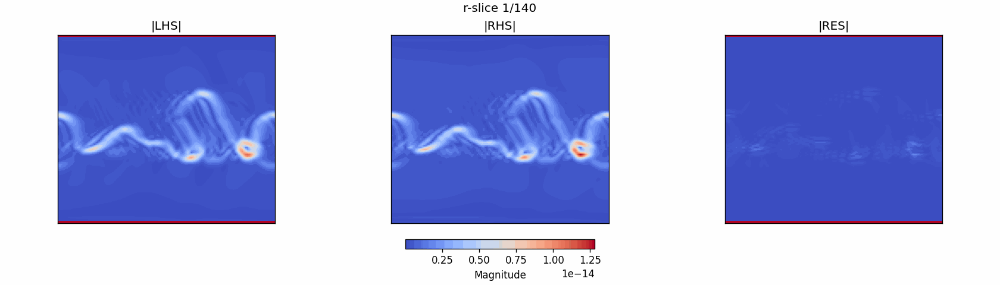

## Ampere's law on MAS

$$
\nabla \times B = \frac{4\pi}{c}(\text{or }\mu_0)J
$$

### CR1833 - cgs system





```
Term budgets (masked interior)
          term |        rms |    mean|x| |     p95|x| |     p99|x| |     max|x|
-------------------------------------------------------------------------------
          lhs_r |  6.612e-17 |  1.942e-17 |  6.746e-17 |  2.419e-16 |  2.708e-15
          lhs_t |  1.209e-16 |  2.513e-17 |  8.920e-17 |  4.288e-16 |  6.077e-15
          lhs_p |  2.533e-16 |  3.891e-17 |  1.121e-16 |  7.175e-16 |  1.447e-14
        lhs_mag |  2.884e-16 |  5.730e-17 |  1.816e-16 |  9.327e-16 |  1.474e-14
          rhs_r |  7.126e-17 |  1.989e-17 |  6.859e-17 |  2.461e-16 |  3.388e-15
          rhs_t |  1.257e-16 |  2.633e-17 |  9.353e-17 |  4.691e-16 |  6.359e-15
          rhs_p |  2.708e-16 |  4.004e-17 |  1.152e-16 |  7.129e-16 |  1.808e-14
        rhs_mag |  3.069e-16 |  5.953e-17 |  1.904e-16 |  9.535e-16 |  1.836e-14
     residual_r |  1.071e-17 |  1.540e-18 |  5.112e-18 |  2.773e-17 |  1.007e-15
     residual_t |  1.581e-17 |  1.534e-18 |  4.518e-19 |  3.834e-17 |  6.223e-16
     residual_p |  3.854e-17 |  4.312e-18 |  1.210e-17 |  7.468e-17 |  3.926e-15
   residual_mag |  4.301e-17 |  6.023e-18 |  1.907e-17 |  1.280e-16 |  4.053e-15

  RMS(LHS)   = 2.884e-16
  RMS(RHS)   = 3.069e-16
  RMS(RES)   = 4.301e-17
  RMS(RES)/RMS(LHS) = 1.491e-01
  RMS(RES)/RMS(RHS) = 1.401e-01
  Pointwise relative residual  |R|/(|LHS|+|RHS|):
    p50=1.009e-02  p90=8.451e-02  p95=1.383e-01  p99=2.516e-01  max=9.991e-01
```


### CR2239 - cgs system





```
Term budgets (masked interior)
          term |        rms |    mean|x| |     p95|x| |     p99|x| |     max|x|
-------------------------------------------------------------------------------
          lhs_r |  3.907e-17 |  1.183e-17 |  4.405e-17 |  1.515e-16 |  1.772e-15
          lhs_t |  1.163e-16 |  2.153e-17 |  7.763e-17 |  3.943e-16 |  7.245e-15
          lhs_p |  1.673e-16 |  2.905e-17 |  9.549e-17 |  5.349e-16 |  1.085e-14
        lhs_mag |  2.075e-16 |  4.303e-17 |  1.471e-16 |  7.455e-16 |  1.100e-14
          rhs_r |  4.232e-17 |  1.233e-17 |  4.543e-17 |  1.593e-16 |  1.982e-15
          rhs_t |  1.180e-16 |  2.223e-17 |  8.259e-17 |  4.087e-16 |  7.930e-15
          rhs_p |  1.782e-16 |  3.021e-17 |  9.855e-17 |  5.465e-16 |  1.261e-14
        rhs_mag |  2.179e-16 |  4.479e-17 |  1.543e-16 |  7.600e-16 |  1.278e-14
     residual_r |  5.812e-18 |  1.095e-18 |  4.440e-18 |  1.988e-17 |  3.488e-16
     residual_t |  9.315e-18 |  9.280e-19 |  2.809e-19 |  2.565e-17 |  6.929e-16
     residual_p |  2.097e-17 |  3.124e-18 |  1.089e-17 |  5.677e-17 |  1.761e-15
   residual_mag |  2.367e-17 |  4.178e-18 |  1.592e-17 |  8.808e-17 |  1.784e-15

  RMS(LHS)   = 2.075e-16
  RMS(RHS)   = 2.179e-16
  RMS(RES)   = 2.367e-17
  RMS(RES)/RMS(LHS) = 1.141e-01
  RMS(RES)/RMS(RHS) = 1.086e-01
  Pointwise relative residual  |R|/(|LHS|+|RHS|):
    p50=1.231e-02  p90=1.082e-01  p95=1.756e-01  p99=3.325e-01  max=9.995e-01
```

