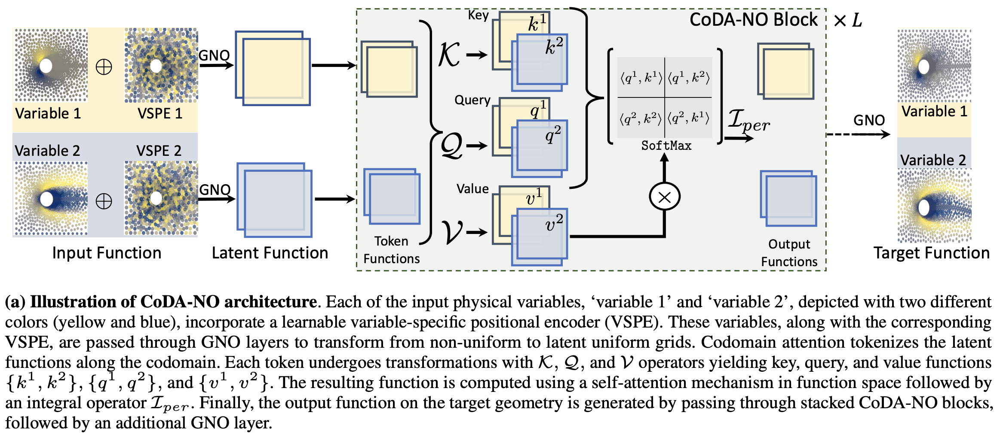
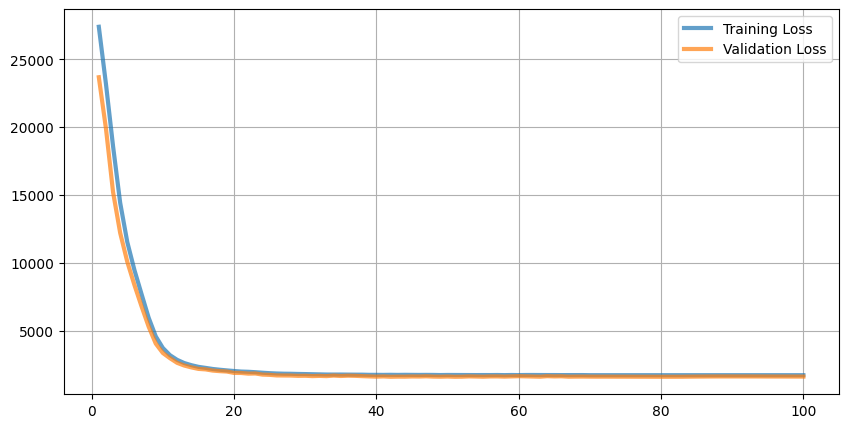
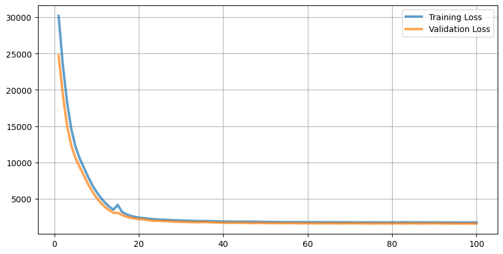

## CODANO (B and J prediction)

Codomain Attention Neural Operators for Solving Multiphysics PDEs - <a href="https://arxiv.org/pdf/2403.12553">Paper</a> - <a href="https://neuraloperator.github.io/dev/modules/generated/neuralop.models.CODANO.html#rc0acb03256ea-1">Code</a>





- **Input**: M spatial variables on a grid **H × W** representing the system state.

- **Goal**: Predict **T future outputs per variable**.

- **Variable tokens**: Each of the **M variables is treated as a token**, enabling the model to learn **interactions between variables**.

- **Lifting**: Inputs are projected into a **higher-dimensional latent space**.

- **Spectral operator**: Uses **Fourier transforms** to learn transformations in the **frequency domain**, capturing **global spatial dependencies**.

- **Codomain attention**: Learns **cross-variable interactions** while preserving spatial structure.

- **Stacked operator layers**: Multiple layers model **nonlinear system dynamics**.

- **Projection**: Maps latent features to **M × T output channels**, reshaped to **[batch, M, T, H, W]**.


6 input components -> 6 output components


### Exp 55

```
  "num_epochs": 100,
  "batch_size": 32,
  "convolution": "fourier",
  "hidden_channels": 32,
  "n_layers": 2,
  "physics_loss": false
```

#### CR2201


#### CR2239




### Exp 56

```
  "num_epochs": 100,
  "batch_size": 32,
  "convolution": "spherical",
  "hidden_channels": 32,
  "n_layers": 2,
  "physics_loss": false
```

#### CR2201


#### CR2239


