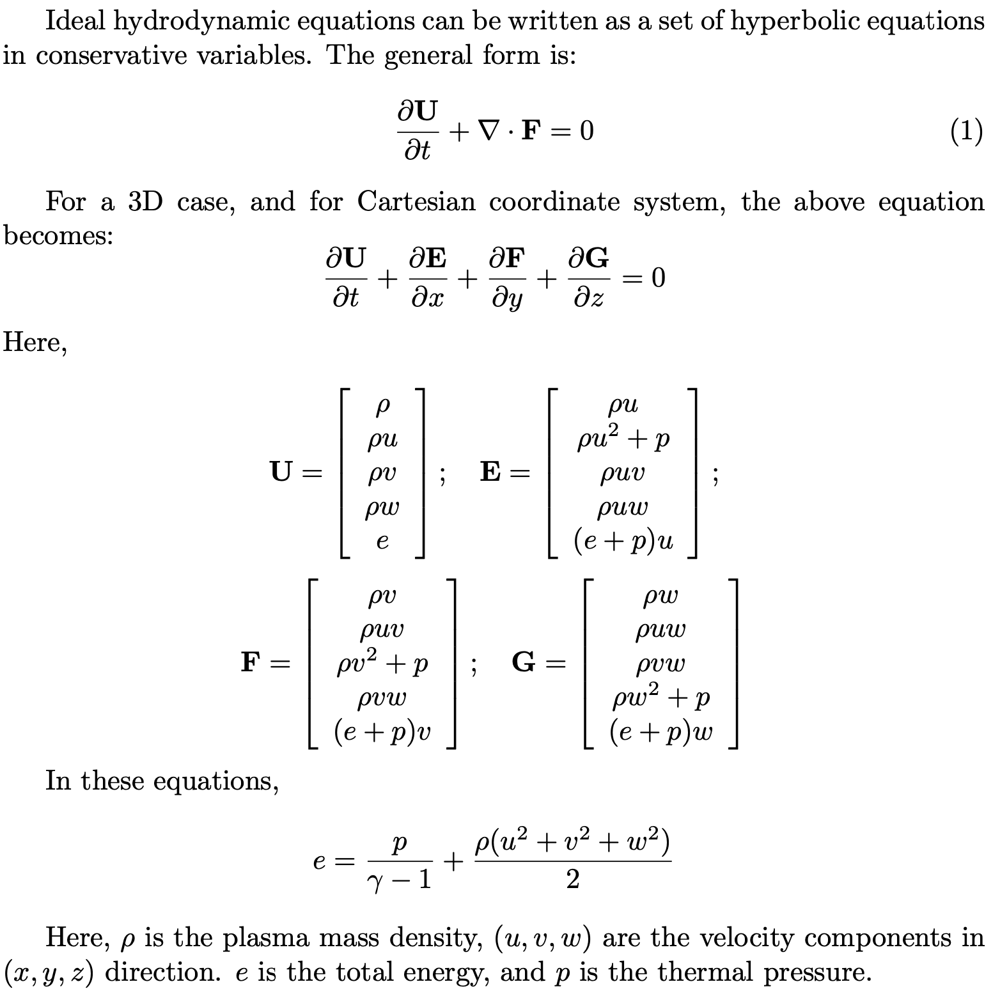

# Ideal Hydrodynamics solutions pt. 1

## Results on MAS

### CR2201

```
                absolute mean		absolute max:
mass_r 		     1.5373e-28 		 3.1423e-26
mass_t 		     4.2989e-29 		 1.0020e-26
mass_p 		     2.6253e-29 		 3.2171e-27
mass_res 	     1.7898e-28 		 3.3308e-26
momr_r 		     6.0731e-21 		 9.3463e-19
momr_t 		     1.7191e-21 		 3.0926e-19
momr_p 		     1.1465e-21 		 1.2630e-19
mom_r_res 	     6.8711e-21 		 1.0171e-18
momt_r 		     6.3711e-22 		 1.7016e-19
momt_t 		     6.2921e-21 		 2.3846e-18
momt_p 		     1.7686e-23 		 3.6261e-21
mom_t_res 	     6.5176e-21 		 2.3847e-18
momp_r 		     5.5693e-22 		 1.1890e-19
momp_t 		     2.2168e-23 		 5.0568e-21
momp_p 		     3.1521e-22 		 6.1631e-20
mom_p_res 	     5.1964e-22 		 9.8437e-20
energy_r 	     1.1467e-13 		 1.7377e-11
energy_t 	     4.7164e-14 		 7.1836e-12
energy_p 	     3.2613e-14 		 4.2121e-12
energy_res 	     9.8212e-14 		 1.5734e-11
total_residual 	 9.8212e-14 		 1.5734e-11
```

### CR2239

```
                absolute mean		absolute max:
mass_r 		     2.8812e-28 		 5.6588e-26
mass_t 		     6.4864e-29 		 2.9766e-26
mass_p 		     5.5081e-29 		 1.3714e-26
mass_res 	     3.3229e-28 		 5.9909e-26
momr_r 		     9.4020e-21 		 1.4734e-18
momr_t 		     2.4399e-21 		 7.9037e-19
momr_p 		     2.2058e-21 		 3.6447e-19
mom_r_res 	     1.0602e-20 		 1.5907e-18
momt_r 		     9.4788e-22 		 6.6881e-19
momt_t 		     6.4557e-21 		 2.3847e-18
momt_p 		     3.7926e-23 		 3.7001e-20
mom_t_res 	     6.7276e-21 		 2.3833e-18
momp_r 		     1.0642e-21 		 4.7177e-19
momp_t 		     4.2189e-23 		 4.7824e-20
momp_p 		     6.1242e-22 		 2.8751e-19
mom_p_res 	     9.9918e-22 		 4.8740e-19
energy_r 	     1.8364e-13 		 4.2391e-11
energy_t 	     6.1765e-14 		 1.7761e-11
energy_p 	     5.7747e-14 		 8.2885e-12
energy_res 	     1.5857e-13 		 3.5544e-11
total_residual 	 1.5857e-13 		 3.5544e-11
```

## Questions


HDF file format from prof. Singh:

```
keys: ['data0', 'datasets_time', 'geometry']

data0 shape: (131072,)
data0 dtype: float64

time: 0

geometry keys: ['dtheta', 'phi', 'theta']
dtheta (128,)
phi (128,)
theta (109,)
```



1. What does this one dimension array represent? $$131072=2^{17} (=128*128*8?)$$ Are we storing vr, vt, vp, rho, p or U, E, F, G?
2. Why isn't $$r$$ in the geometry?
3. Equations are in cartesian coordinates, data in spherical. The conversion of data from spherical to cartesian will lead to a non-uniform grid ($$dx, dy, dz$$ is not the same). Should I look for the equations in spherical coordinates?
4. Is $$\gamma=\frac{5}{3}$$? Different between cgs and MKS systems?
5. Is $$\frac{\partial U}{\partial t}=0$$?
6. How do you compute the derivatives? Finite differences in what system?
7. I know $$p$$ as *gas pressure* is it the same thing as *thermal pressure*?

### Another question

We need more data, possibly time-variant, using PLUTO code. How do we start that?