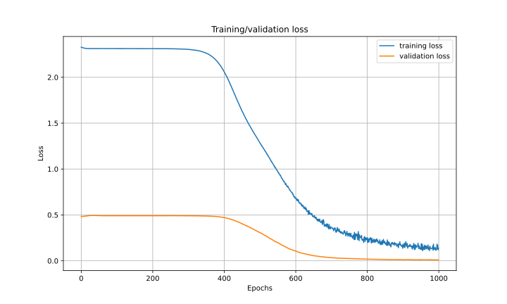

## 1. [My comprehensive notebook of preliminary info](what_is_the_sun.md)

## 2. An experiment with PINNs

### Heat equation
#### 1. PDE:

#### 2. Boundary condition:

#### 3. Training data:
- x: uniform dist [0, 2]

- t: 0 for boundary condition, [0, 1] for PDE

- u: from boundary condition

#### 4. Validation data:
- x: uniform dist [0, 2]

- t: [0, 1]

- u: from numerical analysis

    

#### 4. Loss function

L1 + L2
- L1: Mean squared loss between model(x, t) & u
- L2: Mean squared loss between PDE & 0

#### 5. Training

Trained for 1000 iterations

#### 6. Architecture:
An MLP with 5 hidden layers of:
- 5 neurons
- Sigmoid activation

Doing regression, thus, no activation for the output layer.

#### 7. Inference

