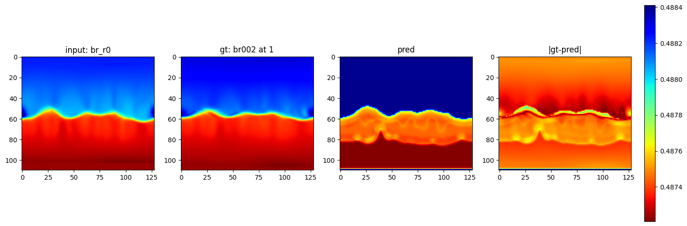

# GraphUNet Experiment

## Data:
- Helio solutions
- kpo instrument
- 210 br_r0 br002 files for training
- 70 br_r0 br002 files for validation
- Graph representation of sphere

## Model:
- GraphUNet
- Depth: 5
- Starting # channels: 128
- Take br_r0 and predict only one slice of br002 (here: slice 2)

## Results:

