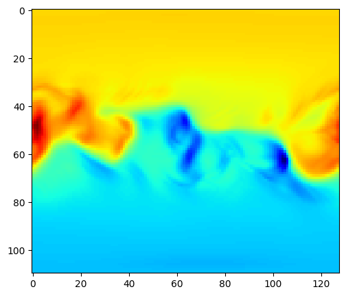

## Quick recap

### Data

- Each modality (velocity, magnetic field, density etc.) is an equirectangular projection of a sphere
- Each datapoint has 4 features. (x, y, z, intensity) or (phi, theta, r, intensity)
- Some modalities (e.g., magnetic field) require being scaled to r^2

### Representations & Models

- Use the equirectangular projection

    <video controls width="600">
    <source src="resources/week_5/pete_sample_1_layer_64_hidden_slice_0.mp4" type="video/mp4">
    Your browser does not support the video tag.
    </video>

    - Pros:
        - Easy to use
        - Lots of DL architectures are usable
    - Cons: 
        - Symmetrical features aren't introduced to the model
        - Exact coordinates of datapoints are not introduced to the model
            - Only intensity
            - Relative spatial features without the symmetries
- Transform into a graph

    

    - Pros:
        - Better representation
        - Able to introduce the symmetries
        - Graph neural networks are available in torch-geometric
    - Cons:
        - A GNN can only process one graph at a time
            - Mini-batch processing for better convergance is complicated
            - If done, a big graph is created from all the graphs in the batch
            - An index will be needed to indicate which vertex belongs to which graph
        - Exact coordinates of datapoints are not introduced to the model
            - <i>Can put relative distance between the vertices on the edges</i>
            - <i>Can put (x,y,z) or (phi, theta, r) on the vertices as well?</i>
- <i>Spherical representation</i>
    - Pros:
        - <i>Spherical ConvNets can be used</i>
    - Cons:
        - <i> They focus on rotation invariance, needs to be disabled in our case</i>
        - <i>Feature extraction is easy, going back up to the original dimensions is hard</i>

## Point clouds

### Representation

- For each pixel in the equirectangular projection
    - Get its intensity, phi, theta, and r
    - Transform spherical coords to cartesian coords
    - 4 features per pixel, leading to (resolution, 4) features per slice

### Models
PointNet

1. Classification head
2. **Segmentation head**
    - We are doing regression
    - Sigmoid at the end with a `(n*1)` dimension instead of softmax
    - For our 110 * 128 Helio Br files a single input will have (110*128, 4) shape. 4=x, y, z, and the value.

Still learns rotation invariance by learning a transformation matrix and applying it to anything it sees for generalization
- Remove this functionality
- It will be orientation aware

### Experiments

Problem: why are helio solutions magnetic field's boundary condition and simulations having different resolutions?

- br_r0 has `(128, 100)`
- br002: `(128, 110)`

For now I will only use br002 simulations.
Take slice 0, predict slice k.

#### Experiment 1 - Small dataset

- kpo instrument
- original complexity of pointnet
- 75-25 train-test split

#### Experiment 2 - Bigger dataset

- all instruments
- original complexity of pointnet
- 75-25 train-test split

### Transformation with spherical harmonics

In progress...

### Next Step

1. Dynamic complexity for PointNet
2. Experiment 2 with more complexity
3. Continue the spherical approach
3. PointNet++ and others...

## Resources
- PointNet paper: https://arxiv.org/pdf/1612.00593
- PointNet repo: https://github.com/fxia22/pointnet.pytorch
- PointNet family from: Learning SO(3) Equivariant Representations with Spherical CNNs https://arxiv.org/pdf/1711.06721

