## Pointnet experiments:

- dynamic complexity
- learning rate scheduler added

Exp 3:
- Slice 0 -> slice 70
- Dimensions: `[64, 128, 256, 512, 1024]`
- Sigmoid at the end (as usual)
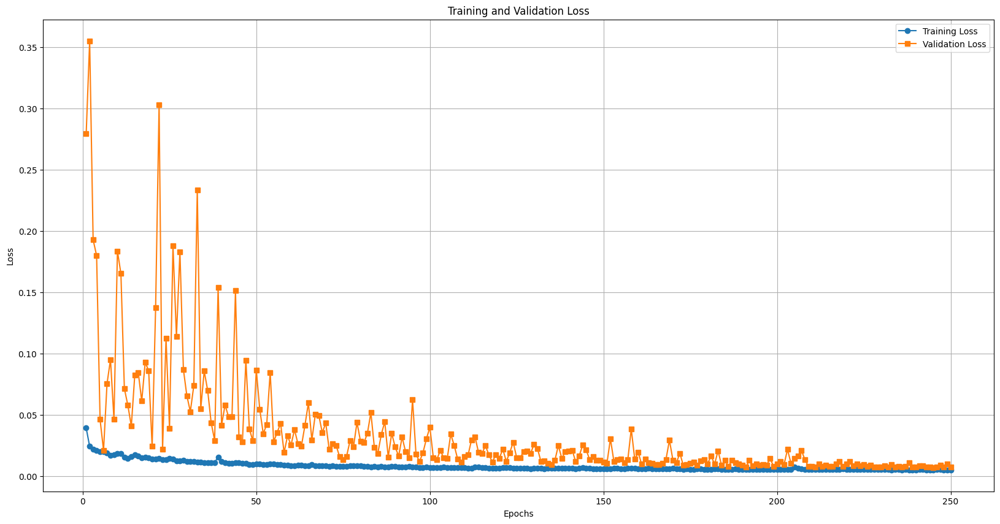
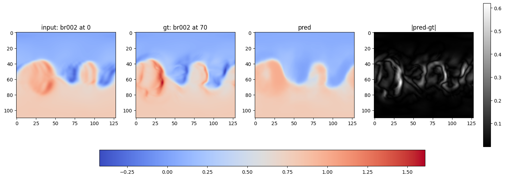

Exp 4:
- Slice 0 -> slice 70
- Dimensions: `[64, 128, 256, 512, 1024]`
- No sigmoid at the end
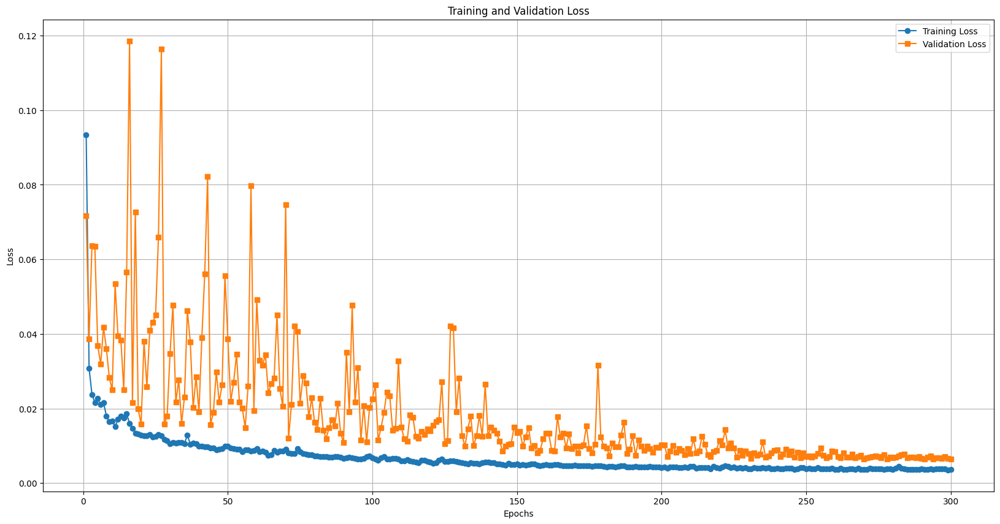
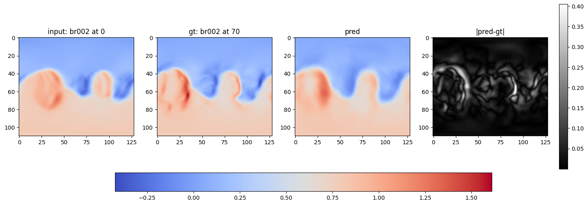

Exp 5:
- Slice 0 -> slice 70
- Dimensions: `[128, 256, 512, 1024]`
- No sigmoid at the end
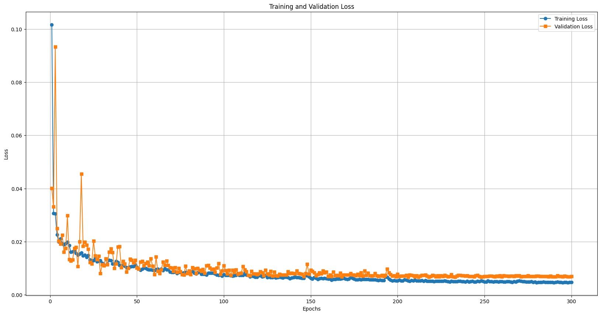
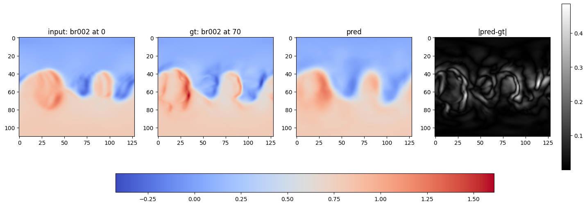

Exp 6:
- Slice 0 -> slice 70
- Dimensions: `[128, 256, 512, 1024, 2048]`
- No sigmoid at the end
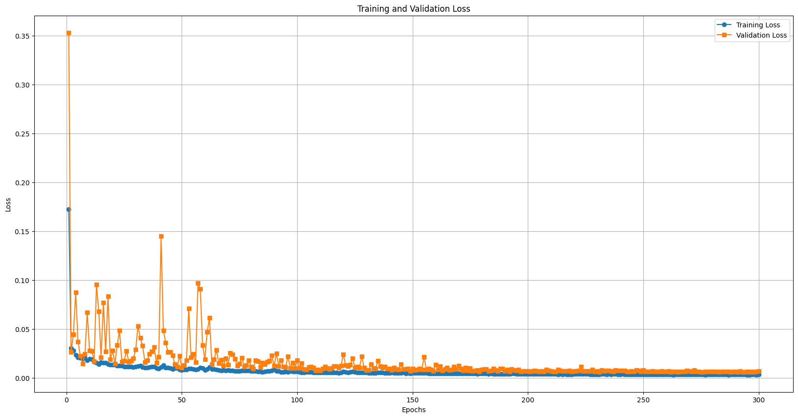

Exp 7:
- slice 0 -> slice 1 -> ... -> slice 8
- Dimensions: `[64, 128, 256, 512, 1024]`
- No sigmoid at the end
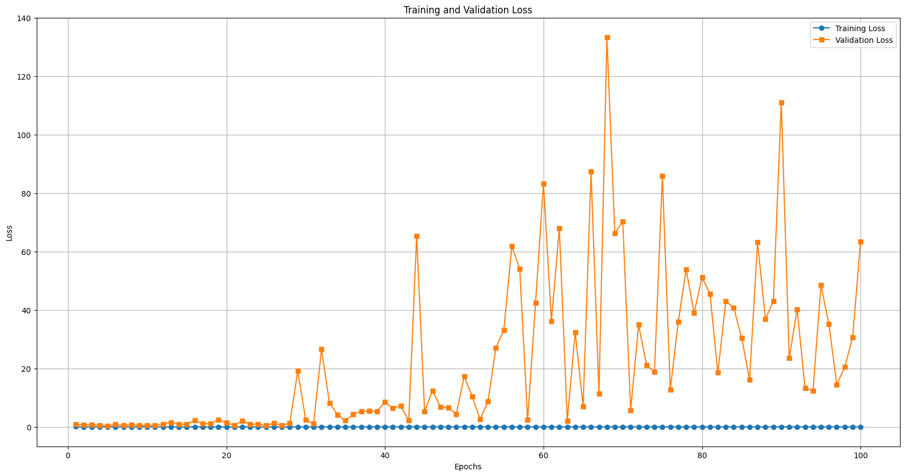
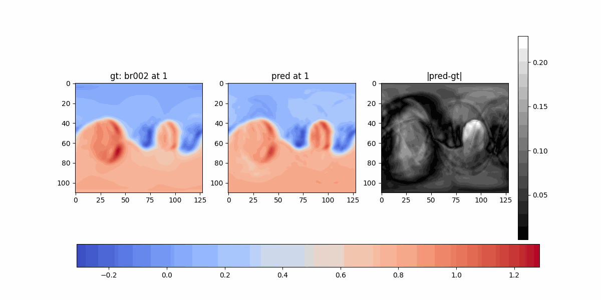

Exp 8:
- Slice 0 -> slice 70
- Dimensions: `[64, 128, 256, 512, 1024]`
- Skip connections
- No sigmoid at the end
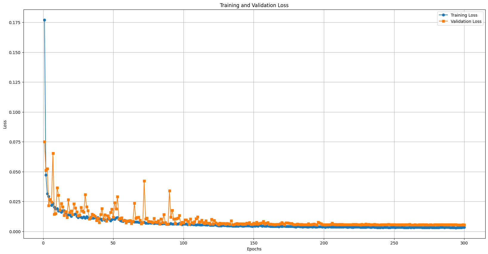

### Comparison:

| Experiment | Description | Least Validation Loss |
|------------|--------|----------------|
| 8     |`[64, 128, 256, 512, 1024]` and skip connections| 0.0054715318   |
| 6      |`[128, 256, 512, 1024, 2048]`| 0.0060299177   |
| 4      |`[64, 128, 256, 512, 1024]`| 0.0063938934   |
| 5      |`[128, 256, 512, 1024]`| 0.0066780968   |
| 3      |`[64, 128, 256, 512, 1024]` with sigmoid| 0.0067507107   |

More results from exp 8:

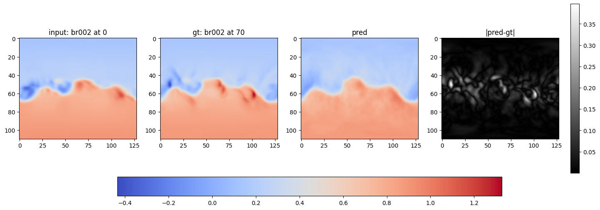
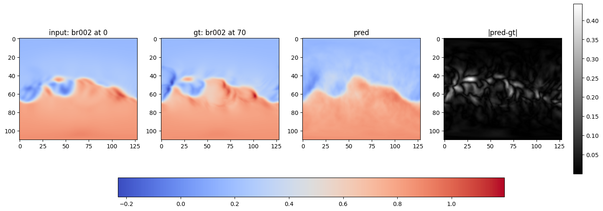
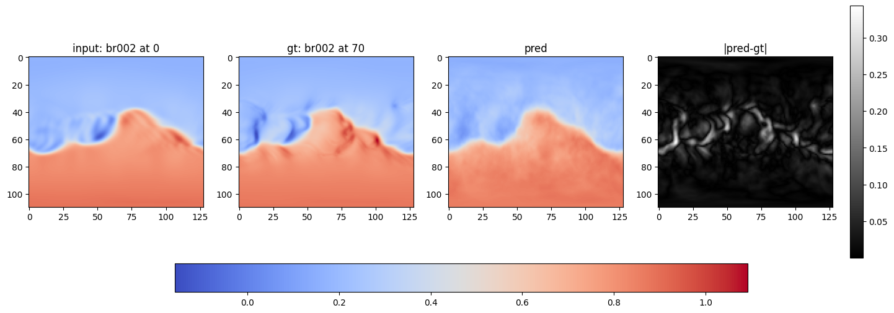
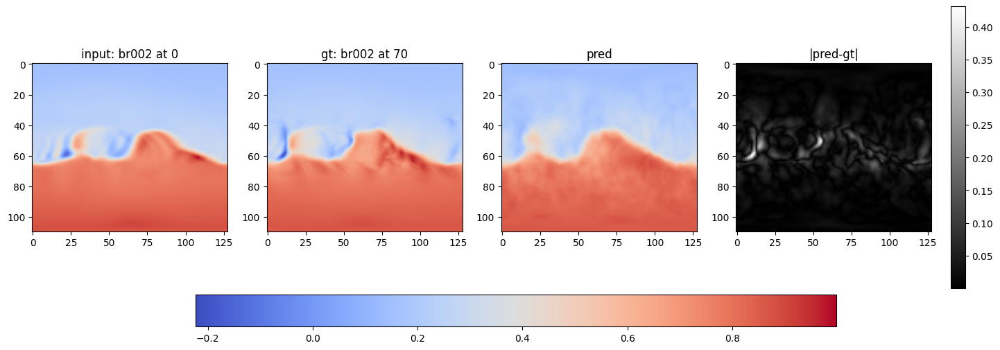
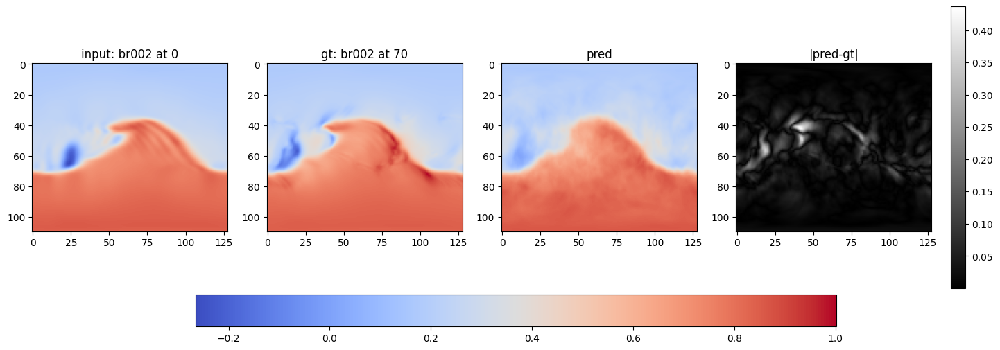

### What's next?

DeepSphere

## Resources
- DeepSphere paper: https://arxiv.org/abs/2012.15000
- DeepSphere: https://github.com/deepsphere/deepsphere-cosmo-tf2
- Recurrent UNet: https://arxiv.org/pdf/1606.00487v2