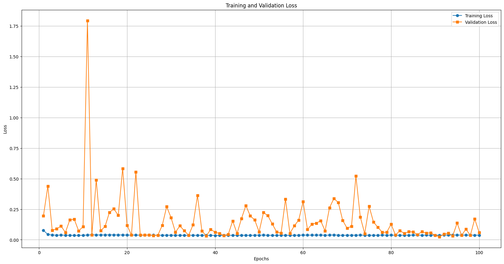
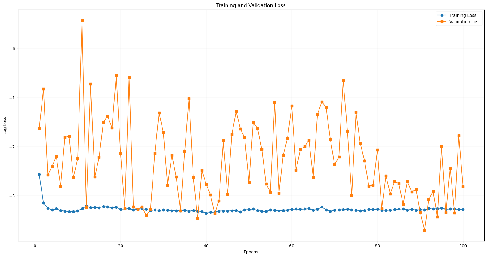
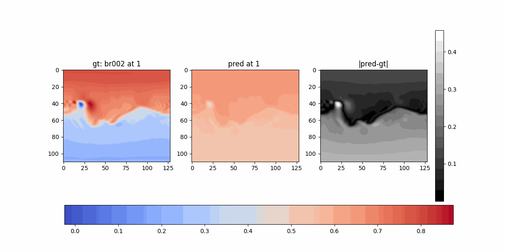
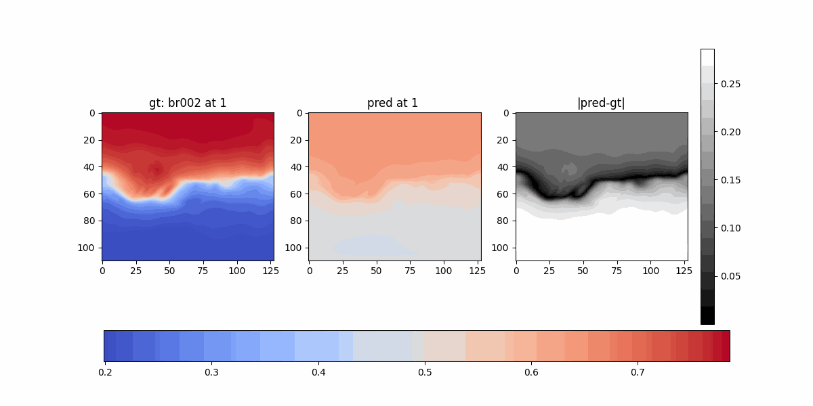
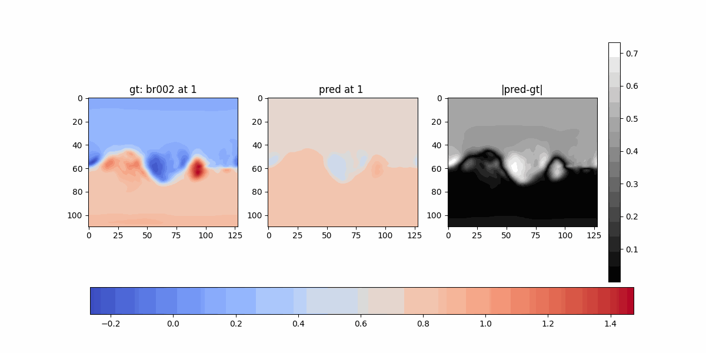
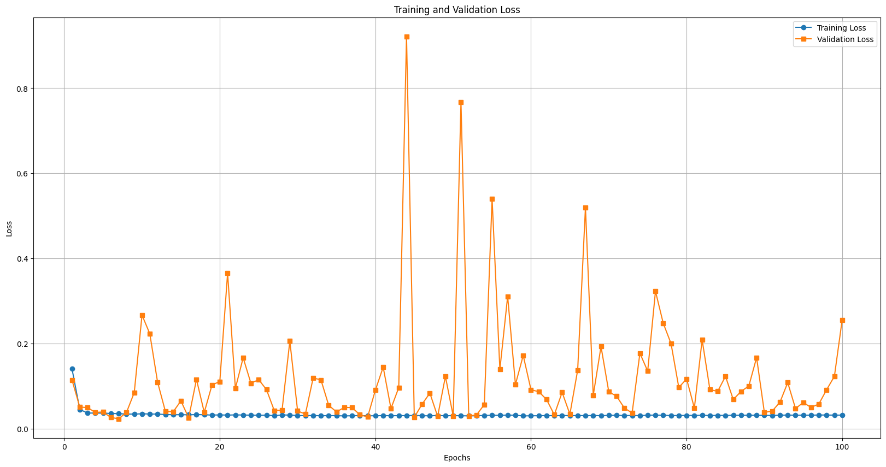
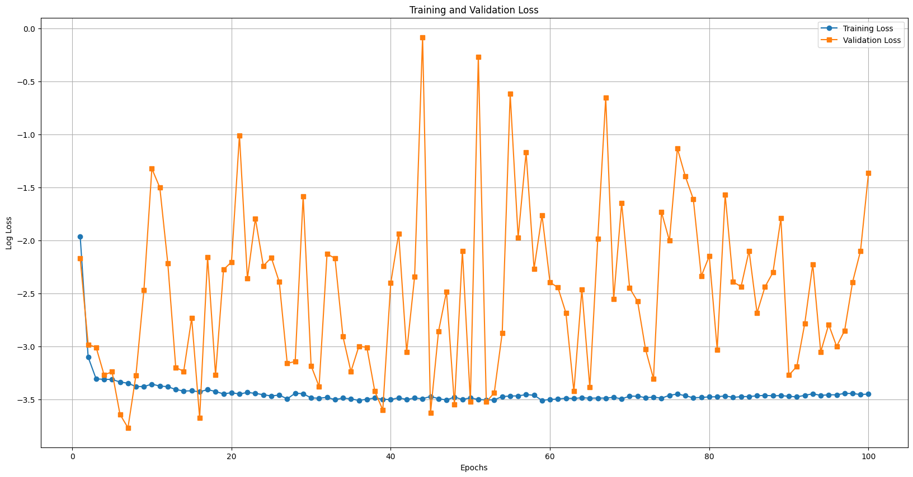
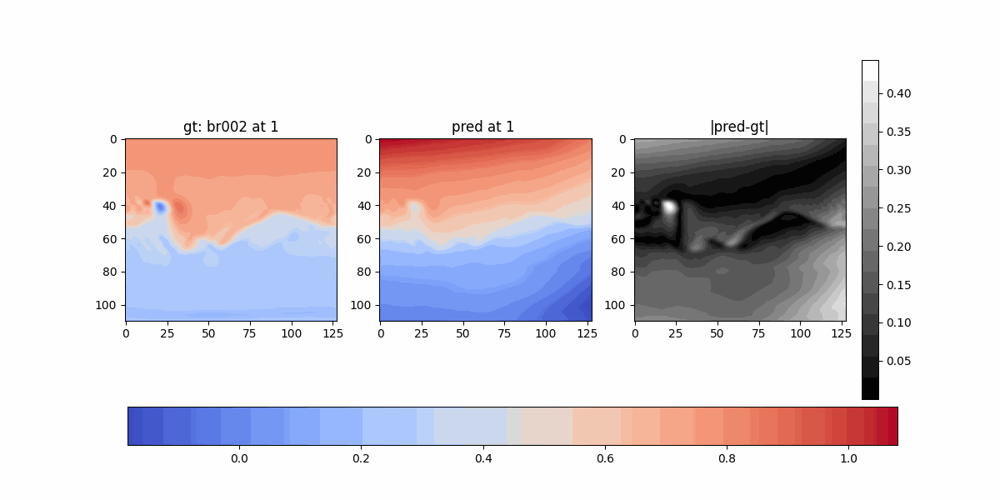
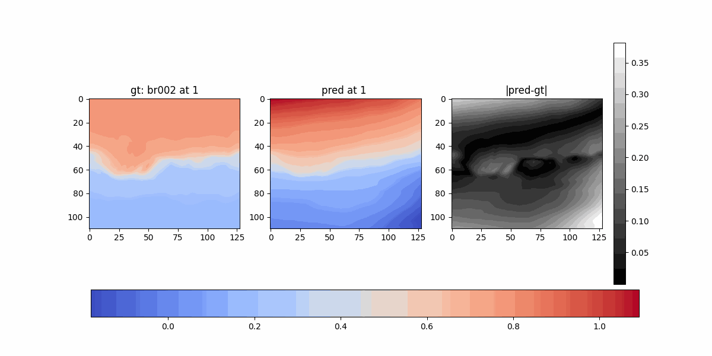
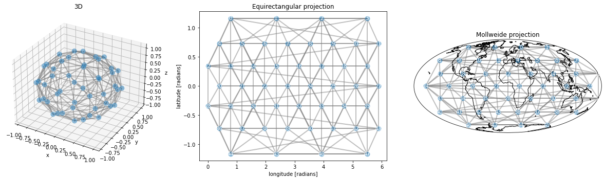

## Pointnet and Google's SphericalCNN

### Exp 9:

- Slice[0] to slice[i] for all cubes
- Features: `(x[target_slice], y[target_slice], z[target_slice], intensity[bc])`
- Output: `intensity[target_slice]`

#### Losses

#### Comparison

- Validation

- Training

### Exp 10:

- Slice[0] to slice[i] for all cubes
- Features: `(phi, theta, r[target_slice], intensity[bc])`
- Output: `intensity[target_slice]`

#### Losses

#### Comparison

- Validation

- Training

### DeepSphere for weather

Uses 
- SphericalUNet
- Transforms the data into HEALPix Grid

### Spherical-CNN from Google

- Written in Jax, Flax and Linen instead of Pytorch and TensorFlow
- Allows turning off spin equivariance
- I have written an auto-encoder so far for bc-to-slice prediction
