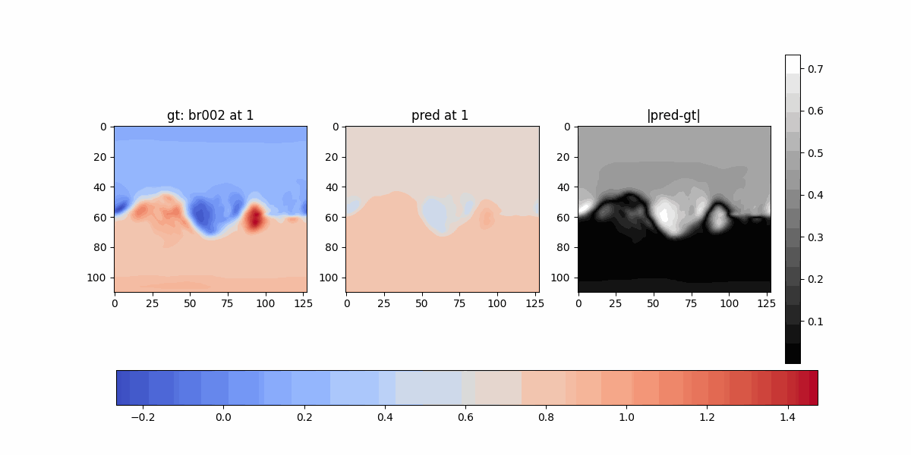
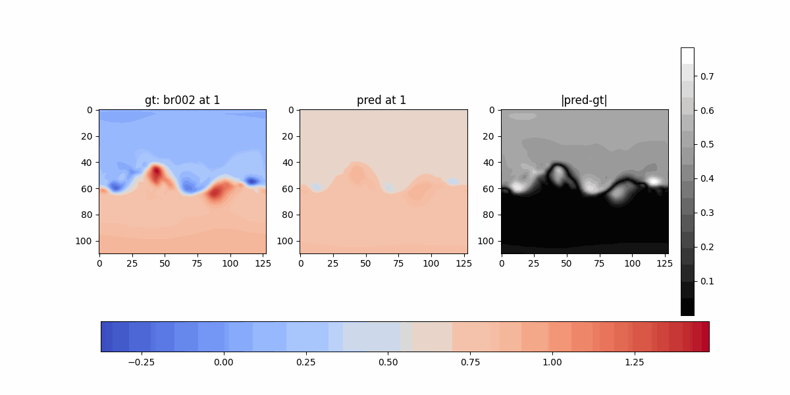
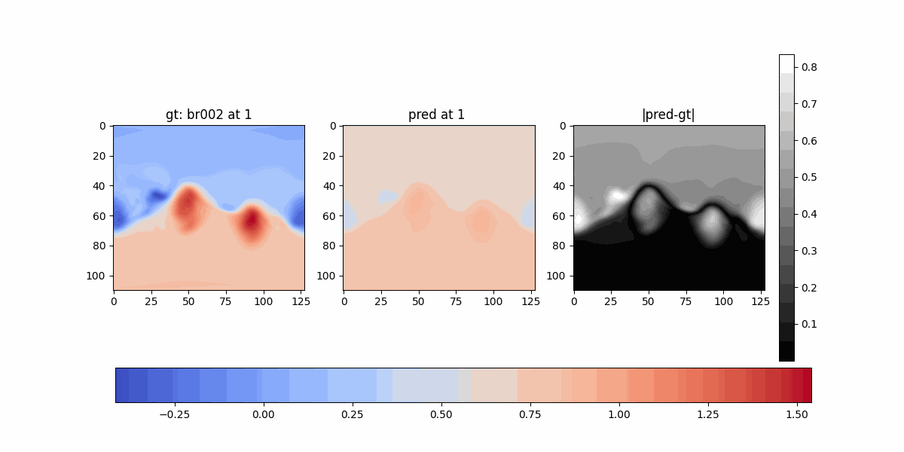
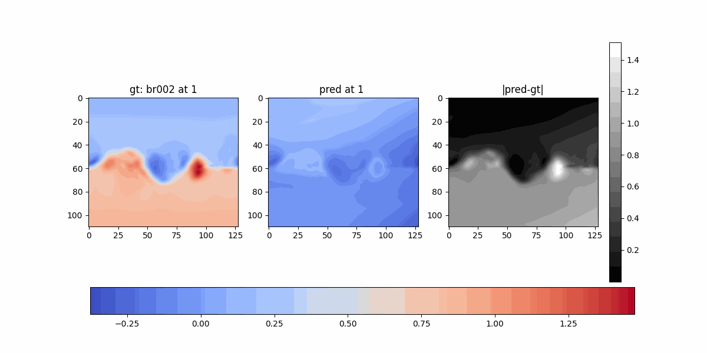
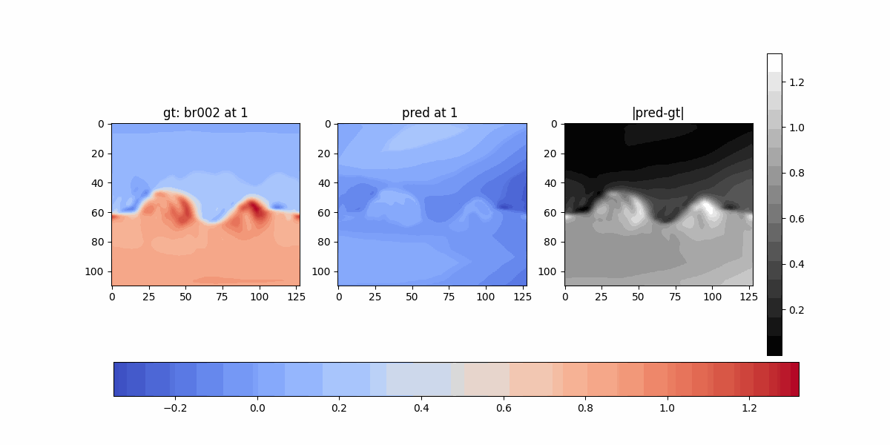
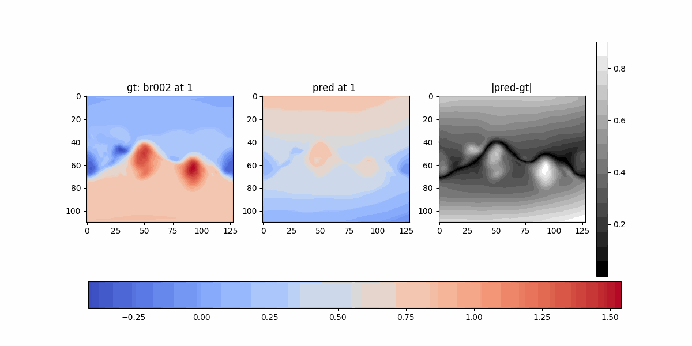

## Pointnet and DeepSphere

### Exp 9:

- Slice[0] to slice[i] for all cubes
- Features: `(phi, theta, r[target_slice], intensity[bc])`
- Output: `intensity[target_slice]`

#### Losses

#### Comparison

### Exp 10:

- Slice[0] to slice[i] for all cubes
- Features: `(x[target_slice], y[target_slice], z[target_slice], intensity[bc])`
- Output: `intensity[target_slice]`

#### Losses

#### Comparison

