# DeepSphere and PointRNN and PINNs

## DeepSphere 

- Weather prediction, HEALPix KNN Graph

Validation instances

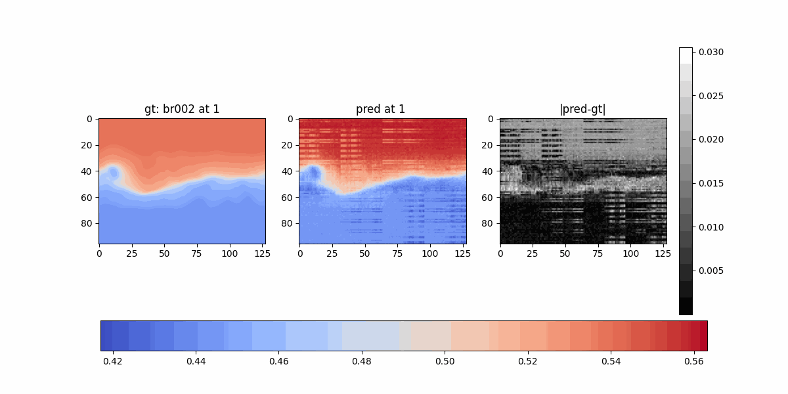
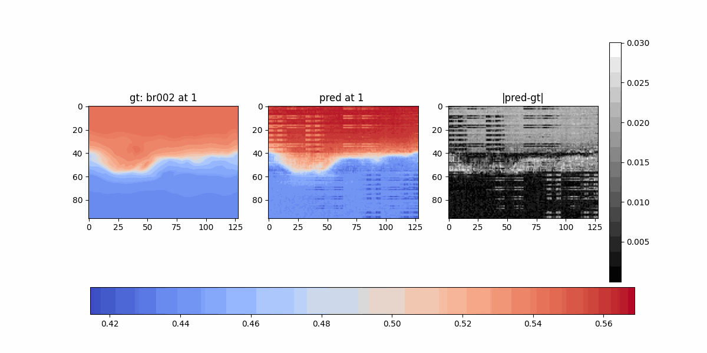

Training instances

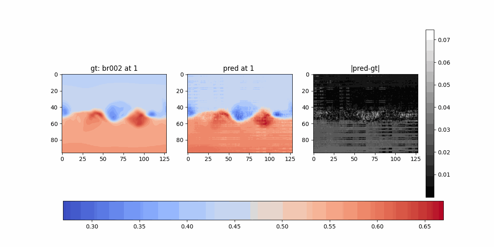
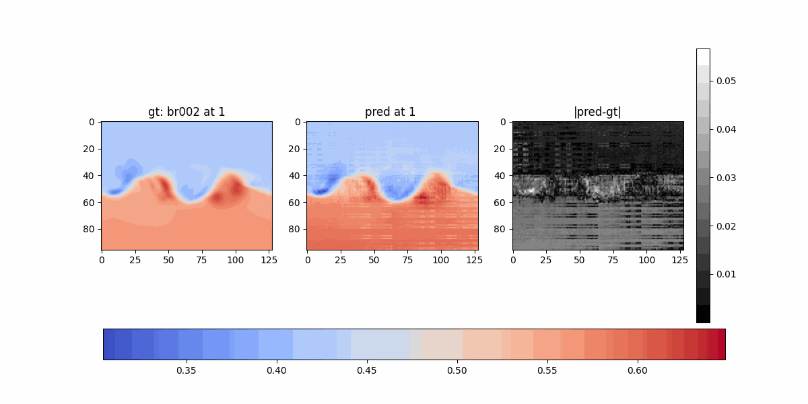

Loss
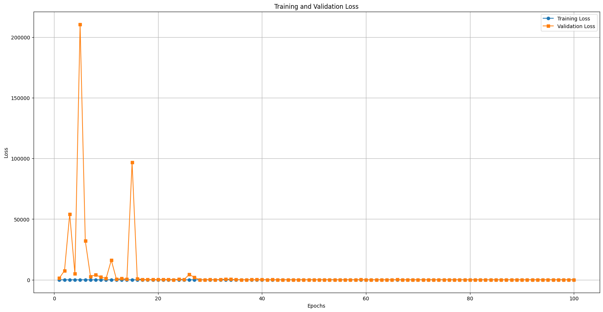

Log loss
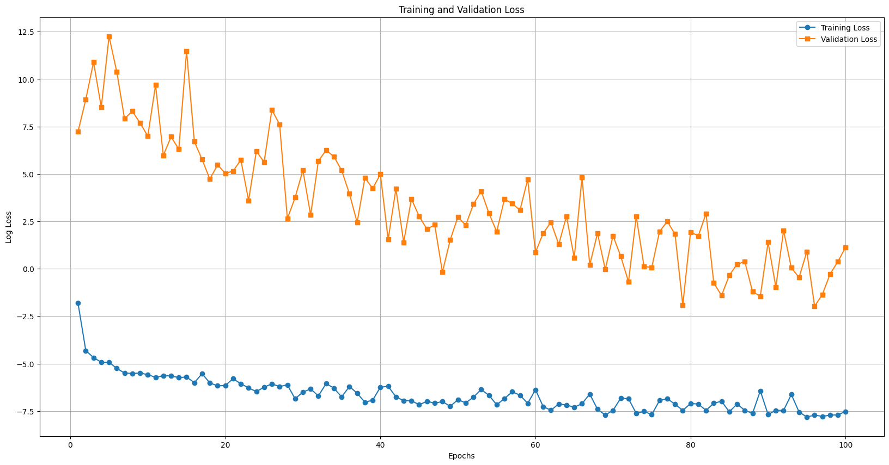

## PointRNN

- <a href="https://github.com/hehefan/PointRNN-PyTorch/tree/master">Github</a>
- <a href="https://arxiv.org/abs/1910.08287">Paper</a>

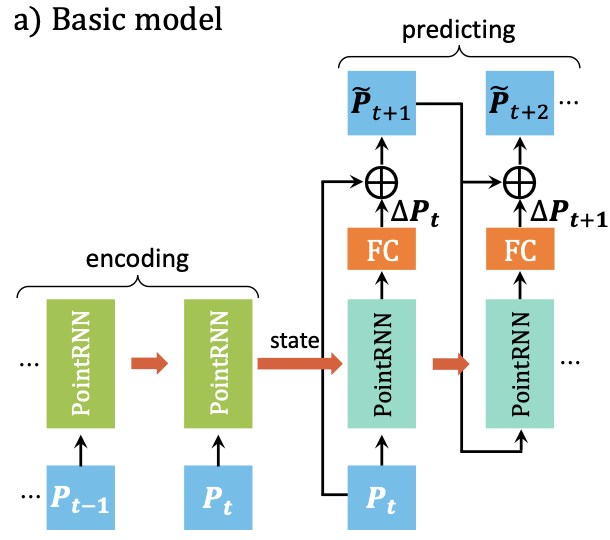

- Paper:
    - `(x, y, z, intensity) at i` for `i=0 to L/2` -> `(x, y, z, intensity) at j` for `j=L/2 to L`
    
- Implementation: 
    - `(x, y, z) at i` for `i=0 to L/2` -> `(x, y, z) at j` for `j=L/2 to L`

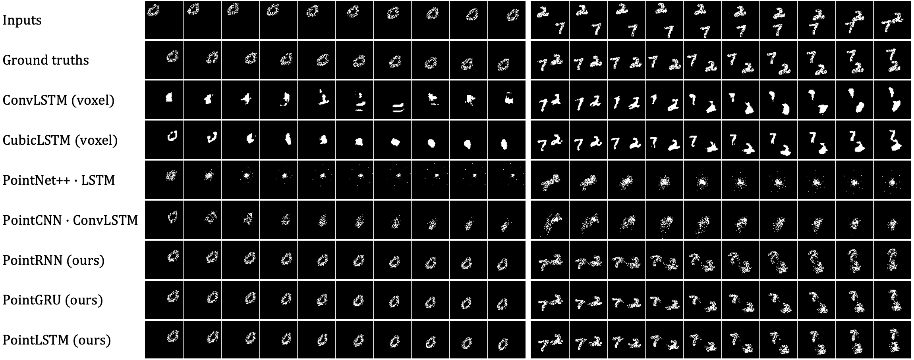

- What we want: 
    - `(x, y, z, intensity) at i` -> `(intensity) at i+1` for `i=0 to i=L`

## PINNs

- <a href="https://www.nature.com/articles/s41550-023-02030-9">Probing the solar coronal magnetic field with physics-informed neural networks</a>

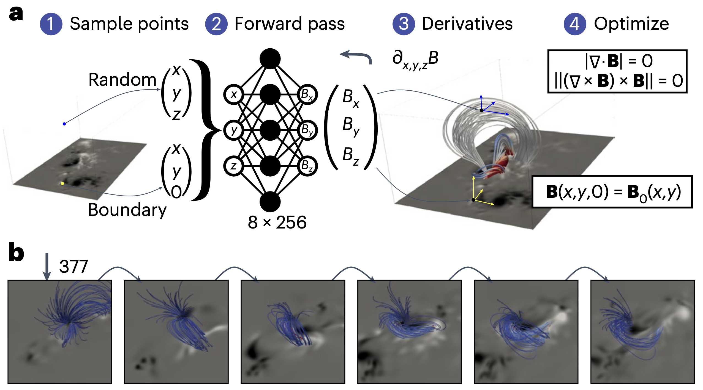

- NOAA 11158, 5 days of observations at full cadence (12 minutes) - 12 to 17 Feb. 2011

- Real-time force-free <u>coronal</u> magnetic-field extrapolations

- The MLP is called <a href="https://arxiv.org/abs/2006.09661">SIREN (Sinusoidal Representation Networks)</a>
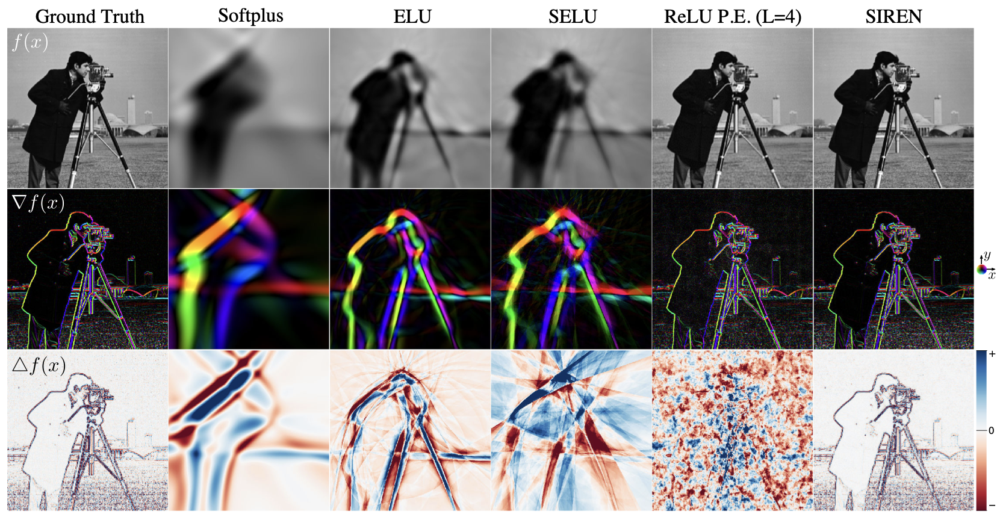
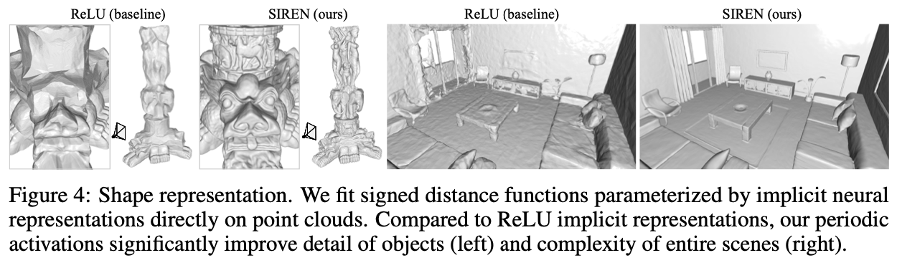

- Loss: 
    - divergence and force freedom in volume
    - B(x,y,0) = B0(x,y)

- Predict the whole volume, go to next time-step, use the previous volume as starting condition

- <a href="https://arxiv.org/abs/2502.13924">PINN ME: A Physics-Informed Neural Network Framework for Accurate Milne-Eddington Inversions of Solar Magnetic Fields</a>

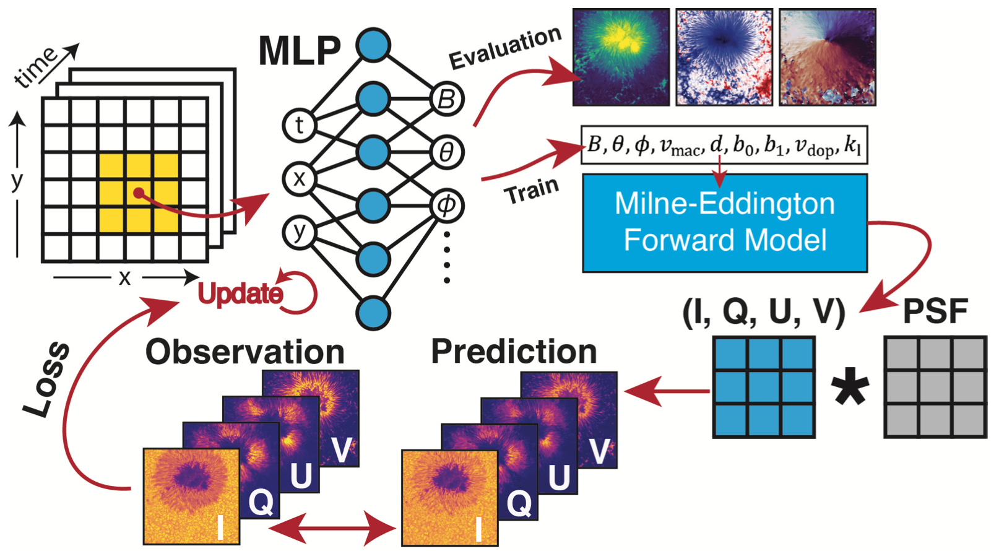

## Next step
- Ongoing:
    - Spherical KNN Graph
    - Spherical Convs from Google
    - PointRNN
- New:
    - Take PFSS ***B***, use PointNet and incorporate physics loss

