# Neural Operators (Spherical Fourier NO)

## Quick intro
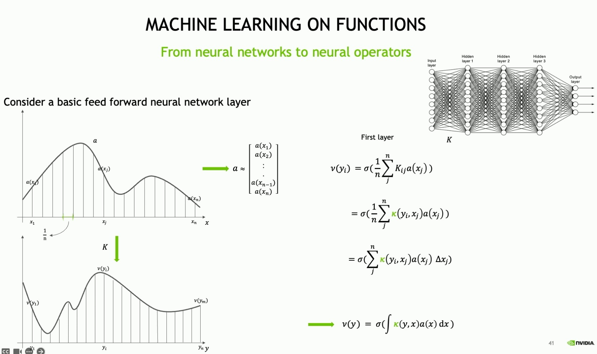
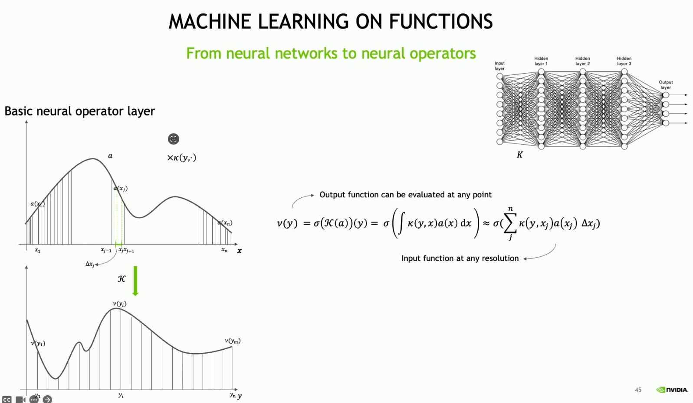
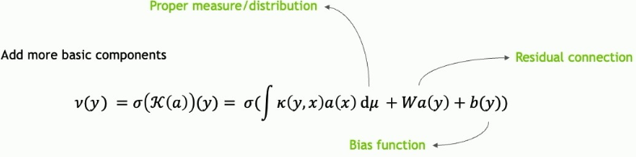

- P: Increase #channels with a neural network
- F: Fourier transform (FFT)
- R: Linear transform
    - On a specified number of lower modes
    - Filter out higher modes
- F^(-1): Inverse fourier transform
- W: Local linear transform
- Q: Project back to the target dimension

## Experiments

### Experiment 12

- Spherical Fourier Neural Operator
    - `n_modes=(32, 32)`
    - `in_channels=1`
    - `out_channels=140`
    - `hidden_channels=128`
    - `projection_channel_ratio=2`
    - `factorization="dense"`
- 200 epochs
- `br002[0, :, :]` -> `br002[1:, :, :]`
    - One single pass of the boundary condition for predicting the whole cube
- All instruments
    - 680 cubes train, 227 test
- 30 mins training
- batch size: 128
- Optimizer: AdamW (Adam with weight decay correctly implemented)
- Loss: LpLoss(p=2)

| Aspect                     | `MSELoss`                             | `LpLoss` (relative L2)                             |
|----------------------------|----------------------------------------|----------------------------------------------------|
| **Definition**             | Mean of squared differences            | Relative Lp norm: ‖x - y‖ / ‖y‖                     |
| **Scale Sensitivity**      | Sensitive to absolute scale            | Scale-invariant (normalized by target)             |
| **Use Case**               | General-purpose loss (e.g. regression) | Scientific fields, PDEs, structured outputs        |
| **Spatial Awareness**      | Flat average over all elements         | Averages over spatial dims with optional weights   |
| **Quadrature Support**     | ❌ No                                  | ✅ Yes (approximates integrals with weights)        |
| **Interpretability**       | Absolute error                         | Relative error (how far off vs. expected signal)   |
| **Typical Domain**         | Images, plain tensors                  | Fields, function spaces, physics-informed learning |

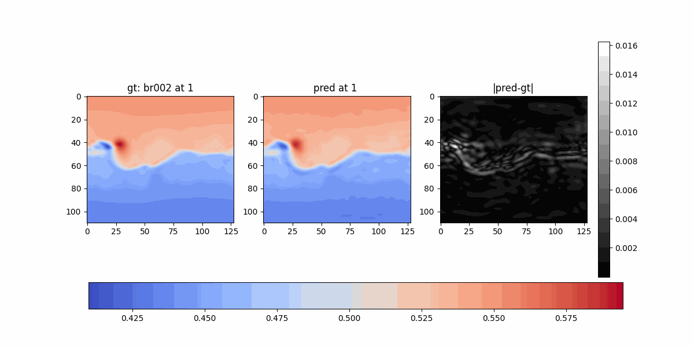
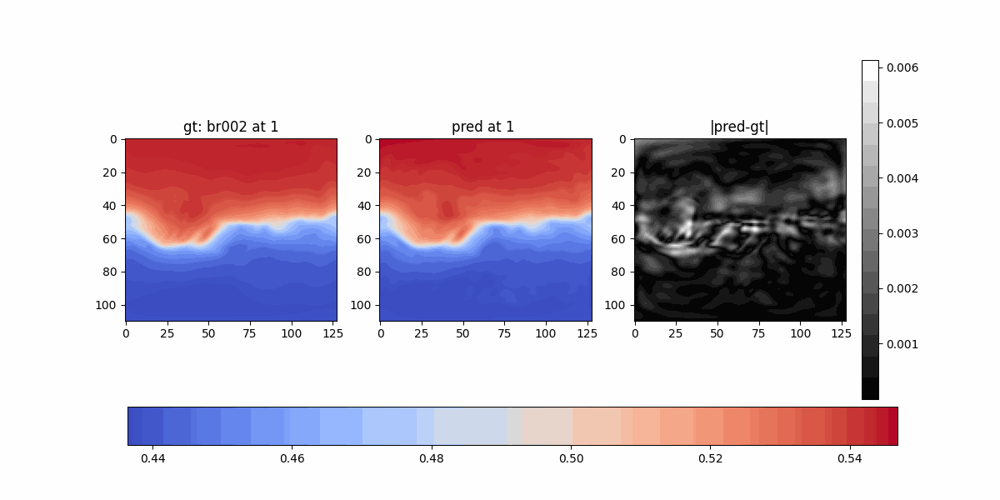
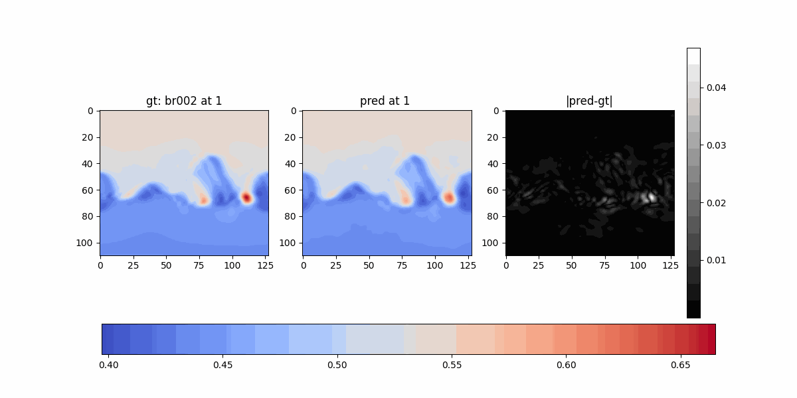

### Experiment 13

- Spherical Fourier Neural Operator
    - `n_modes=(32, 32)`
    - `in_channels=1`
    - `out_channels=140`
    - `hidden_channels=128`
    - `projection_channel_ratio=2`
    - `factorization="dense"`
- 200 epochs
- `vr_r0` (resized from `(180, 360)` to `(111, 128)`) -> `vr002` (`(111, 128)`)
    - One single pass of the boundary condition for predicting the whole cube
- All instruments
    - 680 cubes train, 227 test
- 30 mins training
- batch size: 32
- Optimizer: AdamW
- Loss: LpLoss(p=2)

Original resolution of the solutions: (111, 128)

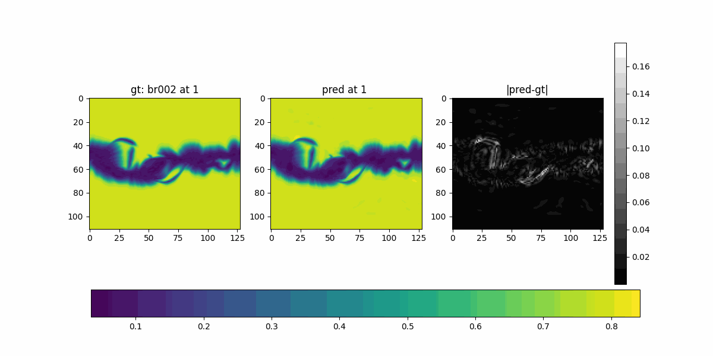

Zero-shot super resolution of the original boundary condition: (180, 360)

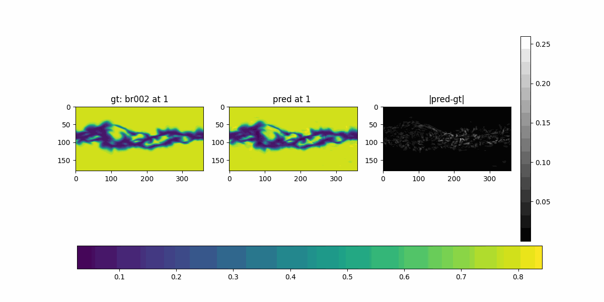

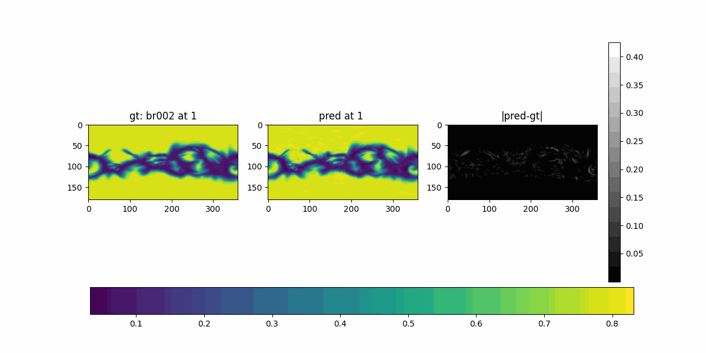

Any resolution: (64 x 64)

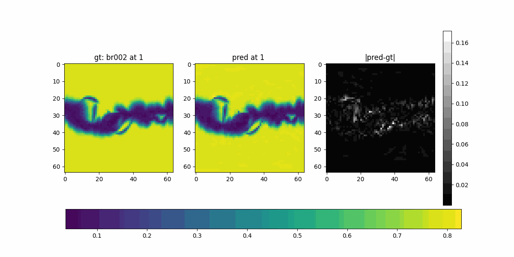

Constant cube:

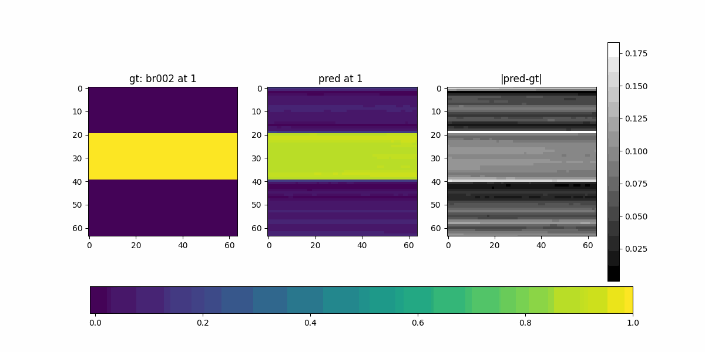

## <a href="https://icml.cc/virtual/2024/tutorial/35235">Neural Operator Notes nVIDIA - ICML 2024</a>

- Neural network: R (d) to R (d) - Mapping between finite dim object to finite dim object
- Data is not always an image, language tokens etc. Sometimes it's a function defined on a sphere.
    - Model the phonomena using deifferential and algerbraic equations
        - Schrodinger
        - Darcy
        - Maxwell
        - Navier-Stokes
        - Fluid dynamics
        - Thermodynamics laws
        - Helmholtz
    - Develop suitable conventional solvers to solve these equations at certain resolutions
        - Finite difference
        - Elements
        - Volume methods
        - Spectral
        - ...
- Alternative: ML on functions (neural operator)
    - Model outputs a function (can be queried at any point)
        - derivatives: for obeying physics laws
        - integrals: for physical quantities

- Pre-requisites
    - Integral = fine Riemannian sum, finder mesh -> better approximations
    - Given the values at two points you can calculate the derivatives (finite differences)

- From neural networks to neural operators

- Input can be given at any resolution 64 x 64 (higher resolution, still the same operator (?slide 50)) 
- Output can be queried at any point 1024 x 1024

- The way you calculate the integral:
    - Fourier bases: FNO
    - PCA: PCA-NO
    - Laplace: LNO
    - Represent by an implicit neural network (Graph NO, DeepONet)

- Graph neural operator is local integration

- UNet's equivalent in Neural operator 
    - It's called Multi-pole GNO (MPGNO) 
    - There is also U-Sahped neural oeprator (UNO)
    - Shrinks down the domain size

- There is also transformer Neural Operator

- Main components
    - Integration, global (FNO) or local (GNO)
    - Residual connection (point-wise)
    - Bias function (point-wise)
    - Derivatives: calculable with a CNN kernel
    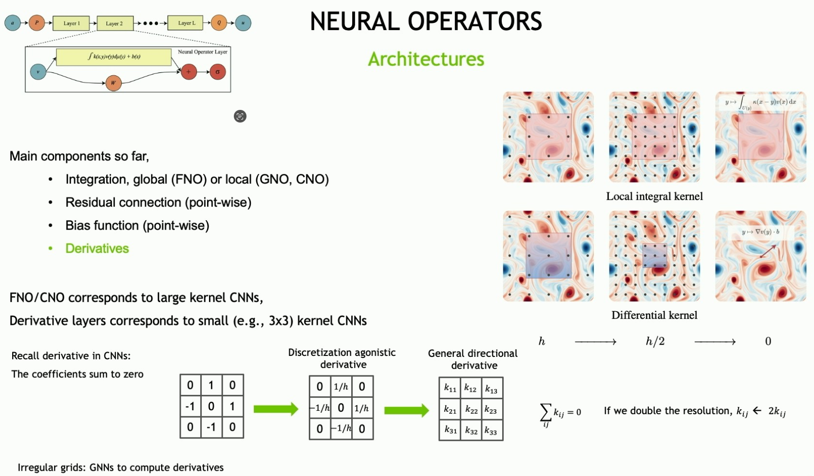

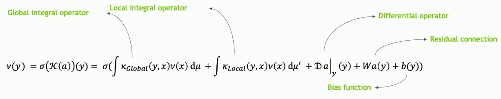

- Domain-specific loss functions (sesimology, weather forecast st.), still unknown

- FourCastNet is a FNO and 45k times faster than current models
    - L2 loss on function space
    - Adaptive FNO
        - Actually: Spherical-harmonic Fourier Neural Operator (SFNO)
            - Bases functions are spherical harmonics
            - Gaussian quadrature for sum
            - MLP based residual connections

## Resources
1. Neural operator: Graph kernel network for partial differential equations, Zongyi Li, Nikola Kovachki, Kamyar Azizzadenesheli, Burigede Liu, Kaushik Bhattacharya, Andrew Stuart, Anima Anandkumar
2. Neural operator: Learning maps between function spaces, Nikola Kovachki, Zongyi Li, Kamyar Azizzadenesheli, Burigede Liu, Kaushik Bhattacharya, Andrew Stuart, Anima Anandkumar
3. Blog post by Zongyi Li, https://zongyi-li.github.io/blog/2020/graph-pde/
4. `neuralop` package https://neuraloperator.github.io

5. DeepXDE Software Lu Lu: https://github.com/lululxvi/deepxde
6. DeepXDE Paper Lu Lu: https://arxiv.org/abs/1907.04502