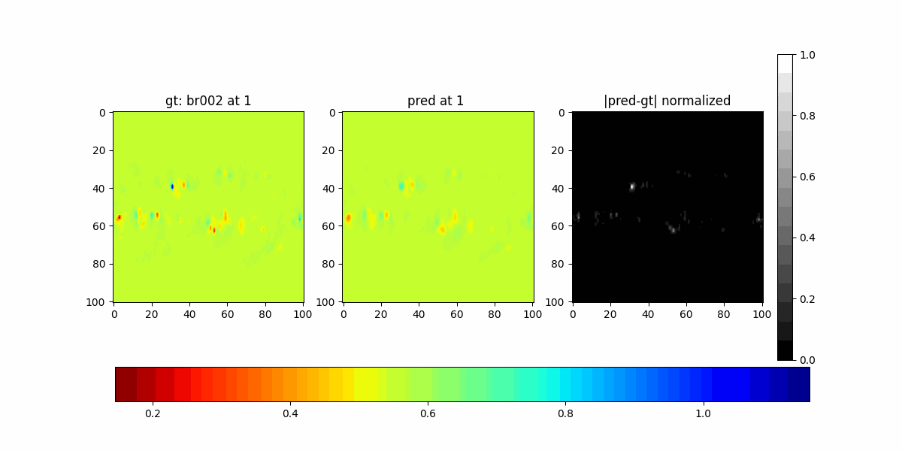
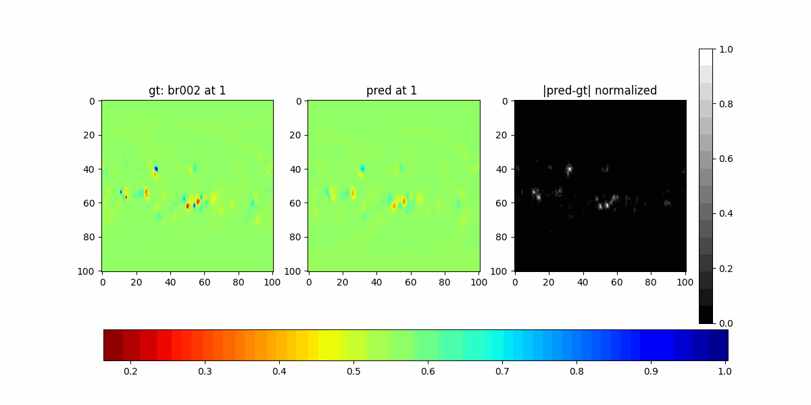
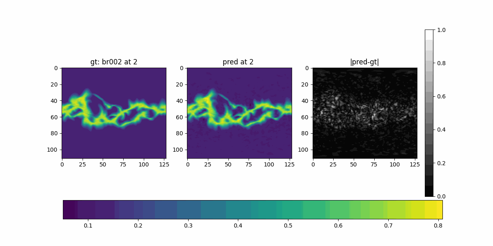
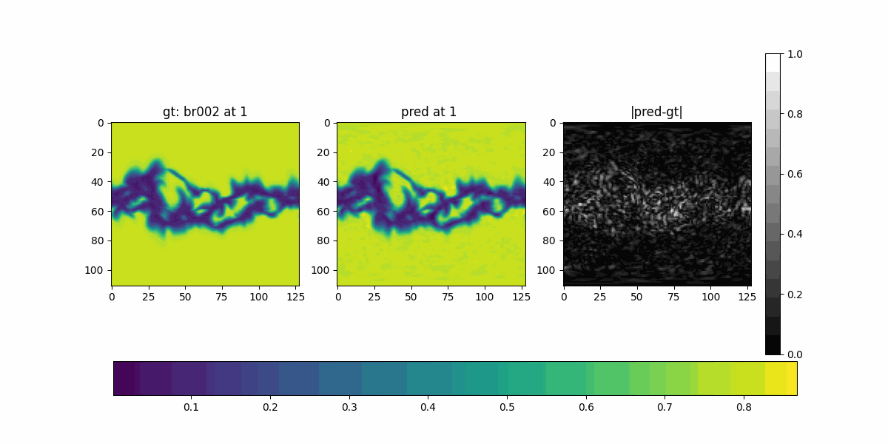
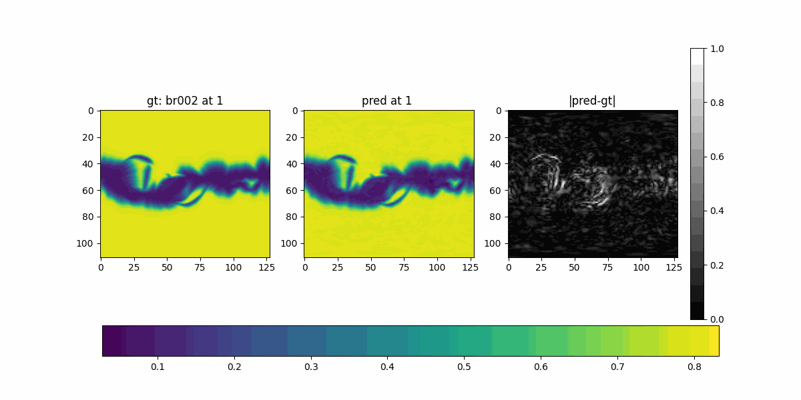
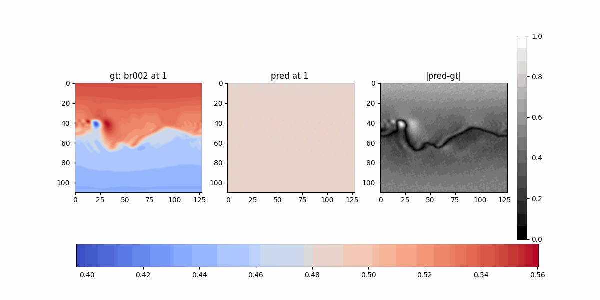
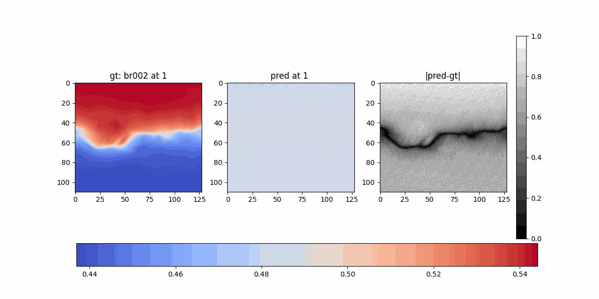

# SFNO on PFSS, MHD rho/vr and DeepONet

## Experiment 14

- PFSS
- `br`
- Model: SFNO

```
n_modes=64
hidden_channels=128
epochs=500
train_size=35
validation_size=12
```





## Experiment 15

- MHD
- `vr` and `rho` interleaved
- Model: SFNO

```
n_modes=64
hidden_channels=128
epochs=500
train_size=680
validation_size=227
```







## Experiment 16

- MHD
- `vr` and `rho` interleaved
- Model: CartesianProductDeepONet


```
epochs=500
train_size=680
validation_size=227
```





## References
- A blog post on a DeepONet simple example: https://towardsdatascience.com/operator-learning-via-physics-informed-deeponet-lets-implement-it-from-scratch-6659f3179887/