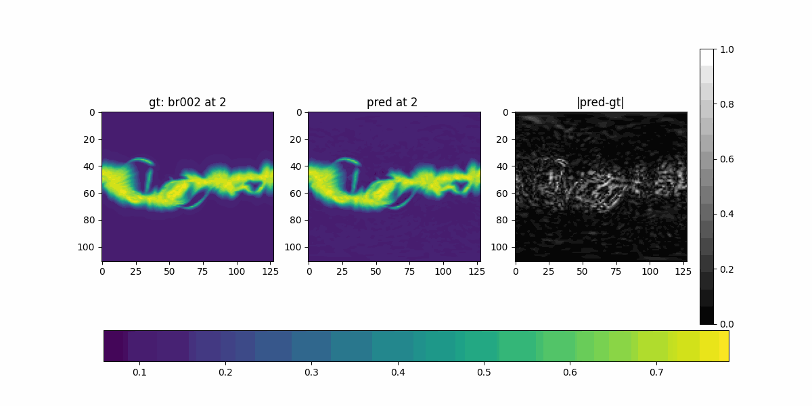

## `factorization` in model arguments

```python
'''
factorization : str or None, {'tucker', 'cp', 'tt'}, default is None
If None, a single dense weight is learned for the FNO.
Otherwise, that weight, used for the contraction in the Fourier domain
is learned in factorized form. In that case, `factorization` is the
tensor factorization of the parameters weight used.
'''
```

Happens after FFT/SHT and before (FFT/SHT)^-1


| Decomposition              | Idea                              | Storage drops from … to …             |
|---------------------------|-----------------------------------|----------------------------------------|
| **Dense**                 | Full tensor with no compression   | O(n^d)              |
| **CP / CANDECOMP–PARAFAC**| Sum of rank‑1 outer products      | O(n^d) -> O(rdn)      |
| **Tucker**                | Core tensor × factor matrices     | O(n^d) -> O(r^d + rdn)  |
| **TT (Tensor‑Train)**     | Chain of 3‑D cores                | O(n^d) -> O(dnr^2)      |


## Experiments

```python
n_modes=64
hidden_channels=128
epochs=500
```

### Experiment 17
Velocity, Dense factorization


### Experiment 18
Density, Dense factorization


### Experiment 19
Velocity, Tucker factorization


### Experiment 20
Velocity, CP factorization


### Experiment 21
Velocity, TT factorization


## Experiment 15
Velocity & Density Interleaved



## Experiment 22
Velocity & Density Interleaved + Physical loss


## Comparison

- Factorization

    | Experiment| Data loss|
    |-----------|----------|
    |Tucker (19)|96.88677144050598|
    |cp (20)|100.67680716514587|
    |Dense (17)|122.72271728515625|
    |tt (21)|173.94258379936218|


- Uni vs. Bimodal vs. Bimodal Physics-informed

    - velocity (v)

    | Experiment| Data loss|
    |-----------|----------|
    |unimodal (17)|122.72271728515625|
    |bimodal (15)|162.18755340576172|
    |bimodal & physics informed (22)|147.30733394622803|

    - density (rho)

    | Experiment| Data loss|
    |-----------|----------|
    |unimodal (18)|684.3484182357788|
    |bimodal (15)|750.3442726135254|
    |bimodal & physics informed (22)|700.9082899093628|


## Alternative
- SFNO1 for v
- SFNO2 for rho
- Loss = data_loss_1 + data_loss_2 + physical_loss


### todo
- test units in physical loss
- physical loss on ground truth should be 0
- <a href="https://arxiv.org/abs/2111.03794">PINO (physics informed neural operator)</a>
- grid search for n_modes, hidden_channels, lift/projection #channels