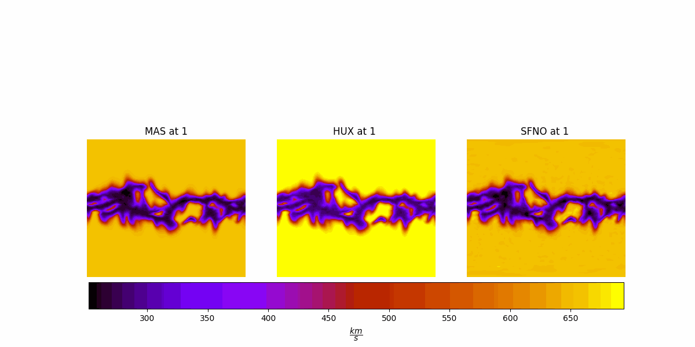
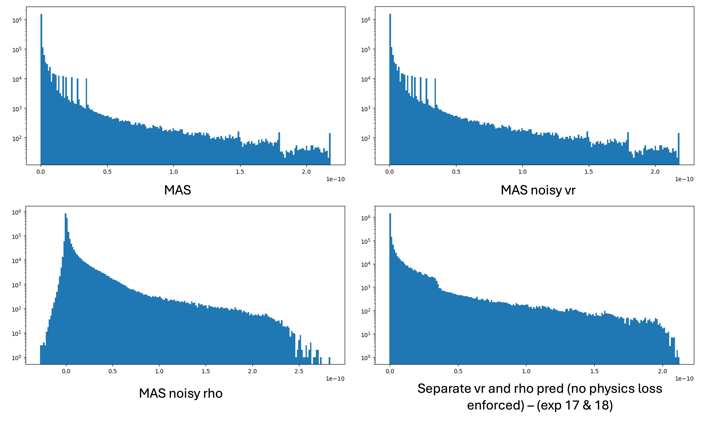

## SFNO vs HUX

SFNO is from exp 17

- `cr2233/hmi_masp_mas_std_0201`



- `cr2239/hmi_mast_mas_std_0201`


## Factorization means more modes?


## Coupled v and rho prediction with physical loss (simplified eq. 6)

### Derivative calculation:

Options:

- ~~Finite differences (order delta r error)~~
- ~~Autograd (not possible since r is not in my computation graph)~~
- Spectral derivatives

#### Using fast fourier transform:
```py
Nr = v.shape[radial_dim]

# complex spectrum, shape (Nr, 111, 128)
v_hat = torch.fft.fft(v, dim=radial_dim) 

# wavenumbers k = 2π n / L  (L = Nr·dr)
k = 2 * math.pi * torch.fft.fftfreq(Nr, d=dr, device=v.device)  # (Nr,)
k = k.view(Nr, 1, 1)                     # reshape for broadcasting

# 4. multiply by ik to get derivative in spectral space
dv_hat = 1j * k * v_hat

# 5. back-transform
dv_dr = torch.fft.ifft(dv_hat, dim=radial_dim).real   # keep real part
```
<a href="https://www.youtube.com/watch?v=y8SqkjoKV4k">reference</a>


*Though it works, FFT is for planar grids, we have spherical grids.*

*SFNO is better than FNO. Using some type of spherical harmonics transform instead of FFT is better?*

#### MAS to Real Conversion
Steps:
1. Inverse min-max normalization for both v and rho
2. convert to meter/kg/second (or centimeter/gram/second) units (MAS Guide page 81 table):
    - v (x 481.3711) km/s
    - rho (x 1.6726e-13) kg/m^3
    - p (x 3.875717e-2) Pa
    - r (x 695,700) km 
        - table says meter though
        - To be consistent with v (km/s)
        - Opal also did the same in HUX


#### Dimensional analysis

- g = G (gravitational constant): dimensions won't match
- g[r] = GM/r**2: dimensions match

#### Physical Loss (Ground truth) = 0?

##### For a MAS instance:


##### For a MAS instance with noise added to v:
mu = mean of cube, std = std of cube


##### For a MAS instance with noise added to rho:
mu = mean of cube, std = std of cube


##### For my two separate rho/v predictions (no physics loss):


##### Comparison
log-scaled hist


## HUX (Pete and Opal Issan)
- <a href="https://www.frontiersin.org/journals/astronomy-and-space-sciences/articles/10.3389/fspas.2021.795323/full">paper</a>
- <a href="https://github.com/predsci/HUX-paper3/tree/main">repo</a>