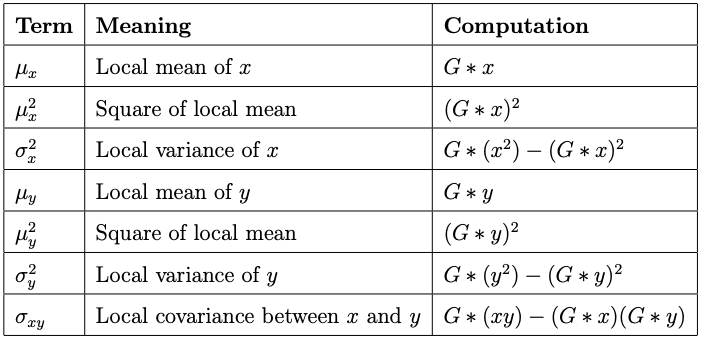
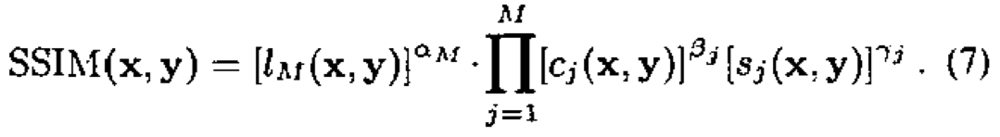
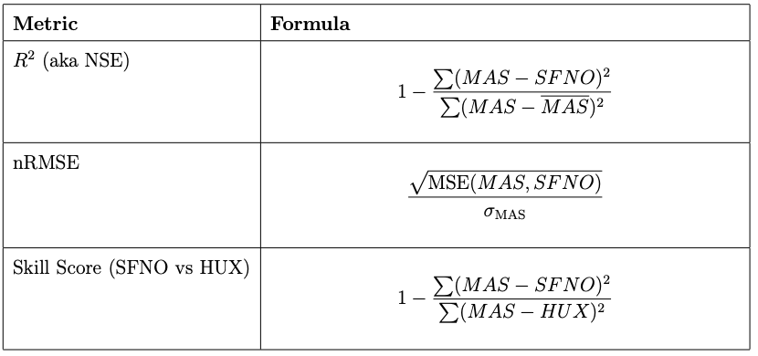

## CV Script done

## Train Script done

## Factorization?

## Metrics?

## Shrink high-res to medium

## Fix flickering?

1. R^2 score, aka NSE (Nash-Sutcliffe Efficiency)

$$
1 - \frac{\sum (y - \hat{y})^2}{\sum (y - {\mu}_y)^2}
$$

- Details:

    - -inf to 1, 0: prediction=mean
    - Normalize it
    - NNSE = 1 / (2-NSE)
        - (0 to 1)
        - 0.5: prediction=mean

2. SSIM

$$
\text{SSIM}(x, y) = 
\frac{(2\mu_x \mu_y + C_1)(2\sigma_{xy} + C_2)}
     {(\mu_x^2 + \mu_y^2 + C_1)(\sigma_x^2 + \sigma_y^2 + C_2)}
$$

- Details:

    - Three aspects:

        - luminance (l): means
        - contrast (c): variances
        - structure (s): covariance

    - -1 to 1
    - a 11 x 11 x 11 gaussian kernel calculating SSIM in all coordinates
    
    - multiscale MSSIM is also available
        - does the SSIM in 5 scales, downsampled (2) by average pooling
        - combines it by weighting
        
        - our cube sizes are incompatible (says larger than 160, needs a fix)

3. ACC (used in SFNO paper for spatiotemporal ERA5 data, weather prediction)

- f: forecast (prediction)
- a: actual dispatch targets (ground truth)
- c: climatology (mean of training set?)

4. LPIPS
5. PSNR

# Optimal SFNO to beat HUX (vr)

## Hyperparameters

- Factorization:
    - Dense
    - CP
    - Tucker
    - TT

- Modes:
    - 8
    - 16
    - 32
    - 64
    -128

- Hidden Channels:
    - 64
    - 128
    - 256
    - 512

- Projection/Lifting Ratio:
    - 1
    - 2
    - 4
    - 8
    - 16

## Training/validation strategy

1. 5-fold cross validation to get best hyperparameters
2. Splits are made with carrington rotations, not instruments/datacubes in carrington rotations
3. Train with the best configuration on 80% and report on 20%

## Metrics

1. R^2 score, aka NSE (Nash-Sutcliffe Efficiency)
    - (-inf to 1)
    - Normalize it
    - NNSE = 1 / (2-NSE)
        - (0 to 1)
2. nRMSE
    - Normalized (by the spread of the data) Root MSE
3. Skill score (for comparison with HUX)

| Metric                        | Formula                                                                                   | Meaning                                |
|:-------------------------------|:------------------------------------------------------------------------------------------|:---------------------------------------|
| $R^2_{\text{SFNO}}$         | $1 - \frac{\sum (MAS - SFNO)^2}{\sum (MAS - \overline{MAS})^2}$                      | How well SFNO predicts MAS             |
| $\text{NSE}_{\text{SFNO}}$  | $1 - \frac{\sum (MAS - SFNO)^2}{\sum (MAS - \overline{MAS})^2}$                      | Same as $R^2$, common in physics     |
| $\text{Skill}_{\text{SFNO vs HUX}}$ | $1 - \frac{ \sum (MAS - SFNO)^2 }{ \sum (MAS - HUX)^2 }$ | How much SFNO outperforms HUX baseline |
