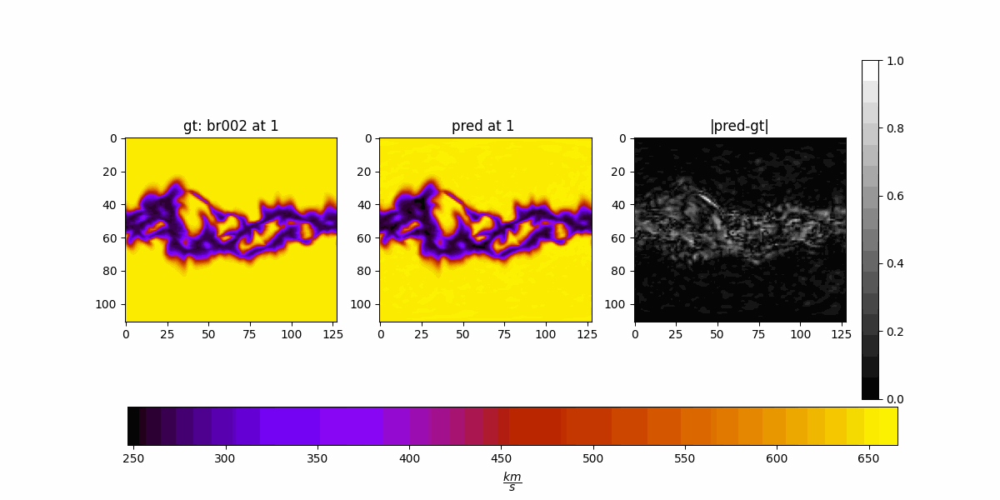

# 1. Regression Performance Metrics

## 1.1. RMSE

Root mean squared error

Lower better

$$
RMSE=\sqrt{MSE(y, \hat{y})}
$$

## 1.2 NSE ($$R^2$$)

Nash-Sutcliffe Efficiency

Higher better

$$
NSE = 1 - \frac{\sum (y - \hat{y})^2}{\sum (y - {y}_{clim})^2}
$$

- $${y}_{clim}$$ is the climatology
    - a `(140, 111, 128)` data cube
    - mean of the training data


- Our NSE will be mean of this score across all coordinates
- Range: $$(-\infty,1]$$
    - $$0$$ means $$\hat{y}={y}_{clim}$$
- NNSE (Normalized NSE)
    - So, $$NNSE = 1 / (2-NSE)$$
    - Range: $$[0,1]$$
    - $$0.5$$ means $$\hat{y}={y}_{clim}$$


## 1.3. ACC

- Higher better
- Anomaly Correlation Coefficient
- Used in SFNO paper for spatiotemporal ERA5 data, weather prediction

$$
ACC = \frac{\sum(\hat{y}-{y}_{clim})(y-{y}_{clim})}{\sqrt{\sum{(\hat{y}-{y}_{clim})}^2}{\sqrt{\sum{(y-{y}_{clim})}^2}}}
$$

- $$\hat{y}$$: forecast (prediction)
- $$y$$: actual dispatch targets (ground truth)
- $${y}_{clim}$$: climatology (mean training set cube)


## 1.4. SSIM

Structural similarity index measure

$$
\text{SSIM}(x, y) = 
\frac{(2\mu_x \mu_y + C_1)(2\sigma_{xy} + C_2)}
     {(\mu_x^2 + \mu_y^2 + C_1)(\sigma_x^2 + \sigma_y^2 + C_2)}
$$

- Higher better
- With $$x=\text{prediction cube}, y=\text{ground truth cube}$$

- A `(11, 11, 11)` gaussian kernel will be convolved (depthwise/separable) with $$x$$ and $$y$$


- Take the mean across all coordinates

- Three aspects $$SSIM = l(x, y) \times c(x, y) \times s(x, y)$$
    - luminance: $$l(x, y)=2\mu_A \mu_B + C_1 \ /\  2\mu^2_A + \mu^2_B + C_1$$
    - contrast $$c(x, y)=2\sigma_A \sigma_B + C_2 \ /\  2\sigma^2_A + \sigma^2_B + C_2$$
    - structure $$s(x, y)=2\sigma_{AB} + C_3 \ /\  \sigma_A \sigma_B + C_3$$, ($$C_3 = C_2 / 2$$)

- Range: $$[-1,1]$$

- Multiscale variant: *MS-SSIM*
    - does the SSIM in 5 scales, downsampled (2) by average pooling
    - combines it by weighting `[0.0448, 0.2856, 0.3001, 0.2363, 0.1333]`
    - simplified expression gives: $$\text{MS-SSIM}(x, y) = l_M(x, y)^{\alpha_M} \prod_{j=1}^{M-1} \text{cs}_j(x, y)^{\beta_j}$$
    - With $$l_M(x, y)$$ being the luminance term at the most coarse scale (last) and $$\alpha_M=0.1333$$
    - And $$\text{cs}_j(x, y)=\text{c}_j(x,y)\times\text{s}_j(x,y)$$ at previous scales and $$\beta_j=$$`weights[j]`
    - Problem
        - Our 111 dimension downsampled 4 times will be $$\frac{111}{2^4}\approx6.93 < 11 \text{ (kernel size)}$$
        - `assert smaller_side > (win_size - 1) * (2 ** 4)`
        - ~~Zero-padding if 111 is close to 160~~
        - *Or, smaller kernel: next kernel choice is 7*
        - and $$\sigma \text{of kernel}: 1.5 \rightarrow 1.0$$


## 1.5. LPIPS


```py
import lpips
loss_fn_alex = lpips.LPIPS(net='alex') # best forward scores
loss_fn_vgg = lpips.LPIPS(net='vgg') # closer to "traditional" perceptual loss, when used for optimization

import torch
img0 = torch.zeros(1,3,64,64) # image should be RGB, IMPORTANT: normalized to [-1,1]
img1 = torch.zeros(1,3,64,64)
d = loss_fn_alex(img0, img1)
```
- Will ignore our radial dimension (going with mean of 2D slices)
- Current implementation uses 3 channel images (because of the sot networks alexnet etc.)
- Lower better

## 1.6. PSNR

$$
\text{PSNR}(y, \hat{y}) = 10 \cdot \log_{10} \left( \frac{\text{max}^2(y)}{\text{MSE}(y, \hat{y})} \right)
$$

- Higher better
- Range $$[0,\infty]$$
- Measures image or signal reconstruction quality

## 1.7 Others

- Feature Similarity Index Measure (FSIM)
- Information theoretic-based Statistic Similarity Measure (ISSM)
- Signal to reconstruction error ratio (SRE)
- Spectral angle mapper (SAM)
- Universal image quality index (UIQ)


## 1.8. Which ones I want go with

- RMSE (Root Mean Square)
- NNSE (Normalized NSE)
- ACC (Anomaly Correlation Coefficient)
- MS-SSIM (Multiscale Structural Similarity Index Measure)
- PSNR


| Noise Scale |   RMSE $$\downarrow$$   |   NNSE $$\uparrow$$   |   ACC $$\uparrow$$  |   PSNR $$\uparrow$$   |   MS-SSIM $$\uparrow$$  |
|-------------|----------|----------|---------|-----------|-------------|
| 0.01        | 0.00999  | 0.99481  | 0.99787 | 40.01     | 0.99314     |
| 0.1         | 0.04999  | 0.88430  | 0.94063 | 26.02     | 0.90880     |
| 0.5         | 0.10002  | 0.65633  | 0.81033 | 19.99     | 0.79606     |


# 2. Shrinking high resolution MAS to use as medium resolution


# 3. Dataset Splitting

- 598 CRs (originally medium) + 54 CRs (shrunk to medium) = 652 CRs = 1069 `vr002.hdf` files from different instruments
- All train/val/test splits will be made on the CRs
- A train/test split once and for all
    - 80% training ~522 CRs
    - 20% testing ~130 CRs
    - Calling the 80% training split D, doing 5-fold cross validation to find hyperparams
    - For each hyperparameter combination:
        - 80% of D for training ~417 CRs
        - 20% of D for validation ~105 CRs

# 4. Hyperparameter search

- Candidates:

| Hyperparameter           | Values                         |
|--------------------------|---------------------------------|
| **Factorization**        | Dense, CP, Tucker, TT           |
| **Modes**                | 8, 16, 32, 64, 128              |
| **Hidden Channels**      | 64, 128, 256, 512               |
| **Projection/Lifting Ratio** | 1, 2, 4, 8, 16               |

For a k-fold cross validation: $$k\times4\times5\times4\times5=400k$$ runs.

Alternatives:

- Random search
- <a href="https://arxiv.org/abs/1603.06560">Hyperband</a>
    1. Search the full grid but models are trained shorter or on subset of data
    2. Select the winner configurations
    3. Search the winner among those with longer training and on the whole data
- Bayesian optimization
    - <a href="https://optuna.org/">Optuna</a>


# 5. New experiments

See if we can fix flickering.

## 5.1. Exp 23

Max candidate for projection (P and Q) = 16


```py
  "projection_channel_ratio": 16,
  "num_epochs": 200,
  "batch_size": 64,
  "hidden_channels": 128,
  "n_modes": 64,
  "factorization": "dense"
```

### Visual Comparison

Comparing with Exp 17. Every hyperparameter is the same but `projection_channel_ratio`=2.

- `projection_channel_ratio`=2 (Exp 17)

- `projection_channel_ratio`=16 (Exp 23)


16 is $$\approx$$ same or even worse than 2.

### Loss and metrics


## 5.2. Exp 24

Min candidate for n_modes = 8 and projection back to 2.

```py
  "n_modes": 8,
  "projection_channel_ratio": 2,
  "num_epochs": 200,
  "batch_size": 64,
  "hidden_channels": 128,
  "factorization": "dense"
```

### Visual Comparison

- `n_modes`=64 (Exp 17)

- `n_modes`=8 (Exp 24)


### Loss and metrics


## 5.3. Exp 25

Maybe the modes control it...

```py
  "n_modes": 128,
  "projection_channel_ratio": 2,
  "num_epochs": 200,
  "batch_size": 64,
  "hidden_channels": 128,
  "factorization": "dense"
```

### Visual Comparison

- `n_modes`=64 (Exp 17)

- `n_modes`=128 (Exp 25)


### Loss and metrics


## Comparing Exp 23 vs. 24 vs 25

| Experiment | n_modes | Projection Ratio | Val Loss | RMSE     | NNSE     | MSSSIM   | ACC      | PSNR    |
|------------|---------|------------------|----------|----------|----------|----------|----------|---------|
| exp_25     | 128     | 2                | 281.25   | 0.02467  | 0.98910  | 0.98088  | 0.99448  | 34.36   |
| exp_23     | 64      | 16               | 306.72   | 0.02717  | 0.98678  | 0.97700  | 0.99329  | 33.36   |
| exp_24     | 8       | 2                | 758.14   | 0.06500  | 0.92850  | 0.87308  | 0.96062  | 25.50   |


## Maybe n_modes is not a hyperparamter?

| **Aspect**              | **Explanation**                                      |
|-------------------------|------------------------------------------------------|
| `n_modes`               | Tuple `(ℓ_max, m_max)` — max degrees of harmonics   |
| Max usable values       | ℓ ≲ N_lat / 2, m ≲ N_lon / 2                          |
| How to choose?          | Use ~50–70% of max, or plot spectral energy          |


# 6. Physical Loss

$$
\rho  v_r \frac{\partial v_r}{\partial r} = -  \frac{\partial p}{\partial r} + \rho g
$$

For MAS, is it zero or small because the variables are small?

Mean of the values for the whole cube:

- Convective term ($$\rho  v_r \frac{\partial v_r}{\partial r}$$): $$3.371118251962845 \times 10^{-22}$$
- Pressure gradient term ($$-  \frac{\partial p}{\partial r}$$): $$2.723992941651573 \times 10^{-16}$$
- Gravitational term ($$\rho g$$): $$3.230910790309221 \times 10^{-12}$$

Residual value: $$3.230910794886196 \times 10^{-12}$$

Lets not multiply $$\rho$$ by `rho_constant=1.6726e-13` (`rho_constant=1`)

- Convective term ($$\rho  v_r \frac{\partial v_r}{\partial r}$$): $$2.01549578617891 \times 10^{-9}$$
- Pressure gradient term ($$-  \frac{\partial p}{\partial r}$$): $$2.723992941651573 \times 10^{-16}$$
- Gravitational term ($$\rho g$$): $$19.31669729946921$$

Residual value: $$19.316697299650734$$


## Todos

- Find `n_modes` (l and m)
- Decide on the training strategy