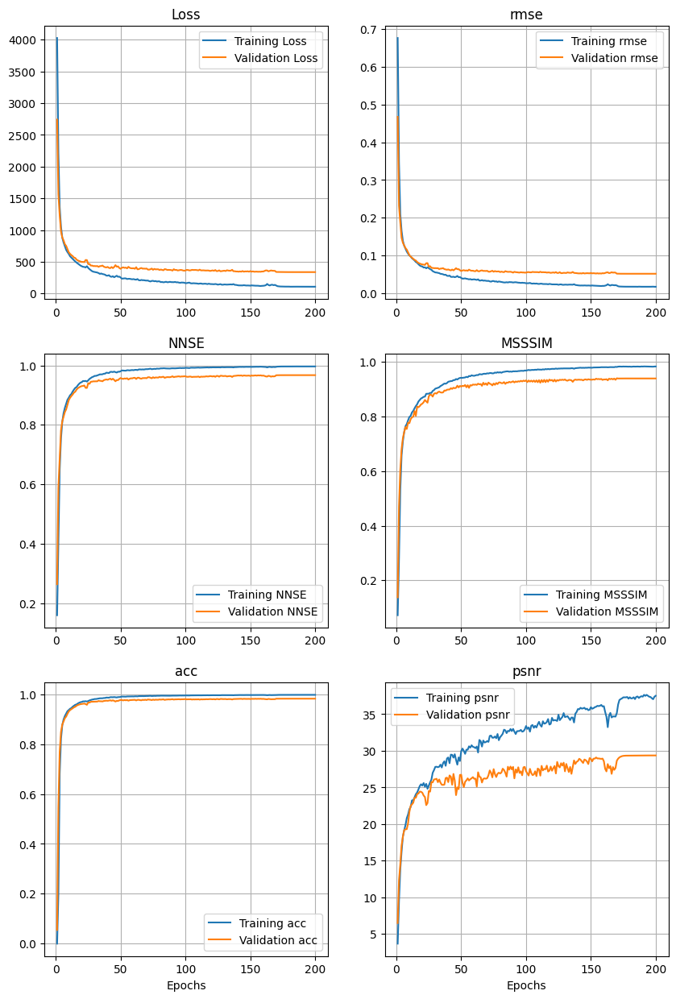
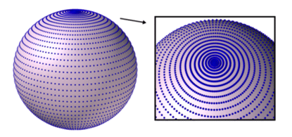
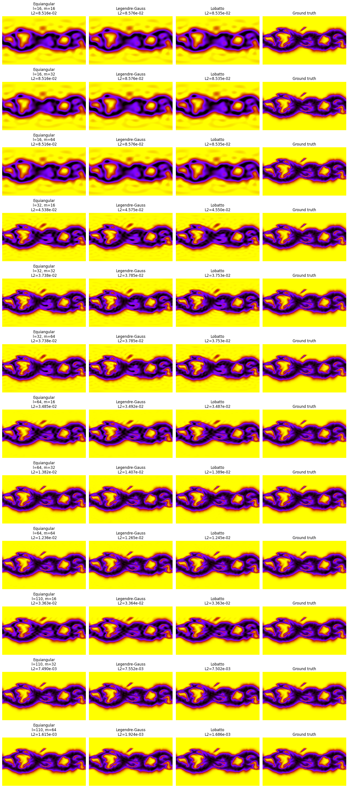
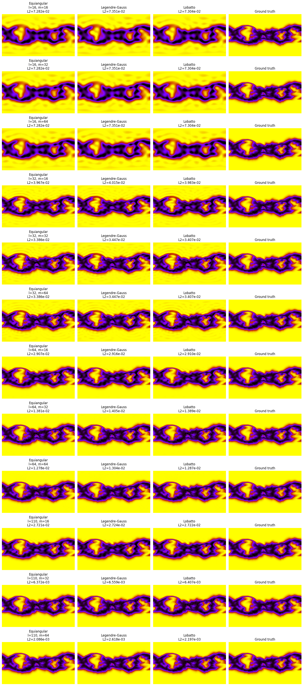
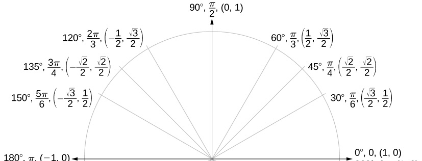
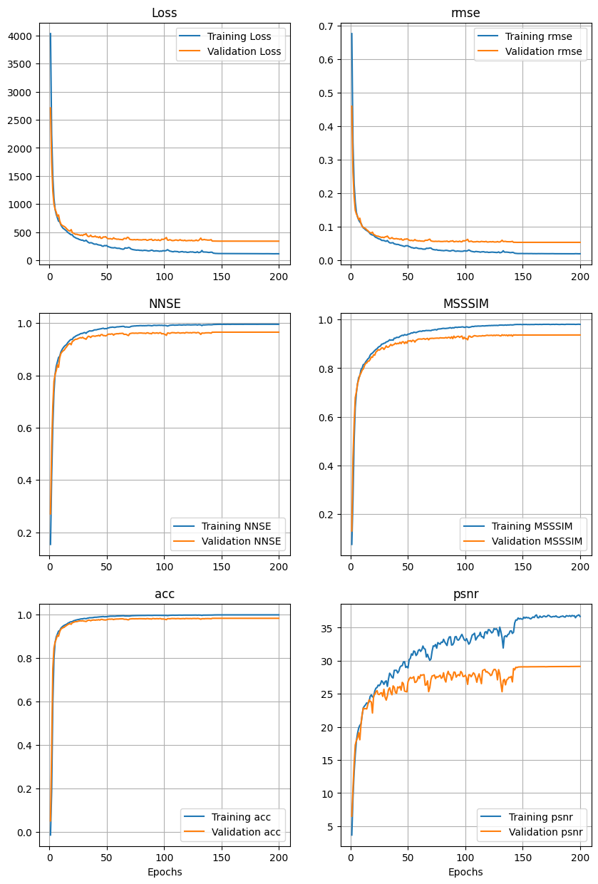
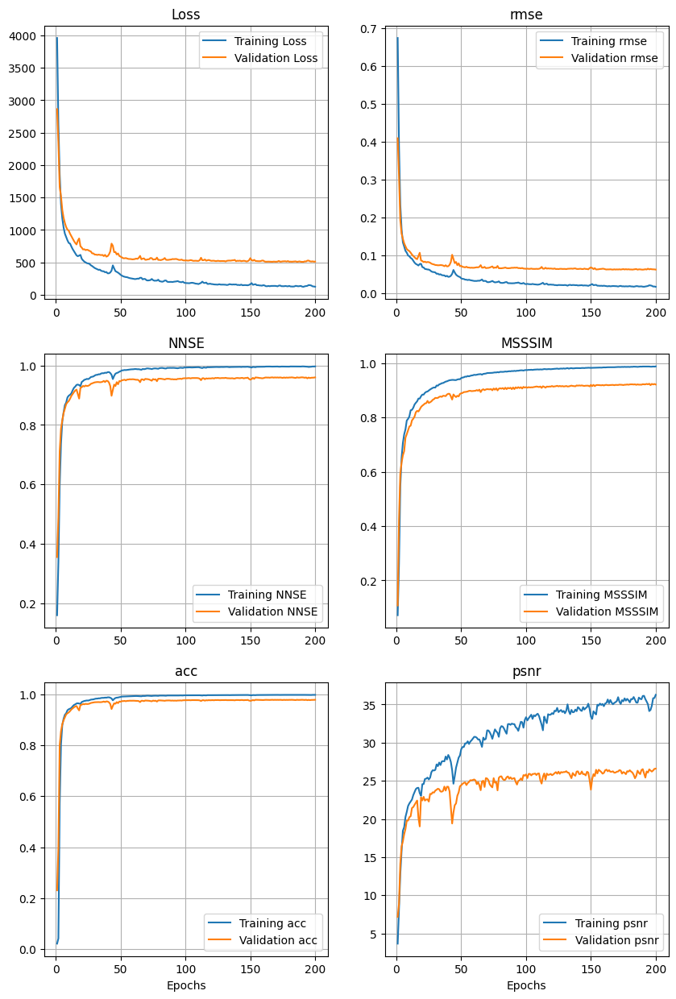
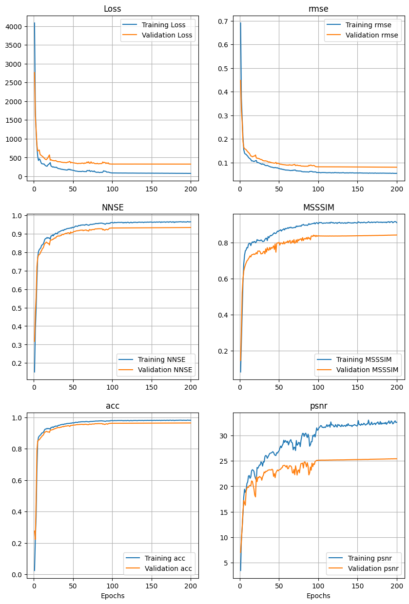
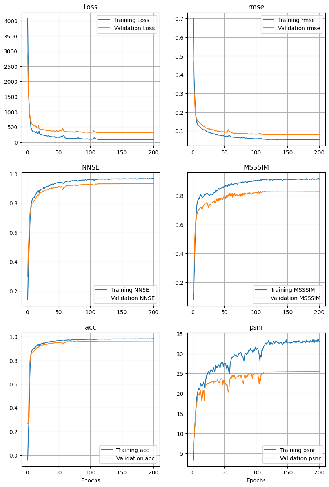

# 1. n_modes


- latitude, $$\phi: [0, 2\pi]$$, periodic, 111 in medium MAS
- longitude, $$\theta: [0, \pi]$$, non-periodic, 128 in medium MAS


## 1.1. $$\phi$$: Shannon Nyquist Sampling Theorem

<i>A function containing no frequency higher than $$\omega$$ Hz, is completely determened by sampling it at $$2\omega$$ Hz.</i>

<i>i.e., to resolve all frequencies in a function, it must be sampled at twice the frequency present.</i>

Example: humans hear up to 22 KHz. `.mp3` files are 44 KHz.

### In our case

$$
m_{max} = 64
$$

<span style="color:red">`neuralop` package knew this. Does the division itself. So:</span>


$$
m_{max} = 128
$$

`>>> neuralop/layers/spherical_convolution.py: line 447`
```py

        out_fft = self.sht_handle.sht(x, s=(self.n_modes[0], self.n_modes[1]//2),
                                      norm=self.sht_norm, grid=self.sht_grids[0])

        out_fft = self._contract(
            out_fft[:, :, :self.n_modes[0], :self.n_modes[1]//2],
            self.weight[:, :, :self.n_modes[0]],
            separable=self.separable,
            dhconv=True,
        )

        x = self.sht_handle.isht(out_fft, s=(height, width), norm=self.sht_norm,
                                 grid=self.sht_grids[1])
```


<a href="https://www.youtube.com/watch?v=FcXZ28BX-xE">Reference</a>


## 1.2. $$\theta$$: polynomial quadrature rules (Gauss-Legendre)

<i>To exactly resolve a polynomial of degree $$\ell$$ you need at least $$\ell+1$$ samples.</i>


### In our case

$$
l_{max}=N_{lat}-1
$$

$$
l = 111 - 1 = 110
$$


### Lets observe it:

#### Example 1:


#### Example 2:


## 1.3. max_n_modes option

You can start with lower number of modes and gradually get to (110, 64).

- Let the model extract more global patterns
- Slowly focus on local patterns


# 2. Experiments

## 2.1. Exp 26

Main difference: maximum n_modes possible: 110 for lat, 64 for lon (110, **128** in code)

Config:
```
num_epochs: 200
batch_size: 32
hidden_channels: 128
n_modes_lat: 110
n_modes_lon: 128
projection_channel_ratio: 2
factorization: "dense"
```

Had to switch to ARCTIC this week. Subset of the whole data and half the batch size:

- 263 cubes for training
- 66 cubes for testing


<span style="color:red">Flickering is still happening.</span>




# 1.4. back to why the flickering happens

Non-uniform area per grid cell (pole crowding effect): In equiangular grids, the grid points in $$\theta$$ (latitude) are uniformly spaced but, near the poles they are smaller and larger near the equator.

| Solution                                  | Why                                          |
|-------------------------------------------|----------------------------------------------|
| Use **Legendre-Gauss grid** in SHT (exp 27)       | Correct area representation, reduces flickering near poles |
| Use **area-weighted loss** (exp 28 & 29) | Ensures model focuses equally per sphere area |
| Apply **smooth tapering** (spectral) exp(30) | Reduces ringing, stabilizes predictions near poles |

Gauss-legnedre grid example:









It will force equal sampled areas.


Area weighted loss



1. Weights are $$sin(\theta)$$
- Less weight to near-pole pixels
- More weight to near-equator pixels
- Why?
    - Maybe the model should not focus on near-pole pixels
    - Small variations in some samples cause the flickering


2. Weights are $$cos^2(\theta)$$
- More weight to near-pole pixels
- Less weight to near-equator pixels
- Why?
    - Make the model actually focus on the high-wind areas


## 2.2. Exp 27

Everything the same as exp 26. Changed `sht_grids` argument in `SphericalConvolution` class to from `'equiangular'` to `'legendre-gauss'`.


<span style="color:red">Flickering is still happening.</span>





## 2.3. Exp 28

Everything the same as exp 26. But $$sin(\theta)$$ weighted.


<span style="color:red">Flickering is still happening. Even worse.</span>



## 2.4. Exp 29

Everything the same as exp 26. But $$cos^2(\theta)$$ weighted.


<span style="color:red">Flickering is still happening. A bit better, but equator preds are bad.</span>




## 2.4. Exp 30

Everything the same as exp 26. But Hann window tapering is applied on $$\ell$$s.

$$
w(\ell) = \frac{1}{2} \left( 1 - \cos\left( \frac{\pi \ell}{\ell_{\text{max}}} \right) \right)
$$

- For low $$\ell$$s it is $$\approx1$$
- For high $$\ell$$s it is $$\approx0$$

The weights get multiplied by the filters $$\kappa$$ (i.e., a low pass filter on the latitude modes).




# 3. Final training/validation strategy


Hyperparameters table from last week:

| Hyperparameter           | Possible Candidate values       | Final Candidate values|
|--------------------------|---------------------------------|-----------------------|
| **Factorization**        | Dense, CP, Tucker, TT           |Dense|
| **Modes_lat**            | 8, 16, 32, 64, 110              |110|
| **Modes_lon**            | 8, 16, 32, 64                   |64 (128 in code)|
| **Hidden Channels**      | 64, 128, 256, 512               |***64, 128, 256*** |
| **Layers** (new!)        | 1, 2, 3, 4 (default, and so far), ... |***4, 8***|
| **Projection/Lifting Ratio** | 1, 2, 4, 8, 16              |***2, 4***|
| **Grid** | equiangular, gauss-legendre, lobatto            |gauss-legendre|


$$

\text{n_experiments}=3 (\text{hidden_channels})\times2(\text{layers})\times2(\text{projection ratio})\times5(\text{k-folds}) + 1=61

$$


# 4. Todos

- Finally fix flickering
- Do the cross-validation (when DMLab cluster is back up)