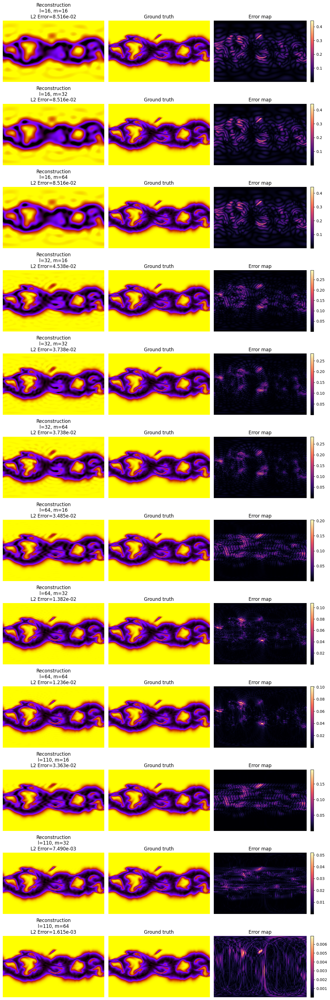
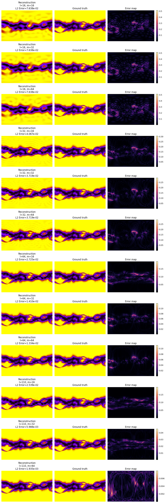

# 1. `n_modes`

- latitude, $$\phi: [0, 2\pi]$$, periodic, 111 in medium MAS
- longitude, $$\theta: [0, \pi]$$, non-periodic, 128 in medium MAS

## 1.1. $$\phi$$: Shannon Nyquist Sampling Theorem

<i>A function containing no frequency higher than $$\omega$$ Hz, is completely determened by sampling it at $$2\omega$$ Hz.</i>

<i>i.e., to resolve all frequencies in a function, it must be sampled at twice the frequency present.</i>

Example: humans hear up to 22 KHz. `.mp3` files are 44 KHz.

### In our case

$$
m_max = 64
$$

<b>`neuralop` package knew this. Does the division itself. So:</b>

$$
m_max = 128
$$

<a href="https://www.youtube.com/watch?v=FcXZ28BX-xE">Reference</a>

## 1.2. $$\theta$$: polynomial quadrature rules (Gauss-Legendre)

<i>To exactly resolve a polynomial of degree $$l$$ you need at least $$l+1$$ samples.</i>

### In our case

$$
l_{max}=N_{lat}-1
$$

$$
l = 111 - 1 = 110
$$

### Lets observe it:

#### Example 1:

#### Example 2:
