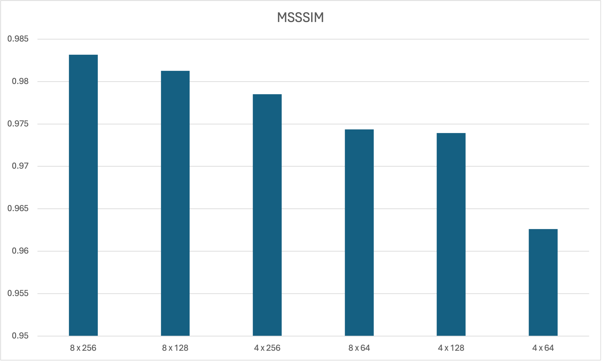

# 1. Target Conferences

| Conference           |  Deadline       | URL | Relevance (out of 5) |
|--------------------------|---------------------------------|-----------------------|----|
|DiscoveryScience      | May 31 (Abstract May 24)           |<a href="https://ds2025.ijs.si/calls/" target="_blank">link</a> (in slovenia?)|5|
|SigSpatial      | June 6 (Abstract May 30)           |<a href="https://sigspatial2025.sigspatial.org/research-submission/" target="_blank">link</a>|2.5|
|**ICDM**      | **June 6**           |<a href="https://www3.cs.stonybrook.edu/~icdm2025/keydates.html" target="_blank">link</a>|4|
|Cogmi      | June 21           |<a href="https://www.sis.pitt.edu/lersais/conference/cogmi/2025/call-for-full-papers/" target="_blank">link</a>|4|
|ICMLA      | July 15           |<a href="https://www.icmla-conference.org/icmla25/keydates.html" target="_blank">link</a>|3.5|
|ICPRS      | August 1           |<a href="https://www.icprs.org/index.html#callforpapers" target="_blank">link</a> (in india?)|2.5|
|BigData      | August 29           |<a href="https://conferences.cis.um.edu.mo/ieeebigdata2025/cfp.html" target="_blank">link</a>|5|

# 2. Final Experiments (1)

Fixed parameters:

|Parameter|Values|
|---------|------|
|modes_lat|110|
|modes_lon|64 (128 in code)|
|factorization|dense|
|projection_channel_ratio|2|
|batch_size|32|

Search space:

|Parameter|Values|
|---------|------|
|hidden_channels|[64, 128, 256]|
|n_layers|[4, 8]|

$$

\text{n_runs}=3 (\text{hidden_channels})\times2(\text{layers})\times5(\text{k-folds}) + 1=31

$$

## 2.1. Results - Metrics

- The data is the first 80% CRs
- 5-fold Cross validation

### Loss

### RMSE

### NNSE

### ACC

### MS-SSIM

### PSNR

Seems like 8 x 256 is the winner. (Lets go higher? 8 x 512?)

## 2.2. 8 x 256 visualization

- Trained from scratch on the first 80% CRs
- Reporting results on the last 20%

## 2.3. Going higher: 8 x 512 visualization

- Trained on the first 80% CRs
- Reporting results on the last 20%