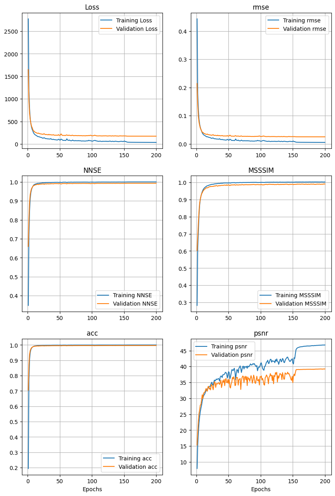
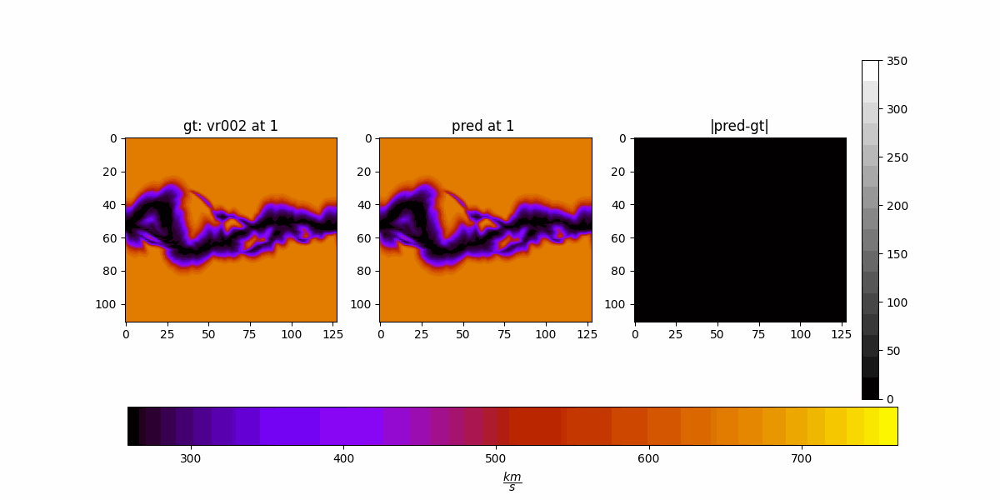
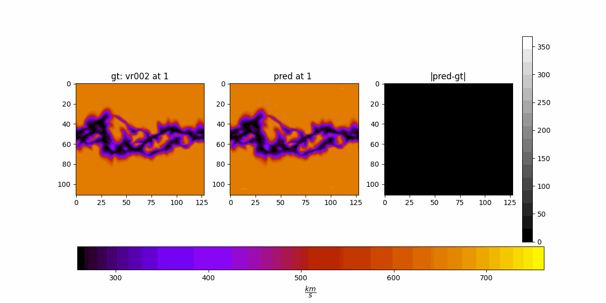
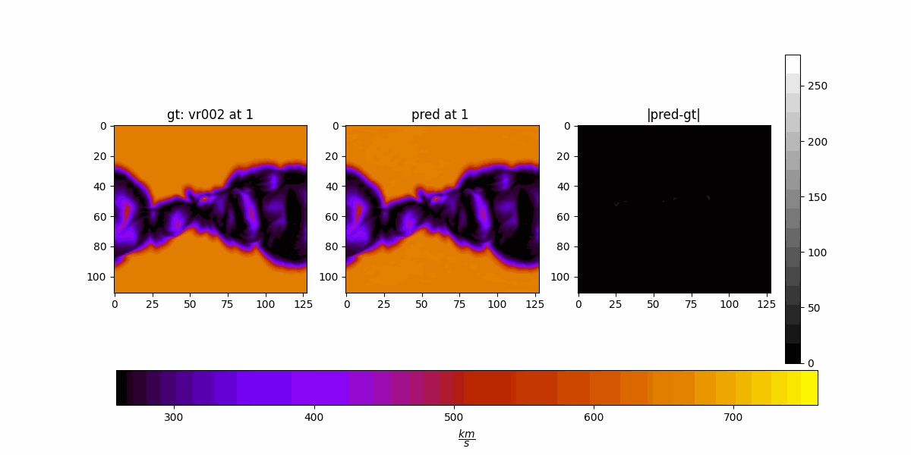
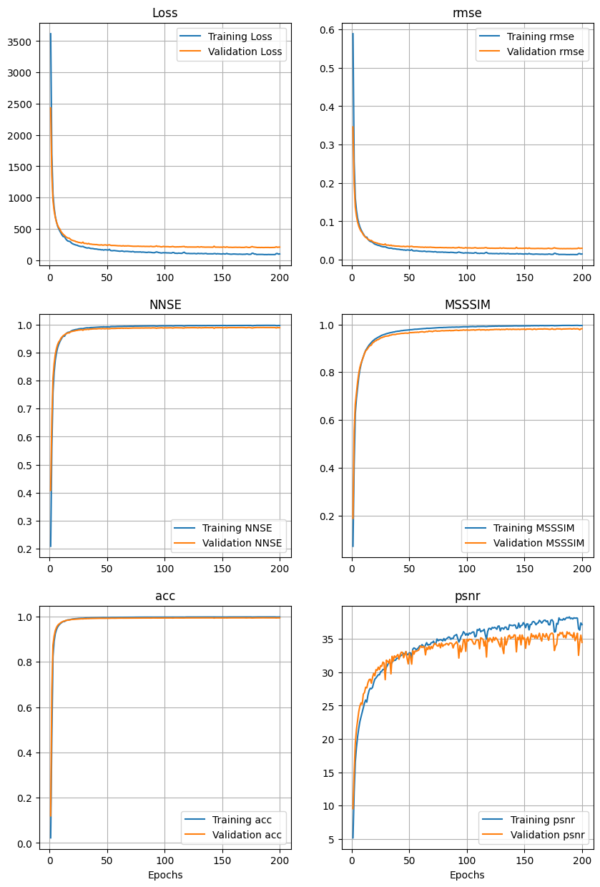

# 1. Target Conferences

| Conference           |  Deadline       | URL | Relevance (out of 5) |
|--------------------------|---------------------------------|-----------------------|----|
|DiscoveryScience      | May 31 (Abstract May 24)           |<a href="https://ds2025.ijs.si/calls/" target="_blank">link</a> (in slovenia?)|5|
|SigSpatial      | June 6 (Abstract May 30)           |<a href="https://sigspatial2025.sigspatial.org/research-submission/" target="_blank">link</a>|2.5|
|**ICDM**      | **June 6**           |<a href="https://www3.cs.stonybrook.edu/~icdm2025/keydates.html" target="_blank">link</a>|4|
|Cogmi      | June 21           |<a href="https://www.sis.pitt.edu/lersais/conference/cogmi/2025/call-for-full-papers/" target="_blank">link</a>|4|
|ICMLA      | July 15           |<a href="https://www.icmla-conference.org/icmla25/keydates.html" target="_blank">link</a>|3.5|
|ICPRS      | August 1           |<a href="https://www.icprs.org/index.html#callforpapers" target="_blank">link</a> (in india?)|2.5|
|BigData      | August 29           |<a href="https://conferences.cis.um.edu.mo/ieeebigdata2025/cfp.html" target="_blank">link</a>|5|

# 2. Final Experiments (1)

Fixed parameters:

|Parameter|Values|
|---------|------|
|modes_lat|110|
|modes_lon|64 (128 in code)|
|factorization|dense|
|projection_channel_ratio|2|
|batch_size|32|

Search space:

|Parameter|Values|
|---------|------|
|hidden_channels|[64, 128, 256]|
|n_layers|[4, 8]|

$$

\text{n_runs}=3 (\text{hidden_channels})\times2(\text{layers})\times5(\text{k-folds}) + 1=31

$$

## 2.1. Results - Metrics

- The data is the first 80% CRs
- 5-fold Cross validation
- 150 epochs for each run

### Loss

### RMSE

$$
RMSE=\sqrt{MSE(y, \hat{y})}
$$

### NNSE

$$
NSE = 1 - \frac{\sum (y - \hat{y})^2}{\sum (y - {y}_{clim})^2}
$$

### ACC

$$
ACC = \frac{\sum(\hat{y}-{y}_{clim})(y-{y}_{clim})}{\sqrt{\sum{(\hat{y}-{y}_{clim})}^2}{\sqrt{\sum{(y-{y}_{clim})}^2}}}
$$

### MS-SSIM

$$
\text{MS-SSIM}(x, y) = l_M(x, y)^{\alpha_M} \prod_{j=1}^{M-1} \text{cs}_j(x, y)^{\beta_j}
$$

### PSNR

$$
\text{PSNR}(y, \hat{y}) = 10 \cdot \log_{10} \left( \frac{\text{max}^2(y)}{\text{MSE}(y, \hat{y})} \right)
$$

Seems like 8 x 256 is the winner. (Lets go higher? 8 x 512?)

## 2.2. 8 x 256 (exp 31)

- Trained from scratch on the first 80% CRs
- Reporting results on the last 20%
- 200 epochs

## 2.3. Going higher: 8 x 512 (exp 32)

- Trained from scratch on the first 80% CRs
- Reporting results on the last 20%
- 200 epochs

Metrics are not representative (?).

## 2.4. Somewhere in the middle: 8 x 64 (exp 33)

- Trained from scratch on the first 80% CRs
- Reporting results on the last 20%
- 200 epochs

# 3. Todos

3.1. metrics for HUX on the test set

3.2. Paper's introduction and background

3.3. Paper's determined methods subsections

3.4. Current loss has been per slice (d=2, norm over slices) L2:

$$
\text{L}_2^{(2D)} = \frac{1}{BCR} \sum_{b=1}^{B} \sum_{c=1}^{C} \sum_{r=1}^{R}
\left( \sum_{i=1}^{H} \sum_{j=1}^{W} \left| x_{bcrij} - y_{bcrij} \right|^2 \right)^{1/2}
$$

Try per cube (d=3, norm over cube) L2 (exp 34)

$$
\text{L}_2^{(3D)} = \frac{1}{BC} \sum_{b=1}^{B} \sum_{c=1}^{C}
\left( \sum_{r=1}^{R} \sum_{i=1}^{H} \sum_{j=1}^{W} \left| x_{bcrij} - y_{bcrij} \right|^2 \right)^{1/2}
$$

Also try adding an L1 term to it (exp 35)

$$
\text{L}_1^{(3D)} = \frac{1}{BC} \sum_{b=1}^{B} \sum_{c=1}^{C}
\sum_{r=1}^{R} \sum_{i=1}^{H} \sum_{j=1}^{W} \left| x_{bcrij} - y_{bcrij} \right|
$$