## 3D L2 Loss (exp 34)

2D:

$$
\text{L}_2^{(2D)} = \frac{1}{BCR} \sum_{b=1}^{B} \sum_{c=1}^{C} \sum_{r=1}^{R}
\left( \sum_{i=1}^{H} \sum_{j=1}^{W} \left| x_{bcrij} - y_{bcrij} \right|^2 \right)^{1/2}
$$

3D:

$$
\text{L}_2^{(3D)} = \frac{1}{BC} \sum_{b=1}^{B} \sum_{c=1}^{C}
\left( \sum_{r=1}^{R} \sum_{i=1}^{H} \sum_{j=1}^{W} \left| x_{bcrij} - y_{bcrij} \right|^2 \right)^{1/2}
$$

- 8 x 256 architecture
- Trained from scratch on the first 80% CRs
- Reporting results on the last 20%
- 200 epochs

Example 1

3D

2D

Example 2

3D

2D

Example 3

3D

2D

Example 4

3D

2D

Example 5

3D

2D

Metrics

3D

<!-- 2D
 -->

Numerical comparison

| Loss fn | Val Loss $$\downarrow$$ | RMSE $$\downarrow$$ | NNSE $$\uparrow$$ | MSSSIM $$\uparrow$$ | ACC $$\uparrow$$ | PSNR $$\uparrow$$ |
|--------|----------|------|------|--------|-----|------|
| 2D L2  | 172.1135 | 0.0249 | 0.9927 | 0.9907 | 0.9963 | 39.22 |
| 3D L2  | 1.3854   | 0.0262 | 0.9920 | 0.9869 | 0.9959 | 38.55 |

Numerically, 2D beats 3D. Visually, in my opinion, 3D beats 2D. **Gonna go with 2D.**

## L2 + L1 Loss (exp 35)

- 8 x 256 architecture
- Trained from scratch on the first 80% CRs
- Reporting results on the last 20%
- 200 epochs

Example 1

2D L2 + L1

2D L2

Example 2

2D L2 + L1

2D L2

Example 3

2D L2 + L1

2D L2

Example 4

2D L2 + L1

2D L2

Example 5

2D L2 + L1

2D L2

Metrics

2D L2 + L1

<!-- 2D L2
 -->

| Loss fn | Val Loss $$\downarrow$$ | RMSE $$\downarrow$$ | NNSE $$\uparrow$$ | MSSSIM $$\uparrow$$ | ACC $$\uparrow$$ | PSNR $$\uparrow$$ |
|-------------|----------|----------|----------|----------|----------|--------|
| 2D L2       | 172.1135 | 0.0249   | 0.9927   | 0.9907   | 0.9963   | 39.22  |
| 2D L2 + L1  | 306.4048 | 0.0264   | 0.9918   | 0.9872   | 0.9959   | 38.41  |

**Gonna go with 2D L2 only.**

## Buffered channels (exp 36)

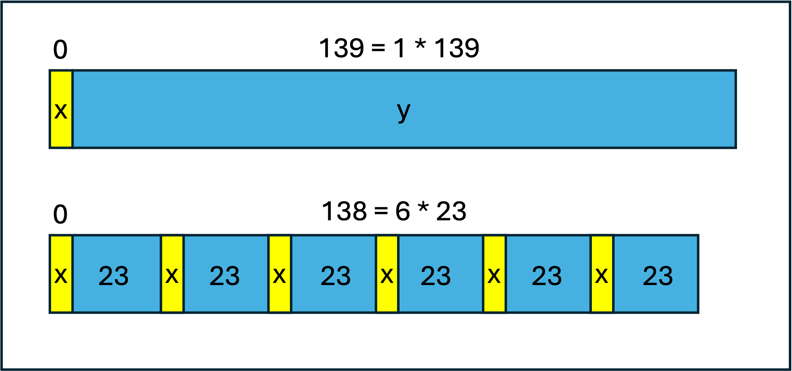

- 8 x 256 architecture
- Trained from scratch on the first 80% CRs
- Reporting results on the last 20%
- 100 epochs

Example 1

6 * 23 Channels (Buffered)

138 Channels at once

Example 2

6 * 23 Channels (Buffered)

138 Channels at once

Example 3

6 * 23 Channels (Buffered)
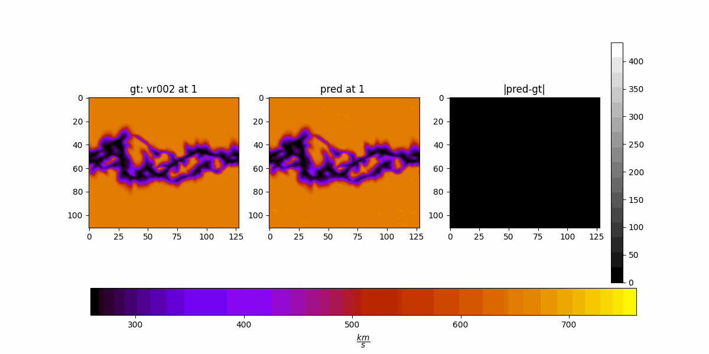
138 Channels at once

Example 4

6 * 23 Channels (Buffered)

138 Channels at once

Example 5

6 * 23 Channels (Buffered)
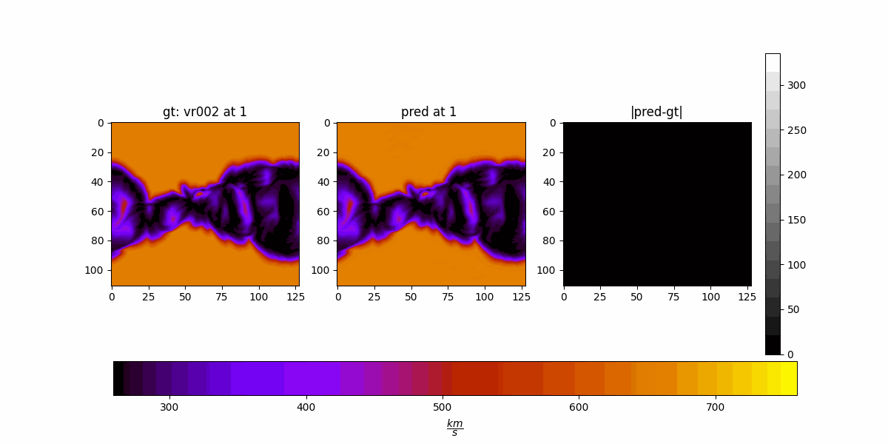
138 Channels at once

Visually and numerically, buffered is better. But the max absolute error is higher.

Metrics

6 * 23 Channels (Buffered)
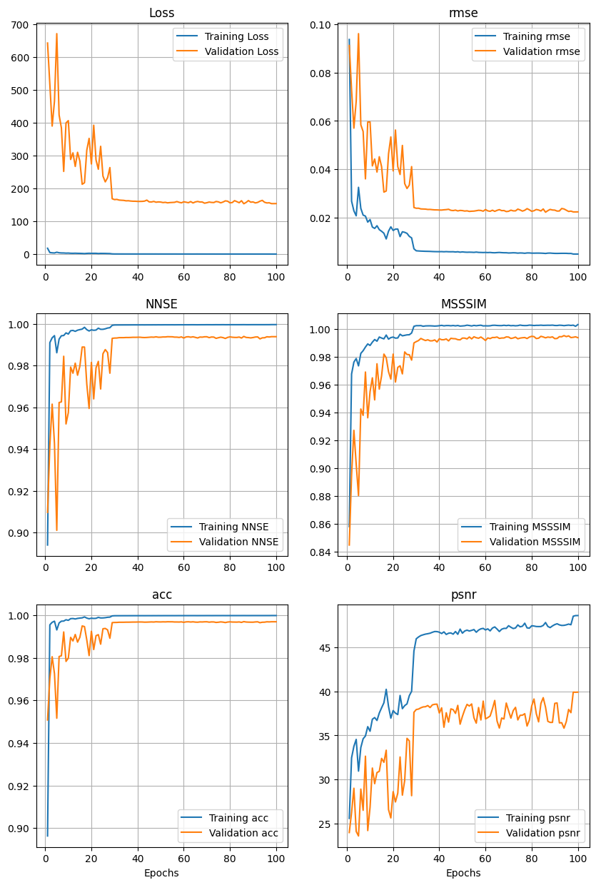

<!-- 138 Channels at once
 -->

| Method | RMSE $$\downarrow$$ | NNSE $$\uparrow$$ | MSSSIM $$\uparrow$$ | ACC $$\uparrow$$ | PSNR $$\uparrow$$ |
|----------|----------|----------|----------|----------|--------|
| Buffered | 0.0235   | 0.9933   | 0.9942   | 0.9966   | 39.29  |
| Full Channel | 0.0249   | 0.9927   | 0.9907   | 0.9963   | 39.22  |

## Enlarge the simulations to capture larger modes (exp 37)

- 8 x 64 architecture (8 x 256 didn't fit. i had 8 x 64 results on normal data (exp 33).)
- Trained from scratch on the first 80% CRs
- Reporting results on the last 20%
- 200 epochs
- slice size: `(140, 111, 128)` -> `(140, 222, 256)`
- n_modes: `(110, 64)` (110, 128 in code) -> `(221, 128)` (221, 256 in code)

Example 1

(222, 256)

(111, 128)

Example 2

(222, 256)

(111, 128)

Example 3

(222, 256)

(111, 128)

Example 4

(222, 256)
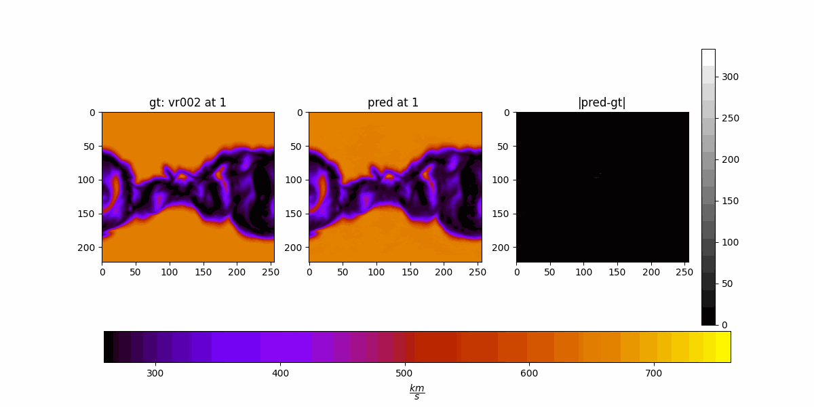
(111, 128)

Example 5

(222, 256)

(111, 128)

Metrics

(222, 256)
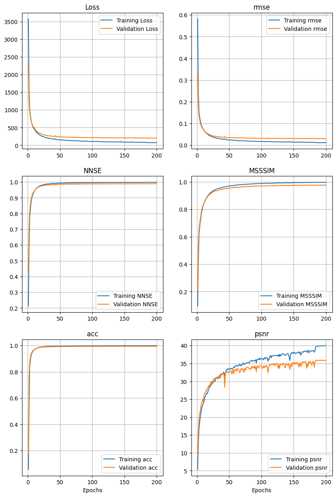

<!-- 138 Channels at once
 -->

| Method | RMSE $$\downarrow$$ | NNSE $$\uparrow$$ | MSSSIM $$\uparrow$$ | ACC $$\uparrow$$ | PSNR $$\uparrow$$ |
|--------|----------|----------|----------|----------|--------|
| (111, 128) | 0.0292   | 0.9900   | 0.9798   | 0.9949   | 35.77  |
| (222, 256) | 0.0299   | 0.9893   | 0.9748   | 0.9946   | 35.36  |

It is worse.

## Slice weighted loss, further=higher (exp 38)

- 8 x 256 architecture
- Trained from scratch on the first 80% CRs
- Reporting results on the last 20%
- 200 epochs

Example 1

Slice weighted L2

2D L2

Example 2

Slice weighted L2

2D L2

Example 3

Slice weighted L2

2D L2

Example 4

Slice weighted L2

2D L2

Example 5

Slice weighted L2

2D L2

Metrics

Slice weighted L2
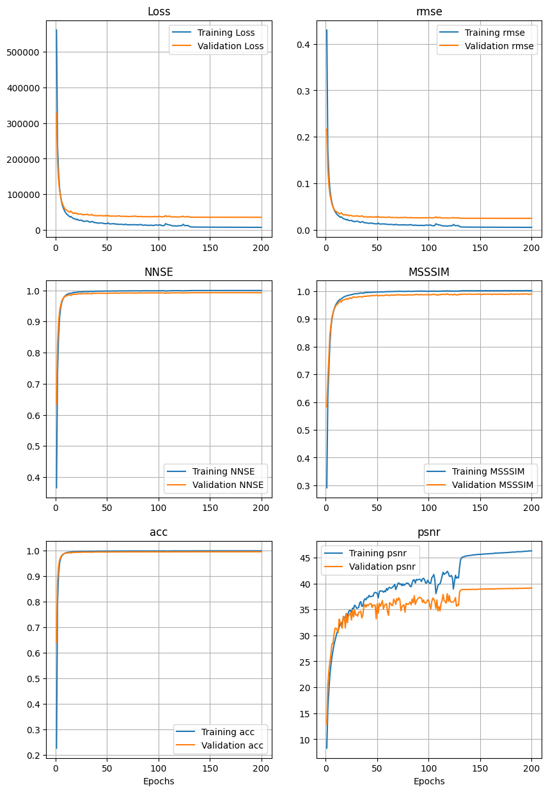

<!-- 2D L2
 -->

| Method | RMSE $$\downarrow$$ | NNSE $$\uparrow$$ | MSSSIM $$\uparrow$$ | ACC $$\uparrow$$ | PSNR $$\uparrow$$ |
|--------|----------|----------|----------|----------|--------|
| L2   | 0.0249   | 0.9927   | 0.9907   | 0.9963   | 39.22  |
| Slice weighted L2 | 0.0250   | 0.9926   | 0.9889   | 0.9963   | 39.12  |

Not that different.

## Fine-tuning slice 24 to 46 (exp 39)

- 8 x 256 architecture
- Fine-tuned on the first 80% CRs
- Reporting results on the last 20%
- 50 epochs

Example 1

Fine-tuned
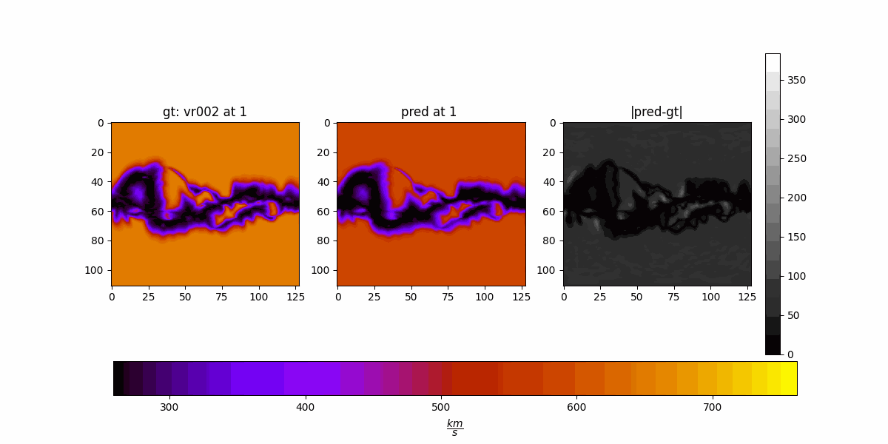
Pre-trained

Example 2

Fine-tuned

Pre-trained

Example 3

Fine-tuned

Pre-trained

Example 4

Fine-tuned
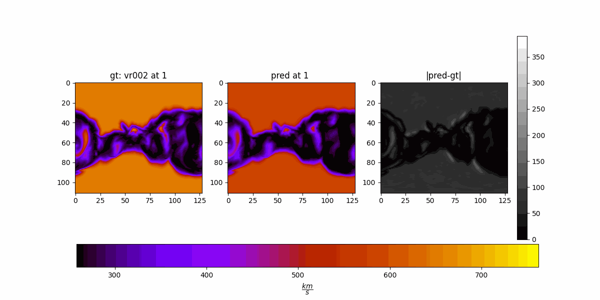
Pre-trained

Example 5

Fine-tuned
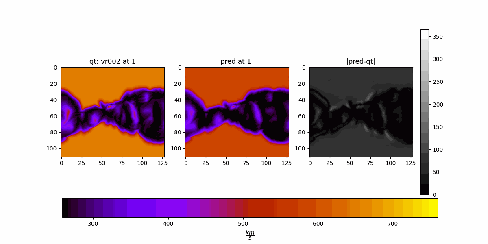
Pre-trained

Metrics

Fine-tuned
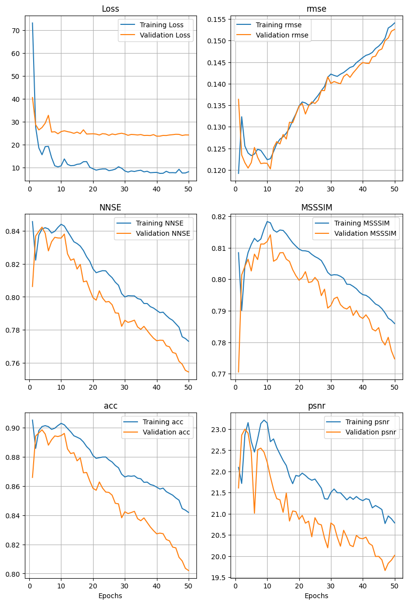

| Method | RMSE $$\downarrow$$ | NNSE $$\uparrow$$ | MSSSIM $$\uparrow$$ | ACC $$\uparrow$$ | PSNR $$\uparrow$$ |
|--------|----------|----------|----------|----------|--------|
| Pre-trained   | 0.0249   | 0.9927   | 0.9907   | 0.9963   | 39.22  |
| Fine-tuned | 0.1443   | 0.7749   | 0.7882   | 0.8294   | 20.42  |

## HUX metrics

| Method | RMSE $$\downarrow$$ | NNSE $$\uparrow$$ | MSSSIM $$\uparrow$$ | ACC $$\uparrow$$ | PSNR $$\uparrow$$ |
|--------|----------|----------|----------|----------|--------|
| Buffered L2 2D | 0.0235   | 0.9933   | 0.9942   | 0.9966   | 39.29  |
| Full Channel L2 2D | 0.0249   | 0.9927   | 0.9907   | 0.9963   | 39.22  |
| HUX    | 40.7198  | 0.9149   | 0.9723   | 0.9584   | 27.82  |
