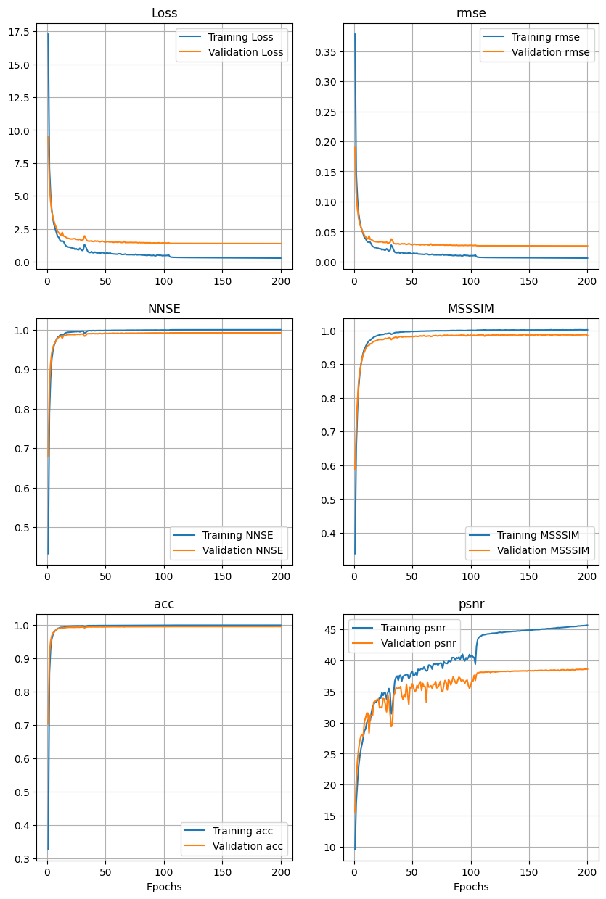
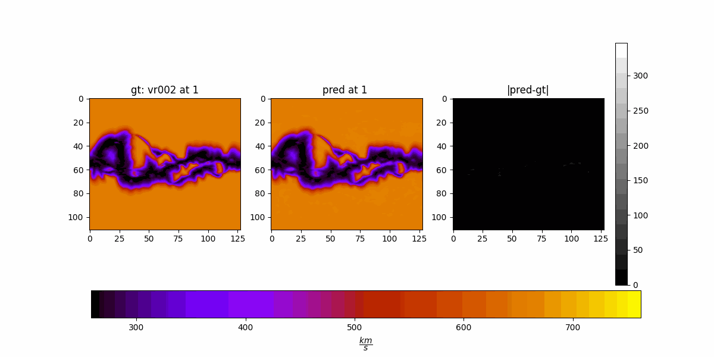
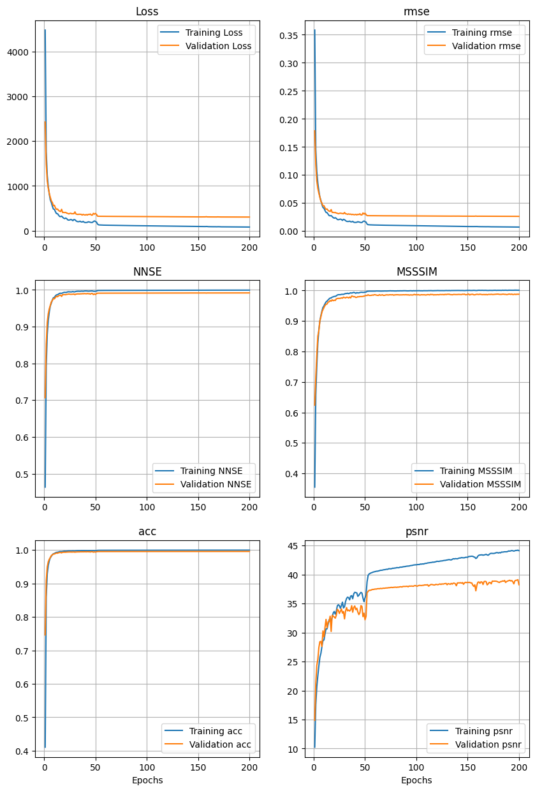

## 3D L2 Loss (exp 34)

2D:

$$
\text{L}_2^{(2D)} = \frac{1}{BCR} \sum_{b=1}^{B} \sum_{c=1}^{C} \sum_{r=1}^{R}
\left( \sum_{i=1}^{H} \sum_{j=1}^{W} \left| x_{bcrij} - y_{bcrij} \right|^2 \right)^{1/2}
$$

3D:

$$
\text{L}_2^{(3D)} = \frac{1}{BC} \sum_{b=1}^{B} \sum_{c=1}^{C}
\left( \sum_{r=1}^{R} \sum_{i=1}^{H} \sum_{j=1}^{W} \left| x_{bcrij} - y_{bcrij} \right|^2 \right)^{1/2}
$$

- 8 x 256 architecture
- Trained from scratch on the first 80% CRs
- Reporting results on the last 20%
- 200 epochs

Example 1

3D

2D

Example 2

3D

2D

Example 3

3D

2D

Example 4

3D

2D

Example 5

3D

2D

Metrics

3D

2D

Numerical comparison

| Method | Val Loss $$\downarrow$$ | RMSE $$\downarrow$$ | NNSE $$\uparrow$$ | MSSSIM $$\uparrow$$ | ACC $$\uparrow$$ | PSNR $$\uparrow$$ |
|--------|----------|------|------|--------|-----|------|
| 3D L2  | 1.3854   | 0.0262 | 0.9920 | 0.9869 | 0.9959 | 38.55 |
| 2D L2  | 172.1135 | 0.0249 | 0.9927 | 0.9907 | 0.9963 | 39.22 |

Numerically, 2D beats 3D. Visually, in my opinion, 3D beats 2D. **Gonna go with 2D.**

## L2 + L1 Loss (exp 35)

- 8 x 256 architecture
- Trained from scratch on the first 80% CRs
- Reporting results on the last 20%
- 200 epochs

Example 1

2D L2 + L1

2D L2

Example 2

2D L2 + L1

2D L2

Example 3

2D L2 + L1

2D L2

Example 4

2D L2 + L1

2D L2

Example 5

2D L2 + L1

2D L2

Metrics

2D L2 + L1

2D L2

| Method      | Val Loss | RMSE     | NNSE     | MSSSIM   | ACC      | PSNR   |
|-------------|----------|----------|----------|----------|----------|--------|
| 2D L2       | 172.1135 | 0.0249   | 0.9927   | 0.9907   | 0.9963   | 39.22  |
| 2D L2 + L1  | 306.4048 | 0.0264   | 0.9918   | 0.9872   | 0.9959   | 38.41  |

## HUX metrics
