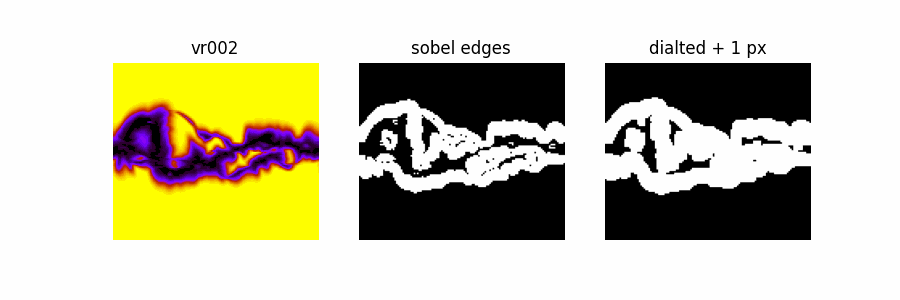
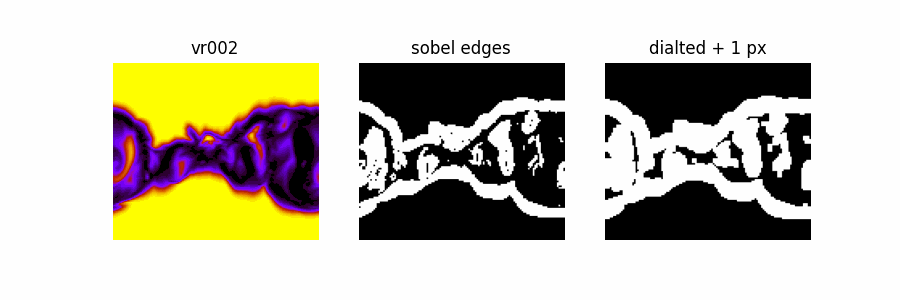
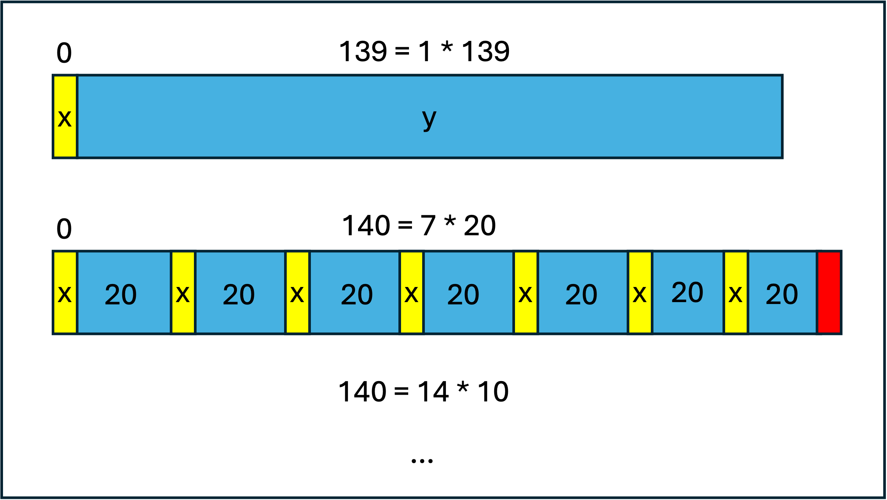

## Important Regions (Edge detection)

## Sequential training (last experiments for paper 1)

## 20 channels (exp 42)

7 * 20 Channels

139 Channels at once

7 * 20 Channels

139 Channels at once

7 * 20 Channels

139 Channels at once

7 * 20 Channels

139 Channels at once

7 * 20 Channels

139 Channels at once

Metrics (everywhere)

| Method | NNSE $$\uparrow$$ | MSSSIM $$\uparrow$$ | ACC $$\uparrow$$ | PSNR $$\uparrow$$ |
|--------|----------|----------|----------|----------|
| 20 Channels | 0.9939   | 0.9944   | 0.9969   | 40.27  |
| 139 Channels at once | 0.9933   | 0.9942   | 0.9966   | 39.29  |

## 10 channels (exp 43)

14 * 10 Channels

139 Channels at once

14 * 10 Channels

139 Channels at once

14 * 10 Channels

139 Channels at once

14 * 10 Channels

139 Channels at once

14 * 10 Channels

139 Channels at once

Metrics (everywhere)

| Method | NNSE $$\uparrow$$ | MSSSIM $$\uparrow$$ | ACC $$\uparrow$$ | PSNR $$\uparrow$$ |
|--------|----------|----------|----------|----------|
| 10 Channels  | 0.9941   | 0.9945   | 0.9970   | 40.29  |
| 20 Channels  | 0.9939   | 0.9944   | 0.9969   | 40.27  |
| 139 Channels at once   | 0.9933   | 0.9942   | 0.9966   | 39.29  |
| HUX    | 0.9149   | 0.9723   | 0.9584   | 27.82  |

Epoch 10 we had a jump. This is the same plots with that removed:

Some more instances:

MSE:

$$
\text{MSE} = \frac{1}{RHW} \sum_{r=1}^{R}
\sum_{i=1}^{H} \sum_{j=1}^{W} \left| x_{bcrij} - y_{bcrij} \right|^2
$$

