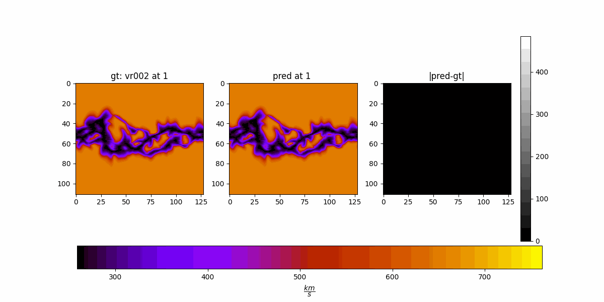
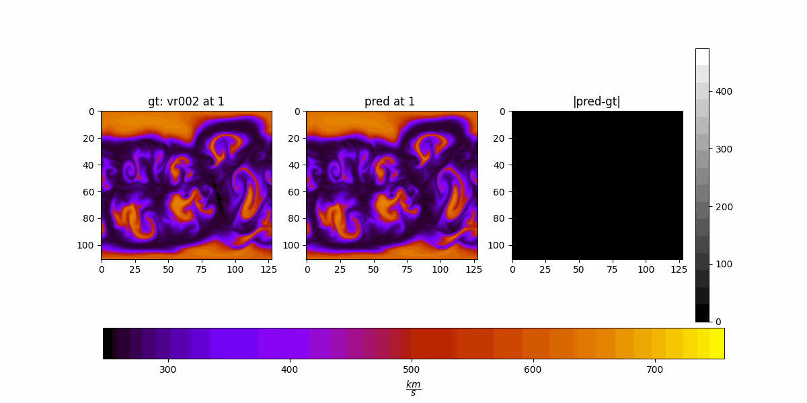
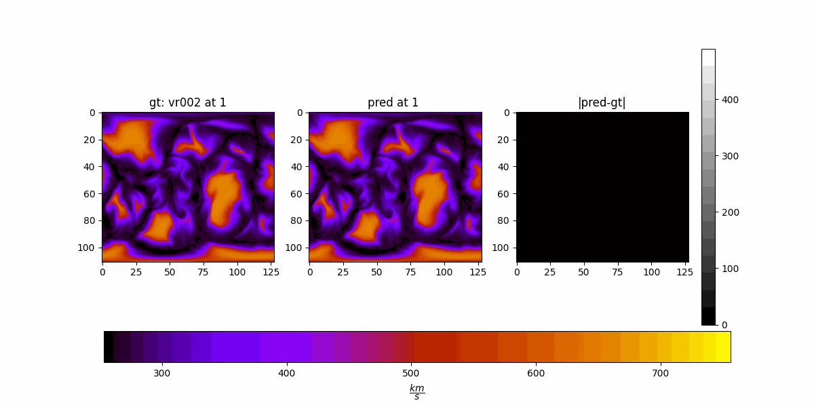

## 5 Buffered Channels (exp 44)

Metrics

| Method | NNSE $$\uparrow$$ | MSSSIM $$\uparrow$$ | ACC $$\uparrow$$ | PSNR $$\uparrow$$ |
|--------|----------|----------|----------|----------|
| 10 Channels  | 0.9941   | 0.9945   | 0.9970   | 40.29  |
| 20 Channels  | 0.9939   | 0.9944   | 0.9969   | 40.27  |
| 5 Channels  | 0.9938   | 0.9959   | 0.9969   | 39.46  |
| 139 Channels at once   | 0.9933   | 0.9942   | 0.9966   | 39.29  |
| HUX    | 0.9149   | 0.9723   | 0.9584   | 27.82  |

MSE Box Whisker
