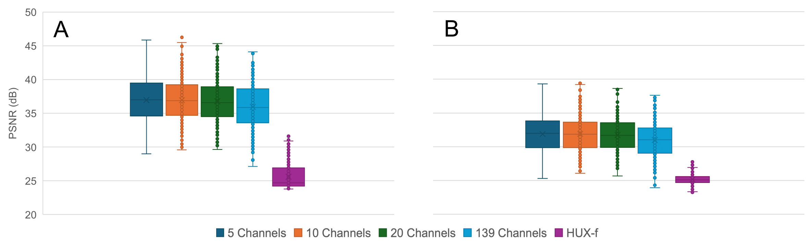

## 5 Buffered Channels (exp 44)

10 channels (exp 43)

5 channels (exp 44)

10 channels (exp 43)

5 channels (exp 44)

10 channels (exp 43)

5 channels (exp 44)

10 channels (exp 43)

5 channels (exp 44)

10 channels (exp 43)

5 channels (exp 44)

<!-- Metrics

 -->

<!-- | Method | NNSE $$\uparrow$$ | MSSSIM $$\uparrow$$ | ACC $$\uparrow$$ |
|--------|----------|----------|----------|
| 10 Channels  | 0.9941   | 0.9945   | 0.9970   |
| 20 Channels  | 0.9939   | 0.9944   | 0.9969   |
| 5 Channels  | 0.9938   | 0.9959   | 0.9969   |
| 139 Channels at once   | 0.9933   | 0.9942   | 0.9966   |
| HUX    | 0.9149   | 0.9723   | 0.9584   |

MSE Box Whisker -->

With 5 Channels it looks much better...

## Numerical comparison:

### MSE distribution (A: Everywhere, B: Edges)

Means:

| Channels         | MSE         | Masked MSE  |
|------------------|-------------|-------------|
| 20 Channels      | 150.1875645 | 129.7723928 |
| 10 Channels      | 151.3408136 | 130.0670439 |
| 5 Channels       | 155.8815447 | 135.3641955 |
| 139 Channels     | 195.5918691 | 161.9930172 |
| HUX-f            | 1721.489896 | 499.5348554 |

Lets zoom in:

### PSNR distribution (A: Everywhere, B: Edges)

Means:

| Channels         | PSNR        | Masked PSNR |
|------------------|-------------|-------------|
| 10 Channels      | 36.95346021 | 31.90967475 |
| 5 Channels       | 36.97548079 | 31.87321922 |
| 20 Channels      | 36.79031263 | 31.74350965 |
| 139 Channels     | 35.95801834 | 31.00104701 |
| HUX-f            | 25.599035   | 25.15527493 |

Lets zoom in:

Which one is better?

## Hard and easy cases

Hardest sample for 10-channel (Max MSE), CR 2271 and same in 5-channel

  
  

Hardest sample for 5-channel (Max MSE), CR 2268 and same in 10-channel

  
  

Easiest sample for 10-channel and 5-channel (Min MSE), CR 2228

  
  

I need to go with 5 but I dont have enough numerical proof for it. MS-SSIM looked better in 5 but I don't have distributions (only means). If that wont't look convincing...

## Dr. Angryk's idea: SFNO vs. HUX (does the samples' difficulties follow a pattern in both? Is there a temporal pattern? The Later the harder?)

### Normalized MSE (for each). (A: everywhere, B: Edges)

### Normalized PSNR (for each). (A: everywhere, B: Edges)

Should we include this in the first paper? I will need to use 5-channel instead.

## Discuss conferences

- The Vegas conference is bad
- ACM, IEEE, Amazon Sciences were irrelevant
- CogMI: Saturday June 22nd 7 AM, 10 pages, I will turn the 1st version in by monday.