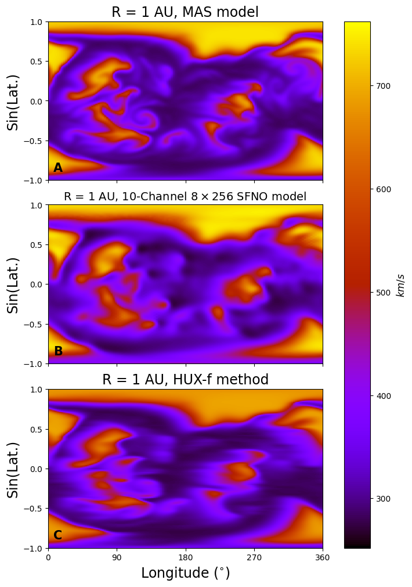
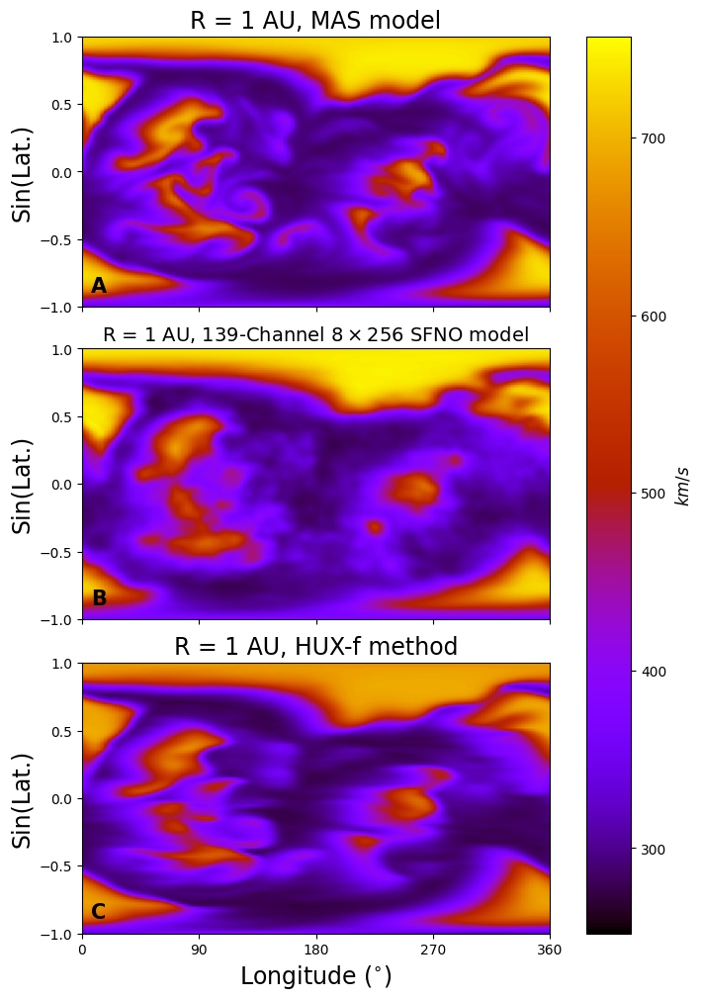
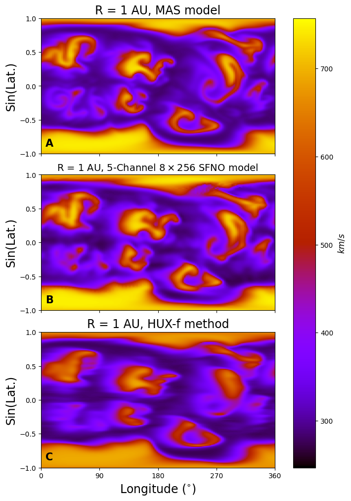
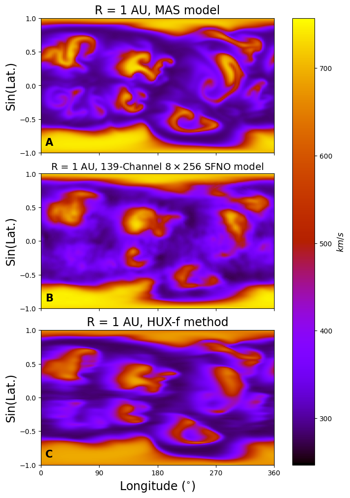

## Paper's text

- 1. Introduction ✅
    - What is solar wind
    - Numerical solvers
    - Why data driven is better
    - HUX & SFNO short intro

- 2. Background ✅
    - Previous work in solar wind speed prediction
        - WindNet
        - SWAN
    - Data driven surrogates in other disciplines
        - Fourcastnet (weather)
    - Operator learning
        - DeepONet
        - FNO
        - SFNO

## A quick comparison if we were to wrap up with 139-channel model

  
  

  
  

Is 139 really better than HUX and visually convincing?

## Page limits

- 6 Pages (up to 8 but $50 per page)