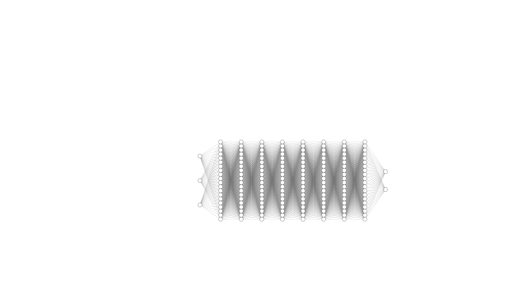

<h1>Week two/three: 23 July - 7 August</h1>

## 1. Navier-Stokes with PINNs

### 1.1. Equations
Incompressible fluid flow in a cylinder-like environment
$x, y, t -> p, (u, v)$

$f =  u_t + \lambda_1 (u u_x + v u_y) + p_x - \lambda_2  (u_{xx} + u_{yy})$

$g = v_t + \lambda_1 (u v_x + v  v_y) + p_y - \lambda_2  (v_{xx} + v_{yy})$

### 1.2. Data
#### 1.2.1 Specs
- Coordinates (x, y), #: 5000 Input
- Time (t), #: 200, range: [0, 0.1, 0.2, ..., 20] Input
- Pressure (p), #: 5000 x 200 Output
- Velocity (u, v), #: 5000 x 200 Output

### 1.2.2. Train / test split
5000 random instances from 5000 x 200 instances for training.
Using the whole 5000 x 200 for plotting comparisons.

### 1.3. Methods

#### 1.3.1. Architecture
MLP
- 3 input nodes
- 8 x 20 hidden layers with tanh
- 2 output nodes

#### 1.3.2. Optimizer

<s>SGD, Momentum, RMSProp, Adam, ...</s>

L-BFGS:

- Is deterministic, unlike stochastic ones
- More suitable for physics smooth loss landscapes
- Faster convergence
- Memory efficient
- For solving PDEs, is more precise

### 1.4. Results

