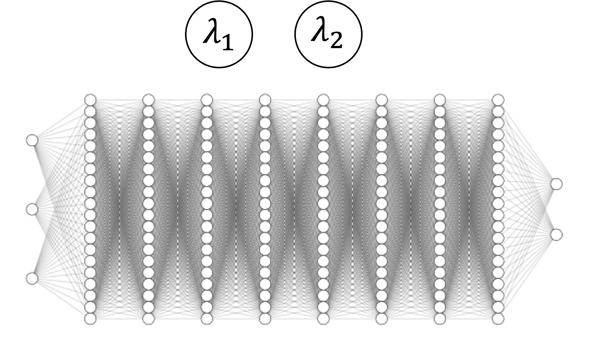
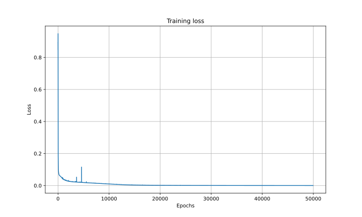
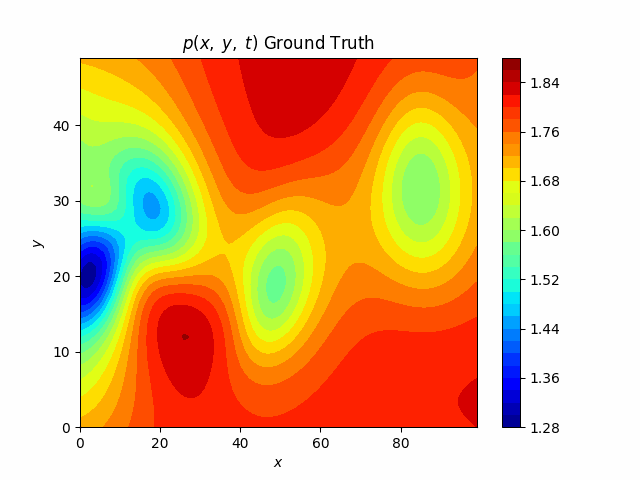
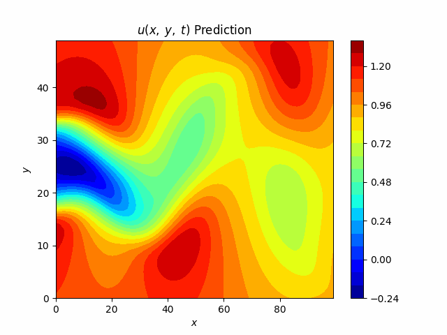
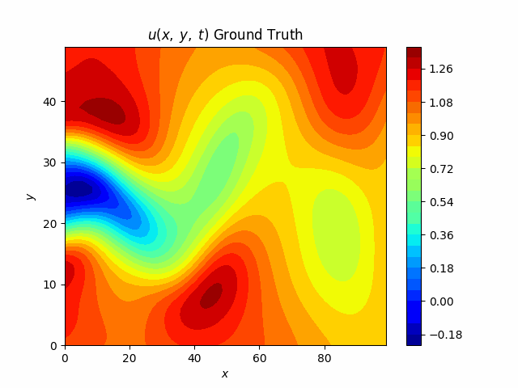
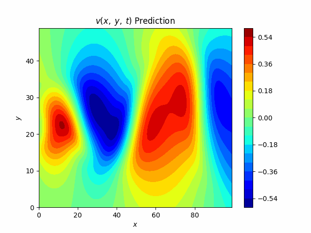
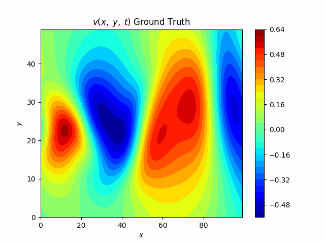

<h1>Week two/three: 23 July - 7 August</h1>

## 1. Navier-Stokes with PINNs

### 1.1. Equations
Incompressible fluid flow in a cylinder-like 2D environment x, y, t -> p, (u, v)

So our PINN will output: 

And we'll try to minimize:

### 1.2. Data
#### 1.2.1 Specs
- Coordinates (x, y), #: 5000 Input
- Time (t), #: 200, range: [0, 0.1, 0.2, ..., 20] Input
- Pressure (p), #: 5000 x 200 Output
- Velocity (u, v), #: 5000 x 200 Output

### 1.2.2. Train / test split
5000 random instances from 5000 x 200 instances for training.

Using 100 consecutive instances from the whole 5000 x 200 for plotting comparisons.

### 1.3. Methods

#### 1.3.1. Architecture
MLP
- 3 input nodes
- 8 x 20 hidden layers with tanh
- 2 output nodes
- lambda 1 and lambda 2 (initialized with 0)

#### 1.3.2. Optimizer

<s>SGD, Momentum, RMSProp, Adam, ...</s>

L-BFGS:

- Is deterministic, unlike stochastic ones
- More suitable for physics smooth loss landscapes
- Faster convergence
- Memory efficient
- For solving PDEs, is more precise

### 1.4. Results

#### 1.4.1. Learning curve

#### 1.4.2. Pressure t: [1, 20]

        
        

#### 1.4.3. Velocity (u) t: [1, 20]

        
        

#### 1.4.4. Velocity (v) t: [1, 20]

        
        

#### 1.4.5. PDE Solutions

<table>
  <tr>
    <th></th>
    <th>f</th>
    <th>g</th>
  </tr>
  <tr>
    <td>Correct PDE</td>
    <td></td>
    <td></td>
  </tr>
  <tr>
    <td>Identified PDE (clean data)</td>
    <td></td>
    <td></td>
  </tr>
  <tr>
    <td>Identified PDE (1% noise)</td>
    <td></td>
    <td></td>
  </tr>
</table>

#### References
- <a href="https://maziarraissi.github.io/PINNs/">Maziar Raissi's GitHub (TensorFlow)</a>
- <a href="https://github.com/rezaakb/pinns-torch/tree/main">Reza Akbari PINNsTorch Package</a>
- <a href="https://github.com/ComputationalDomain/PINNs/tree/main/Cylinder-Wake">ComputationDomain Navier-Stokes in Torch</a>