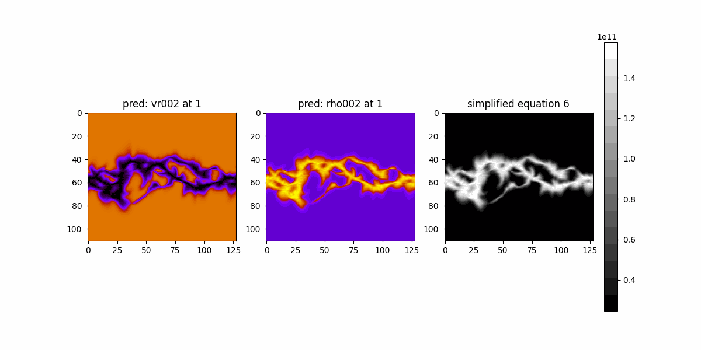

$$

   -\Omega_{\text{rot}}\rho \frac{\partial{v_r}}{\partial \phi} + \rho \left( v_r \nabla v_r \right) = -\nabla p + \rho g 

$$

=

$$
-\Omega_{\text{rot}}\frac{\partial{v_r}}{\partial \phi} + \rho  v_r \frac{\partial v_r}{\partial r} = -  \frac{\partial p}{\partial r} + \rho g
$$

### Testing on MASModel output (in kms units, from psipy code)

### Questions

- Are we sure $-\Omega_{\text{rot}}\frac{\partial{v_r}}{\partial \phi}$ (time stationary flows) is not $-\Omega_{\text{rot}}\frac{\partial{v_\phi}}{\partial \phi}$ ?

- Is $\Omega_{\text{rot}}=2.865\times10^{-6}\text{rad}$ a constant? is the value correct?

### Next step

1. Two 140-channel SFNOs
    - One for velocity
    - One for density

Train independently. Data loss only. Few epochs, small data.

2. Two 140-channel SFNOs
    - One for velocity
    - One for density

Train in parallel. Data + Physics loss. Few epochs, small data.

if 2 > 1, its a win.