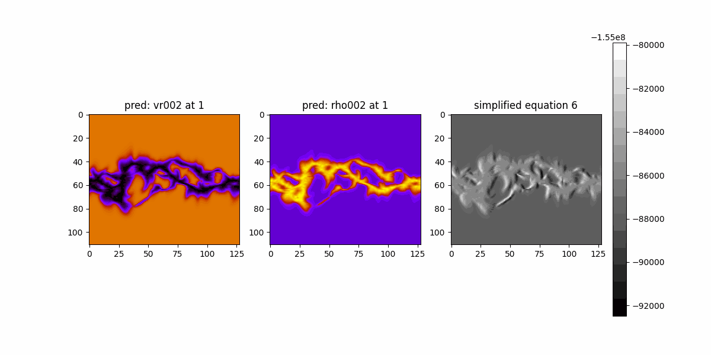
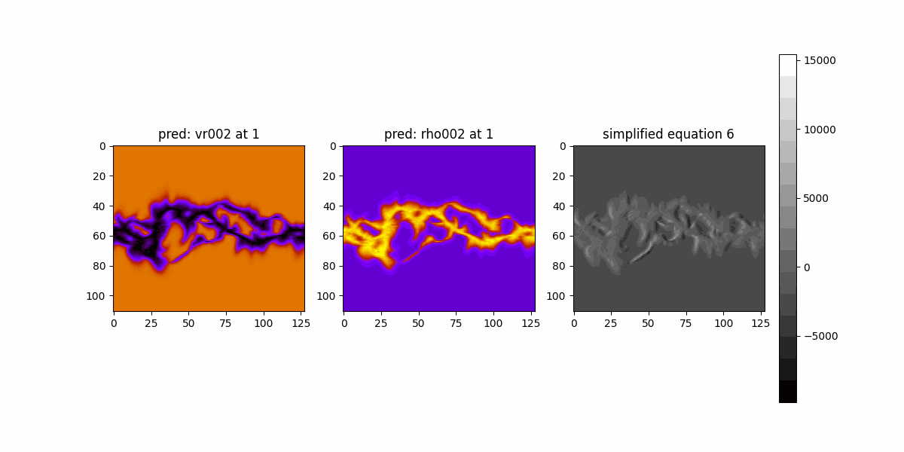
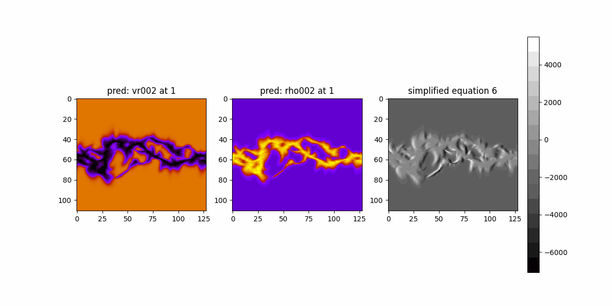

## Discussion

The physics loss we're trying to enforce for velocity, density, (and maybe pressure) prediction

$$
-\Omega_{\text{rot}}\frac{\partial{v_r}}{\partial \phi} +  v_r \frac{\partial v_r}{\partial r} = -  \frac{1}{\rho}\frac{\partial P}{\partial r} -G\frac{M_s}{r^2} \ \text{(Eq. 1)}
$$

- $$\Omega_{\text{rot}}=2.47\times10^{-6}\ \text{rad}/\text{s}$$
- Gradient w.r.t to R should not be FFT approximated since the domain is not periodic
- Gradient w.r.t to $$\phi$$ can be FFT approximated since the domain is periodic ($$[0, 2\pi]$$)
- The sign for $$G\frac{M_s}{r^2}$$ in the equation above has been $$+$$ for the previous checks, i.e., wrong direction
- Do we need to predict $$P$$ too, gas pressure? (3 SFNOS, $$v_r, rho, P$$)

### Alternatives:

Lionello, Riley (2011): *In one dimension, neglecting the pressure gradient and gravity terms, this reduces to*:

$$
-\Omega_{\text{rot}}\frac{\partial{v_r}}{\partial \phi} +  v_r \frac{\partial v_r}{\partial r}=0 \ (\text{Eq. 2})
$$

Pluggin the $$-  \frac{1}{\rho}\frac{\partial P}{\partial r}$$ term back in:

$$
-\Omega_{\text{rot}}\frac{\partial{v_r}}{\partial \phi} +  v_r \frac{\partial v_r}{\partial r}=-  \frac{1}{\rho}\frac{\partial P}{\partial r} \ (\text{Eq. 3})
$$


## Checks for Loss(MAS) == 0

### 1. Eq. 1

$$
-\Omega_{\text{rot}}\frac{\partial{v_r}}{\partial \phi} +  v_r \frac{\partial v_r}{\partial r} = -  \frac{1}{\rho}\frac{\partial P}{\partial r} -G\frac{M_s}{r^2}
$$

```py
Term magnitude means:
Periodic term (omega * dvr/dphi): 0.00040352288927857365
Convective term (v * dv/dr): 613.8210903172538
Pressure gradient term (-1/rho*dp/dr): 5.625292555921715e-13
Gravitational term (-GMs/r^2): 19560662.0
Residual value: 19560965.429960452
```


- Global Scale


- Per-radius Scale





### 2. Eq. 2
This problem will be $$v_r$$ only. No need for multiple SFNOs etc.

$$
-\Omega_{\text{rot}}\frac{\partial{v_r}}{\partial \phi} +  v_r \frac{\partial v_r}{\partial r}=0 \ (\text{Eq. 2})
$$


```py
Term magnitude means:
Periodic term (omega * dvr/dphi): 0.00040352288927857365
Convective term (v * dv/dr): 613.8210903172538
Residual value: 613.8207054426922
```

- Global Scale




- Per-radius Scale




### 3. Eq. 3

$$
-\Omega_{\text{rot}}\frac{\partial{v_r}}{\partial \phi} +  v_r \frac{\partial v_r}{\partial r}=-  \frac{1}{\rho}\frac{\partial P}{\partial r} \ (\text{Eq. 3}) \ (\text{Eq. 2})
$$

```py
Term magnitude means:
Periodic term (omega * dvr/dphi): 0.00040352288927857365
Convective term (v * dv/dr): 613.8210903172538
Pressure gradient term (-1/rho*dp/dr): 5.625292555921715e-13
Residual value: 613.8207054426916
```

- Global Scale


- Per-radius Scale


