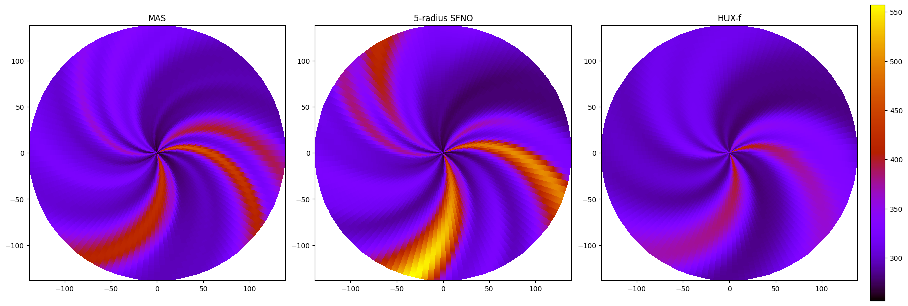
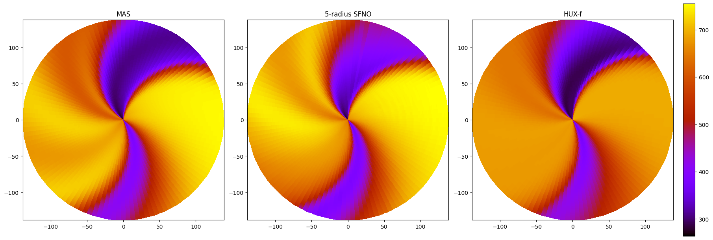
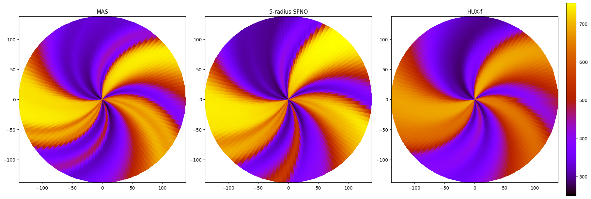
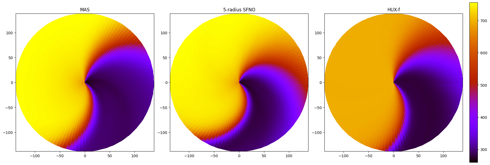
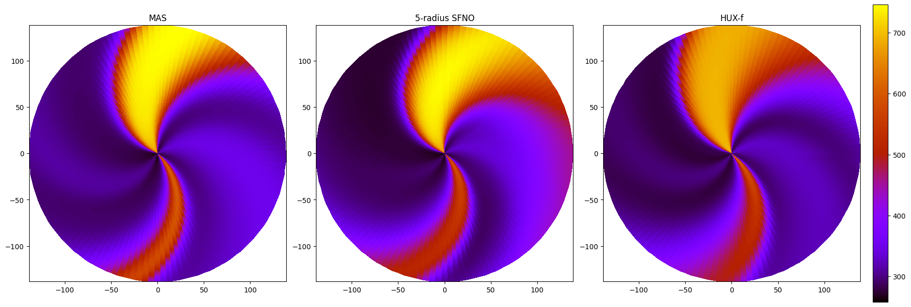

Layer-wise comparison, we're okay at least.

All layers: SFNO is behind. SFNO does wayy better than HUX near poles.

### CR 2285

At latitude = 0 degrees, middle.

At latitude = 140 degrees. near north pole.

At latitude = -140 degrees. near south pole.

### CR 2293

At latitude = 0 degrees, middle.

At latitude = 140 degrees. near north pole.

At latitude = -140 degrees. near south pole.

