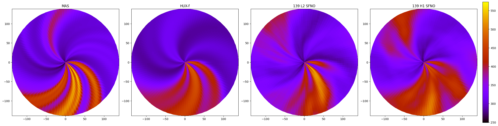
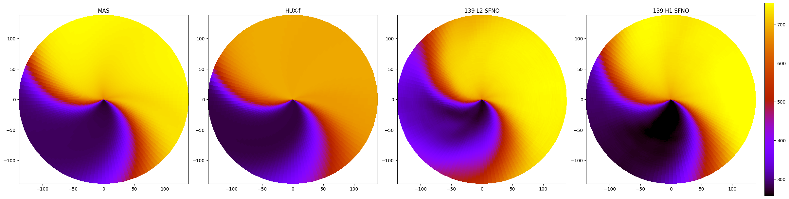
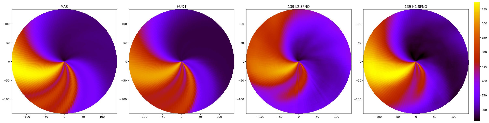
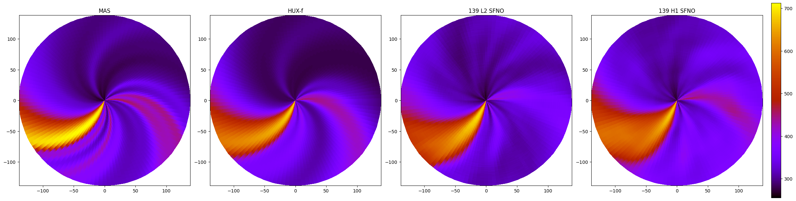
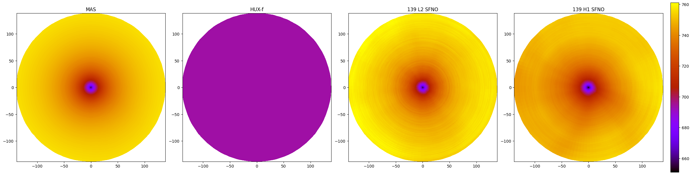
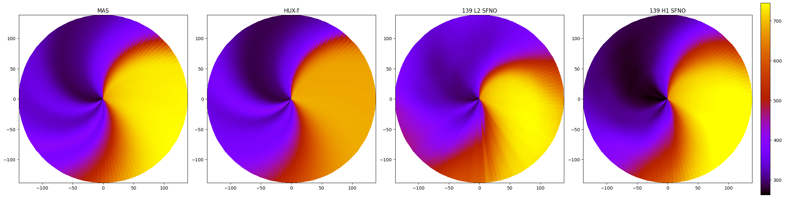
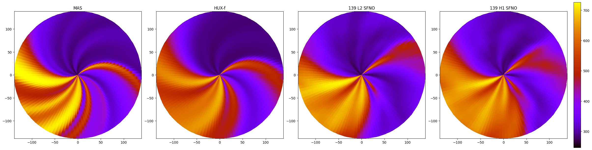
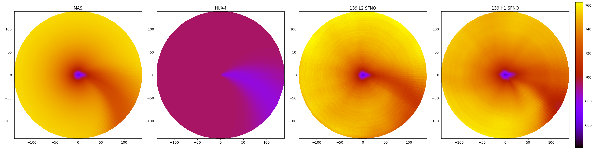
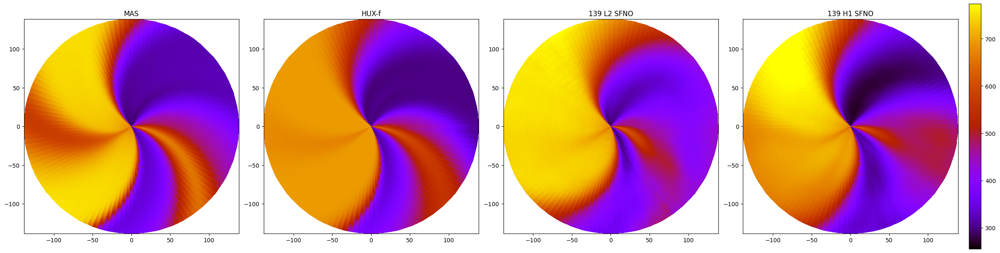

Paper 1 and 2 loss functions:

$$
\text{L}_2^{(2D)} = \frac{1}{BCR} \sum_{b=1}^{B} \sum_{c=1}^{C} \sum_{r=1}^{R}
\left( \sum_{i=1}^{H} \sum_{j=1}^{W} \left| x_{bcrij} - y_{bcrij} \right|^2 \right)^{1/2}
$$

Caused the SFNO to not match the rotation of the sun. Regardless of the pattern.

The new loss function should match the whole datacube with the ground truth at once; i.e., no means across dims etc.

## New Loss functions

### 1. Sobolov H1 Loss (exp 45)

H1 Norm:

$$
\|u\|_{H^1(\Omega)}^2
= \int_\Omega \Big( |u(r,\theta,\phi)|^2 
+ |u_r(r,\theta,\phi)|^2 
+ |u_\theta(r,\theta,\phi)|^2 
+ |u_\phi(r,\theta,\phi)|^2 \Big)\, dr\, d\theta\, d\phi
$$

H1 Loss:

$$
\|x - y\|_{H^1(\Omega)} \;=\;
\left(
\int_\Omega
\Big(
|x(r,\theta,\phi) - y(r,\theta,\phi)|^2
+ |x_r - y_r|^2
+ |x_\theta - y_\theta|^2
+ |x_\phi - y_\phi|^2
\Big)\, dr\, d\theta\, d\phi
\right)^{1/2}
$$

Relative H1 Loss(normalized by the H1 norm of the ground truth):

$$
\frac{\|x - y\|_{H^1(\Omega)}}{\|y\|_{H^1(\Omega)}} \;=\;
\frac{
\left(
\int_\Omega
\big(
|x - y|^2 + |x_r - y_r|^2 + |x_\theta - y_\theta|^2 + |x_\phi - y_\phi|^2
\big)\, dr\, d\theta\, d\phi
\right)^{1/2}
}{
\left(
\int_\Omega
\big(
|y|^2 + |y_r|^2 + |y_\theta|^2 + |y_\phi|^2
\big)\, dr\, d\theta\, d\phi
\right)^{1/2}
}
$$

- Derivatives are acquired via finite differences
  - One cool thing: you can introduce the periodicity in $$\phi$$
- Integrals are acquired by summing over the cube $$\times$$ the volume
-  This is the equivalent of the loss in cartesian coordinates for $$(r, \theta, \phi)$$, i.e., the volume/area of slice 0=volume/area of slice 139. An $$r^2\sin\theta$$ term should be included:
  -  Abosulte form:
  $$
  \|x-y\|_{H^1}^2 
  = \int_0^{R} \int_0^\pi \int_0^{2\pi} 
  \Bigg[
  |x(r,\theta,\phi) - y(r,\theta,\phi)|^2
  + \left(\frac{\partial (x-y)}{\partial r}\right)^2
  + \frac{1}{r^2}\left(\frac{\partial (x-y)}{\partial \theta}\right)^2
  + \frac{1}{r^2 \sin^2 \theta}\left(\frac{\partial (x-y)}{\partial \phi}\right)^2
  \Bigg]
  \, r^2 \sin\theta \, dr\, d\theta\, d\phi
  $$
  TODO
  

8 x 256 139-Radius SFNO (ICMLA 2025 paper: 2D L2 Loss)

#### CR 2271

At latitude = 0 degrees, middle.

At latitude = 140 degrees. near north pole.

At latitude = -140 degrees. near south pole.

#### CR 2289

At latitude = 0 degrees, middle.

At latitude = 140 degrees. near north pole.

At latitude = -140 degrees. near south pole.

#### CR 2291

At latitude = 0 degrees, middle.

At latitude = 140 degrees. near north pole.

At latitude = -140 degrees. near south pole.

## Metrics that we've seen -> Differentiable and Transformed into Distance Functions:

### 1. Earth Mover's Distance

$$
W_1(P, Q) \;=\; \int_{-\infty}^{\infty} \big| F_P(x) - F_Q(x) \big| \, dx
$$

- **$$W_1(P, Q)$$**  
  The Earth Mover’s Distance between two 1D probability distributions \(P\) and \(Q\).

- **$$F_P(x), F_Q(x)$$**  
  The cumulative distribution functions (CDFs) of $$P$$ and $$Q$$:  
  $$
  F_P(x) = \int_{-\infty}^{x} p(t) \, dt, 
  \quad 
  F_Q(x) = \int_{-\infty}^{x} q(t) \, dt
  $$

- **$$|F_P(x) - F_Q(x)|$$**  
  At position $$x$$, this represents the imbalance in total mass between the two distributions up to that point.

- **The integral**  
  Summing the absolute imbalance over the whole line gives the minimum “work” required to transform $$P$$ into $$Q$$.

- Current open-source implementation is 2D
- I took the mean across the $$r$$ dim for reports
- 3D implementation required
- Some implementations for 3D point cloud etc:
    - [PyTorch EMDLoss](https://github.com/meder411/PyTorch-EMDLoss)
    - [pointGAN EMD](https://github.com/fxia22/pointGAN/tree/74b6c432c5eaa1e0a833e755f450df2ee2c5488e/emd)
    - [SciPy 2D](https://docs.scipy.org/doc/scipy/reference/generated/scipy.stats.wasserstein_distance.html)