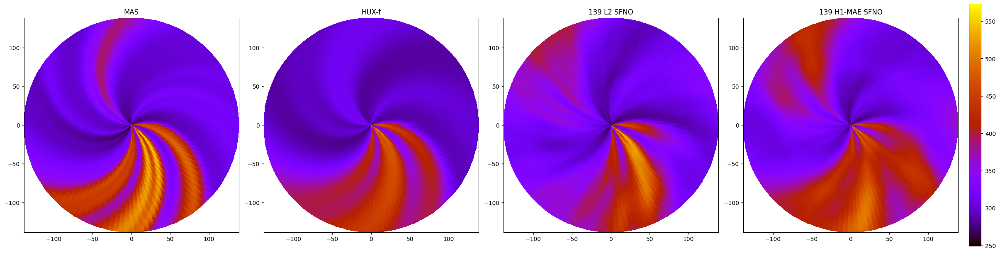
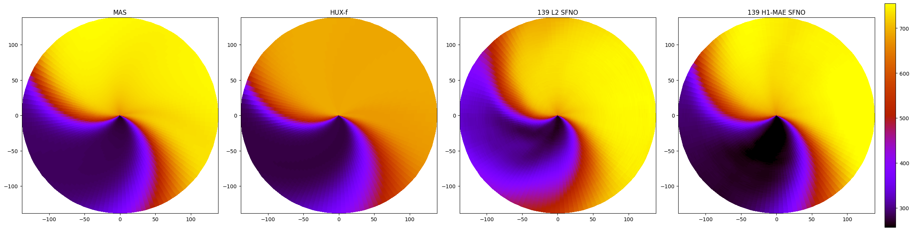
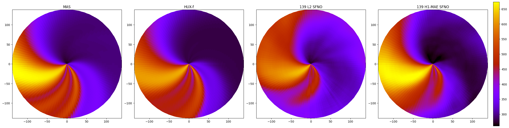
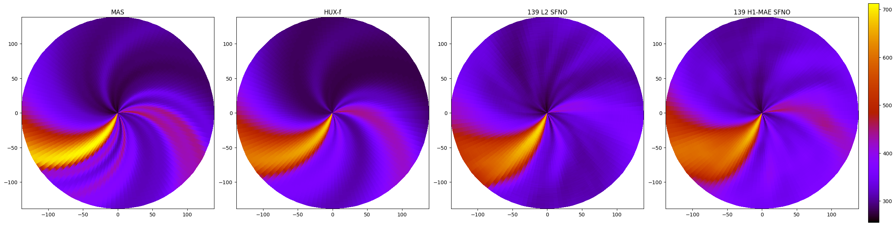
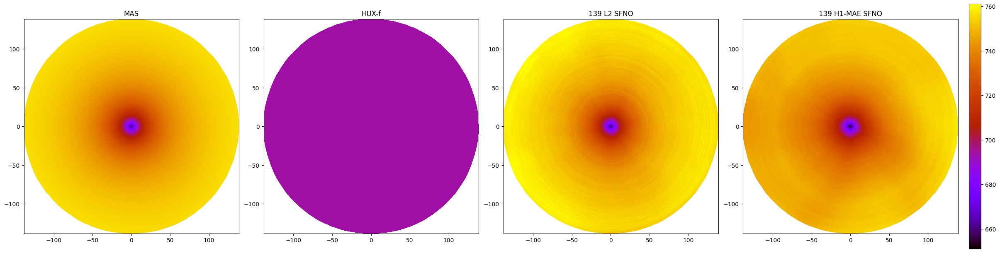
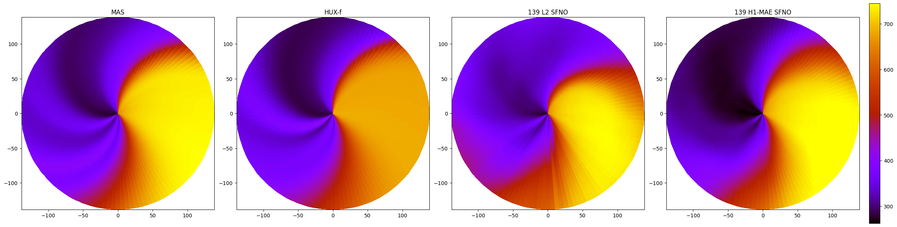
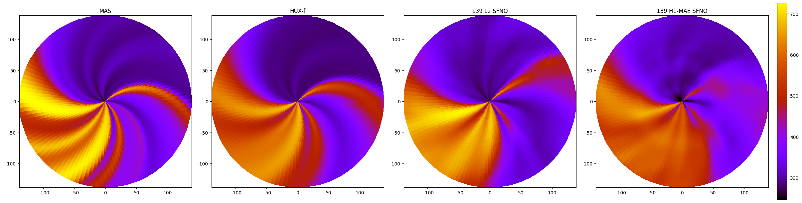
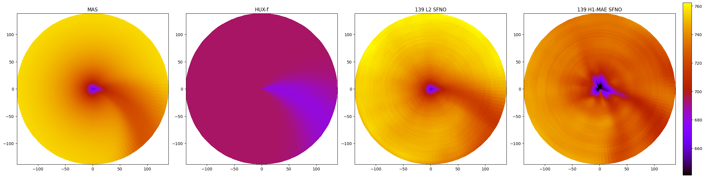

Exp 48 vs. Exp 31

difference is 48 is H1 loss with no powers of 2 (H1-MAE) and with correct spherical terms

#### CR 2271

At latitude = 0 degrees, middle.

At latitude = 140 degrees. near north pole.

At latitude = -140 degrees. near south pole.

#### CR 2289

At latitude = 0 degrees, middle.

At latitude = 140 degrees. near north pole.

At latitude = -140 degrees. near south pole.

#### CR 2291

At latitude = 0 degrees, middle.

At latitude = 140 degrees. near north pole.

At latitude = -140 degrees. near south pole.

## Positional Embedding

We were using equiangular grids for the previous papers.

Exp 47 vs. Exp 31

difference is 47 doesnt have the incorrect embedding in 31 (grid_embedding=None)

Exp 49 vs. Exp 31

difference is 49 has the spherical embedding whereas it is equiangular in 31

TODO

Exp 50 vs. Exp 44

difference is 50 has the spherical embedding + radii whereas its equiangular in 44 with no radii