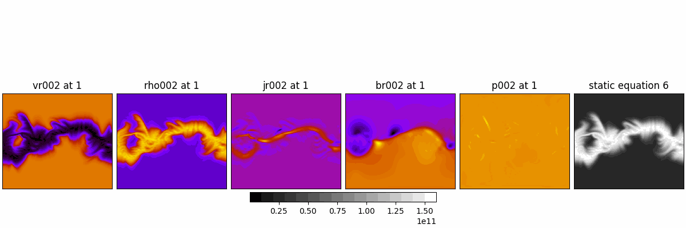
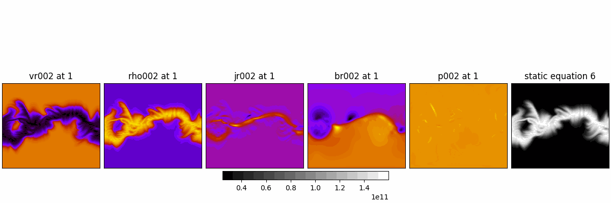

Equation 6:

$$
\rho\left(\frac{\partial{v_r}}{\partial t}+{v} \cdot \nabla {v}\right)=\frac{1}{c} {J} \times {B}-\nabla P+\rho {g}+\nabla \cdot(\nu \rho \nabla {v})
$$


In static state:

$$
\rho\left(-\Omega_{\text{rot}}\frac{\partial{v_r}}{\partial \phi}+{v} \cdot \nabla {v}\right)=\frac{1}{c} {J} \times {B}-\nabla P+\rho {g}+\nabla \cdot(\nu \rho \nabla {v})
$$


Could not find $$\nu$$. But it would not make that much of a difference. Set it to $$\nu=1$$. Also $$c=2.998\times10^5$$.


CR1833

Error is $$|RHS - LHS|$$.

```py
Term magnitude means:
rho * -omega * dv_r_dphi: 0.018307880733456013
rho * vr * dv_r_dr: 30796.770706165393
jr / c * br: 1.9414475009905293e-22
-d_p_dr: 4.14632516057427e-11
rho * g: 2610126899.9328117
viscosity term: 5.711462653596647
Residual: 2610106787.747816
```

Scale the error globally:



Scale the error by shell:



