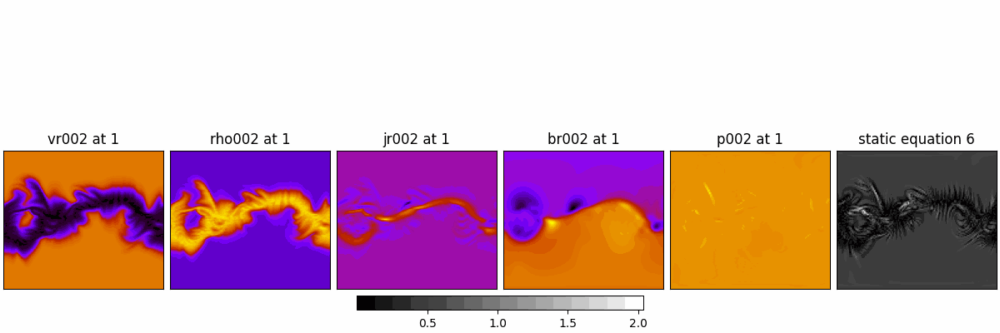

Equation 6:

$$
\rho\left(\frac{\partial{v_r}}{\partial t}+{v} \cdot \nabla {v}\right)=\frac{1}{c} {J} \times {B}-\nabla P+\rho {g}+\nabla \cdot(\nu \rho \nabla {v})
$$


In static state:

$$
\rho\left(-\Omega_{\text{rot}}\frac{\partial{v_r}}{\partial \phi}+{v} \cdot \nabla {v}\right)=\frac{1}{c} {J} \times {B}-\nabla P+\rho {g}+\nabla \cdot(\nu \rho \nabla {v})
$$


MAS output units:

```py
# A mapping from unit names to their units, and factors the data needs to be
# multiplied to get them into these units.

vr: [Unit("km / s"), 481.37107] 
rho: [Unit("1 / cm3"), 100000000.0] 
P: [Unit("Pa"), 0.03875717] 
jr: [Unit("A / m2"), 2.5232592e-07] 
br [Unit("G"), 2.2068914] 
r: solRad
```

Converted units and constants:


$$
\rho = n \cdot m_p = 1.0\times10^8 \cdot 1.6726219\times10^{-27}\ \mathrm{kg/cm^3}
$$


$$
\nu = 0.005\ \mathrm{m^2/s} 
\quad (\text{convert to km²/s: } 5\times10^{-9}\ \mathrm{km^2/s})
$$

$$
r = r_{\rm raw} \cdot R_\odot = r_{\rm raw} \cdot 696{,}000\ \mathrm{km} 
\quad (\text{radial coordinate in km})
$$

$$
\Omega_{\rm rot} = 2.67\times10^{-6}\ \mathrm{s^{-1}}
$$

$$
G = 6.6743\times10^{-20}\ \mathrm{km^3 \cdot kg^{-1} \cdot s^{-2}}
$$

$$
M_\odot = 1.989\times10^{30}\ \mathrm{kg}
$$

$$
c = 2.998\times10^5\ \mathrm{km/s}
$$


CR1833

Error is |RHS - LHS|.

```py
Term magnitude means:
rho * -omega * dv_r_dphi: 0.0197903
rho * vr * dv_r_dr: 0.0442482
jr / c * br: 1.9414e-22
-d_p_dr: 5.9573e-17
rho * g: 0.0053881
viscosity term: 5.8952e-14
Residual: 0.027651
```

Scale the error globally:


Scale the error by shell:



