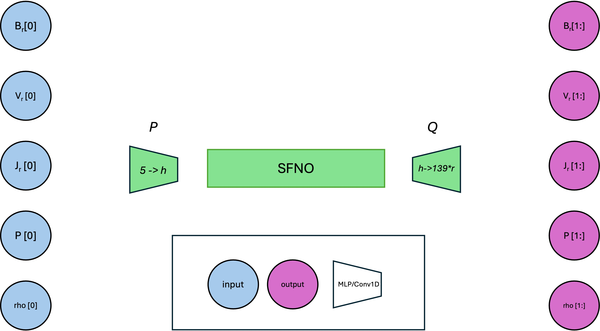
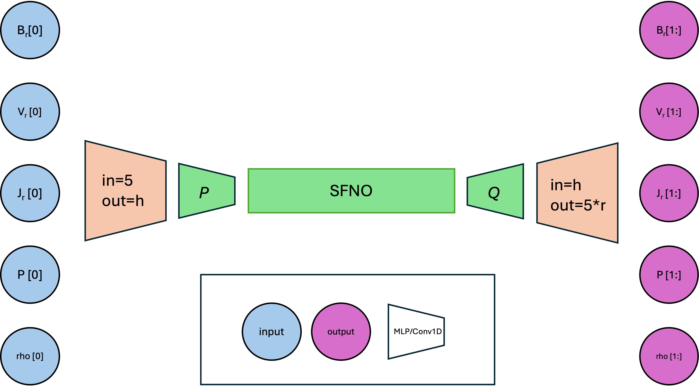
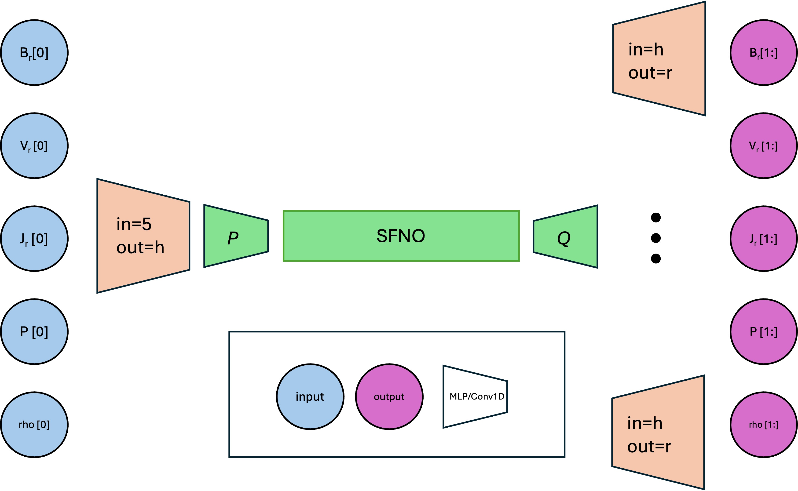
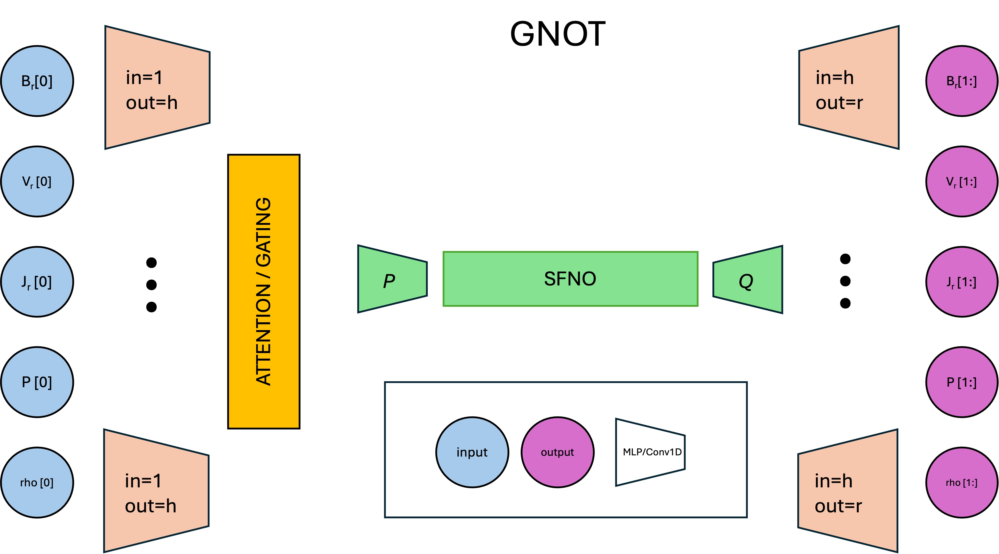
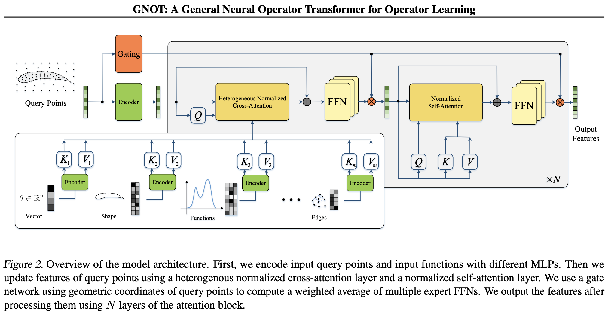
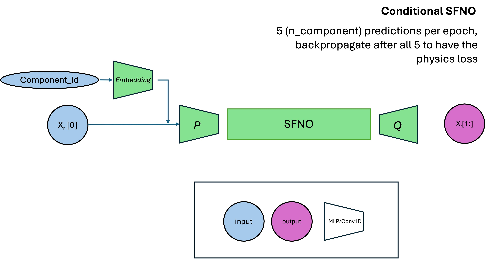

### 1. Simple brute force approach

We've done it before, not that appeasing (<a href="https://rezmansouri.github.io/sun-sim/week_16.html" target="_blank">Week 16</a>).

### 2. Additional encoder and decoder

### 3. Additional encoder and decoder(S)

### 4. Additional encoder(S) and decoder(S)

### 5. Additional encoder(S) and decoder(S) with attention/gating

<a href="https://arxiv.org/abs/2302.14376" target="_blank">GNOT: A General Neural Operator Transformer for Operator Learning</a>

### 6. Conditional SFNO

## Next step

Implement 4 with early results (full radii model - standard loss etc).