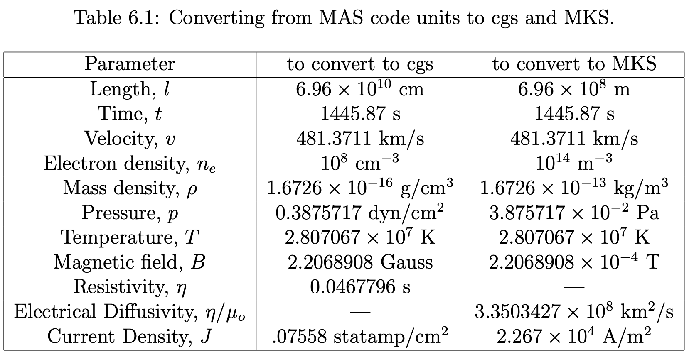

Equation 6 in static state:

$$
\rho\left(-\Omega_{\text{rot}}\frac{\partial{v_r}}{\partial \phi}+{v} \cdot \nabla {v}\right)=\frac{1}{c} {J} \times {B}-\nabla P+\rho {g}+\nabla \cdot(\nu \rho \nabla {v})
$$



## cgs system

$$
r = r \times 6.96 \times 10^{10}\ \text{cm}
$$

$$
v_r = v_r \times 481.3711 \times 10^{5}\ \text{cm/s}
$$

$$
\rho = \rho \times 1.6726 \times 10^{-16}\ \text{g/cm}^3
$$

$$
p = p \times 0.3875717\ \text{dyn/cm}^2
$$

$$
j_r = j_r \times 0.07558\ \text{statamp/cm}^2
$$

$$
B_r = B_r \times 2.2068908\ \text{G}
$$

$$
G = 6.67430 \times 10^{-8}\ \text{cm}^3\,\text{g}^{-1}\,\text{s}^{-2}
$$

$$
M_{\odot} = 1.9885 \times 10^{33}\ \text{g}
$$

$$
\Omega_{\text{rot}} = 2.84 \times 10^{-6}\ \text{rad/s}
$$

$$
c = 2.99792458 \times 10^{10}\ \text{cm/s}
$$

$$
\nu = 50\ \text{cm}^2/\text{s}
$$


CR1833

Error is \|RHS - LHS\|.

```py
Term magnitude means:
rho * -omega * dv_r_dphi: 3.520883078890735e-21
rho * vr * dv_r_dr: 7.400962234736368e-21
jr / c * br: 5.815425597694765e-22
-d_p_dr: 5.957363762174241e-21
rho * g: 9.010026400505447e-22
viscosity term: 9.860328495851813e-39
------------------------------------------------
Residual: 1.9419274516347666e-21
```

Scale the error globally:


Scale the error by shell:


## mks system

### Possible mistake in MAS guide?


$$
1~\text{statA} = 3.33564\times10^{-10}~\text{A},
\qquad
1~\text{cm}^2 = 10^{-4}~\text{m}^2,
$$


$$
1~\text{statA}/\text{cm}^2
= 3.33564\times10^{-6}~\text{A}/\text{m}^2.
$$

$$
j_r^{(\text{cgs})} = j_r^{(\text{code})} \times 0.07558~(\text{statA}/\text{cm}^2),
$$

the corresponding MKS multiplier should be  

$$
j_r^{(\text{MKS})}
= j_r^{(\text{code})} \times
\big(0.07558 \times 3.33564\times10^{-6}\big)
\simeq j_r^{(\text{code})} \times 2.52\times10^{-7}~(\text{A}/\text{m}^2).
$$

<hr/>

$$
r = r \times 6.96 \times 10^{8}\ \text{m}
$$

$$
v_r = v_r \times 481.3711 \times 10^{3}\ \text{m/s}
$$

$$
\rho = \rho \times 1.6726 \times 10^{-13}\ \text{kg/m}^3
$$

$$
p = p \times 0.03875717\ \text{Pa}
$$

$$
j_r = j_r \times 2.52 \times 10^{-7}\ \text{A/m}^2
$$

$$
B_r = B_r \times 2.2068908 \times 10^{-4}\ \text{T}
$$

$$
G = 6.67430 \times 10^{-11}\ \text{m}^3\,\text{kg}^{-1}\,\text{s}^{-2}
$$

$$
M_{\odot} = 1.9885 \times 10^{30}\ \text{kg}
$$

$$
\Omega_{\text{rot}} = 2.84 \times 10^{-6}\ \text{rad/s}
$$

$$
c = 2.99792458 \times 10^{8}\ \text{m/s}
$$

$$
\nu = 5.0 \times 10^{-3}\ \text{m}^2/\text{s}
$$


CR1833

Error is \|RHS - LHS\|.

```py
Term magnitude means:
rho * -omega * dv_r_dphi: 3.520882957278221e-20
rho * vr * dv_r_dr: 7.400960662934856e-20
jr / c * br: 1.9389881590620281e-29
-d_p_dr: 5.957362802713479e-20
rho * g: 9.010026337537412e-21
viscosity term: 9.860310817019834e-38
------------------------------------------------
Residual: 1.8871003181009213e-20
```

Scale the error globally:


Scale the error by shell:


## Questions

### 1

Equation 1:

$$
\nabla \times B = \frac{4\pi}{c}J
$$

Can I only use Br here? Curl of Br would be:

$$
(\nabla \times \mathbf{B})_r = \frac{1}{r \sin\theta}
\left[
\frac{\partial}{\partial \theta}(B_\phi \sin\theta)
- \frac{\partial B_\theta}{\partial \phi}
\right]
$$

$$
(\nabla \times \mathbf{B})_\theta = \frac{1}{r}
\left[
\frac{1}{\sin\theta} \frac{\partial B_r}{\partial \phi}
- \frac{\partial}{\partial r}(r B_\phi)
\right]
$$

$$
(\nabla \times \mathbf{B})_\phi = \frac{1}{r}
\left[
\frac{\partial}{\partial r}(r B_\theta)
- \frac{\partial B_r}{\partial \theta}
\right]
$$

---

If $$ B_\theta = B_\phi = 0 $$, then:

$$
(\nabla \times \mathbf{B})_r = 0
$$

$$
(\nabla \times \mathbf{B})_\theta = \frac{1}{r \sin\theta} 
\frac{\partial B_r}{\partial \phi}
$$

$$
(\nabla \times \mathbf{B})_\phi = -\frac{1}{r} 
\frac{\partial B_r}{\partial \theta}
$$

### 2

Where is E (electric field) in the simulations?
