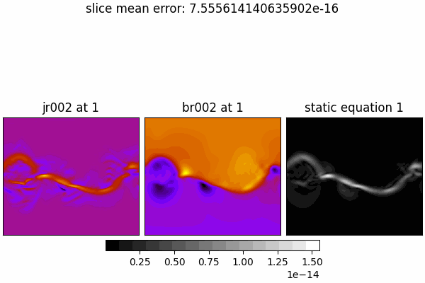
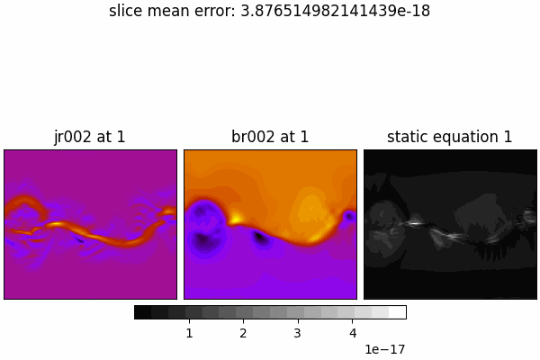
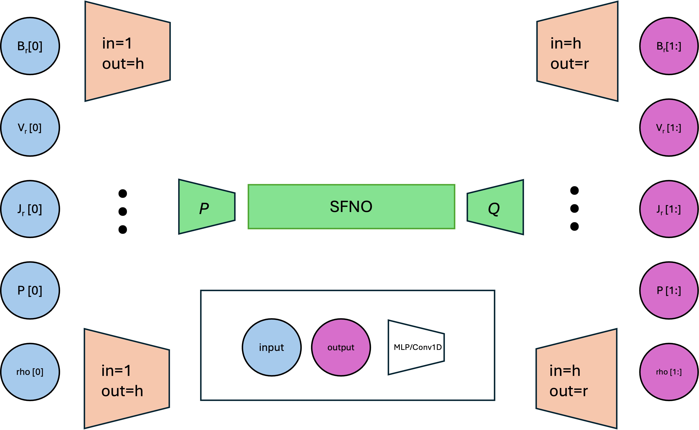
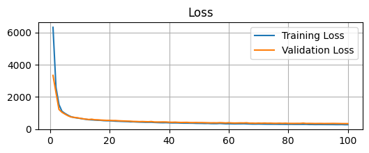
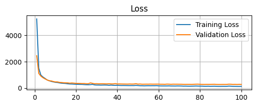

## Equation 1 in static state (radial only):

$$
\nabla \times B = \frac{4\pi}{c}J
$$

$$
B_\phi = 0
$$

$$
B_\theta = 0
$$


$$
(\nabla \times \mathbf{B})_r = \frac{1}{r \sin\theta}
\left[
\frac{\partial}{\partial \theta}(B_\phi \sin\theta)
- \frac{\partial B_\theta}{\partial \phi}
\right]=0
$$

$$
(\nabla \times \mathbf{B})_\theta = \frac{1}{r}
\left[
\frac{1}{\sin\theta} \frac{\partial B_r}{\partial \phi}
- \frac{\partial}{\partial r}(r B_\phi)
\right] = \frac{1}{r \sin\theta} 
\frac{\partial B_r}{\partial \phi}
$$

$$
(\nabla \times \mathbf{B})_\phi = \frac{1}{r}
\left[
\frac{\partial}{\partial r}(r B_\theta)
- \frac{\partial B_r}{\partial \theta}
\right] = -\frac{1}{r} 
\frac{\partial B_r}{\partial \theta}
$$


Error is

$$
\sqrt{\text{residual}_r^2 + \text{residual}_{\theta}^2 + \text{residual}_{\phi}^2}
$$

Which doesn't make sense? each term will be non zero...
We'll need $$B_r, B_{\theta}, B_{\phi}, J_r, J_{\theta}, J_{\phi}$$.

## cgs system

CR1833


```py
Mean |lhs_r|: 0.000e+00
Mean |lhs_theta|: 2.155e-17
Mean |lhs_phi|: 3.955e-17
Mean |rhs_r|: 1.984e-17
Mean |rhs_theta|: 0.000e+00
Mean |rhs_phi|: 0.000e+00
Mean |residual_r|: 1.984e-17
Mean |residual_theta|: 2.155e-17
Mean |residual_phi|: 3.955e-17
Mean |residual|: 5.534e-17
```

Scale the error globally:


Scale the error by shell:




## mks system

$$
\nabla \times B = \mu_0J
$$

$$
\mu_0: \text{permeability of free space (vacuum)} = 4 \pi \times 10^{-7} \text{Henry/m or T.m/A}
$$

CR1833

$$
\sqrt{\text{residual}_r^2 + \text{residual}_{\theta}^2 + \text{residual}_{\phi}^2}
$$

```py
Mean |lhs_r|: 0.000e+00
Mean |lhs_theta|: 2.155e-19
Mean |lhs_phi|: 3.955e-19
Mean |rhs_r|: 1.984e-19
Mean |rhs_theta|: 0.000e+00
Mean |rhs_phi|: 0.000e+00
Mean |residual_r|: 1.984e-19
Mean |residual_theta|: 2.155e-19
Mean |residual_phi|: 3.955e-19
Mean |residual|: 5.534e-19
```

Scale the error globally:


Scale the error by shell:


## Equation 1 in static state (r, theta and phi):

$$
\nabla \times B = \frac{4\pi}{c}J
$$


$$
(\nabla \times \mathbf{B})_r = \frac{1}{r \sin\theta}
\left[
\frac{\partial}{\partial \theta}(B_\phi \sin\theta)
- \frac{\partial B_\theta}{\partial \phi}
\right]
$$

$$
(\nabla \times \mathbf{B})_\theta = \frac{1}{r}
\left[
\frac{1}{\sin\theta} \frac{\partial B_r}{\partial \phi}
- \frac{\partial}{\partial r}(r B_\phi)
\right]
$$

$$
(\nabla \times \mathbf{B})_\phi = \frac{1}{r}
\left[
\frac{\partial}{\partial r}(r B_\theta)
- \frac{\partial B_r}{\partial \theta}
\right]
$$


Error is

$$
\sqrt{\text{residual}_r^2 + \text{residual}_{\theta}^2 + \text{residual}_{\phi}^2}
$$

## cgs system

CR1833


```py
Mean |curl_r|: 1.621e-17
Mean |curl_theta|: 2.660e-17
Mean |curl_phi|: 3.975e-17
Mean |rhs_r|: 1.984e-17
Mean |rhs_theta|: 2.893e-17
Mean |rhs_phi|: 4.113e-17
Mean |residual_r|: 4.694e-18
Mean |residual_theta|: 9.013e-18
Mean |residual_phi|: 4.930e-18
Mean |residual|: 1.403e-17
```

Scale the error globally:


Scale the error by shell:


## mks system

$$
\nabla \times B = \mu_0J
$$

$$
\mu_0: \text{permeability of free space (vacuum)} = 4 \pi \times 10^{-7} \text{Henry/m or T.m/A}
$$

CR1833

$$
\sqrt{\text{residual}_r^2 + \text{residual}_{\theta}^2 + \text{residual}_{\phi}^2}
$$

```py
Mean |curl_r|: 1.621e-19
Mean |curl_theta|: 2.660e-19
Mean |curl_phi|: 3.975e-19
Mean |rhs_r|: 1.984e-19
Mean |rhs_theta|: 2.891e-19
Mean |rhs_phi|: 4.111e-19
Mean |residual_r|: 4.688e-20
Mean |residual_theta|: 9.011e-20
Mean |residual_phi|: 4.923e-20
Mean |residual|: 1.402e-19
```

Scale the error globally:



Scale the error by shell:


## Multimodal architecture check



### Exp 50

$$V_r$$ and $$J_r$$

All the data we had is used for train/test 80/20.

No autoregression, all shells at once.

```py
{
  "num_epochs": 100,
  "batch_size": 32,
  "hidden_channels": 64,
  "encoder_hidden_channels": 64,
  "n_layers": 4,
  "loss_fn": "l2"
}
```



#### CR2240


#### CR2284


### Exp 51

$$V_r$$ and $$J_r$$

All the data we had is used for train/test 80/20.

No autoregression, all shells at once.

Final SFNO trunk architecture we used for the ICMLA paper.


```py
{
  "num_epochs": 100,
  "batch_size": 32,
  "hidden_channels": 256,
  "encoder_hidden_channels": 64,
  "n_layers": 8,
  "loss_fn": "l2"
}
```



#### CR2240


#### CR2284


## Equation 6 in static state:

$$
\rho\left(-\Omega_{\text{rot}}\frac{\partial{v_r}}{\partial \phi}+{v} \cdot \nabla {v}\right)=\frac{1}{c} {J} \times {B}-\nabla P+\rho {g}+\nabla \cdot(\nu \rho \nabla {v})
$$

## cgs system

$$
r = r \times 6.96 \times 10^{10}\ \text{cm}
$$

$$
v_r = v_r \times 481.3711 \times 10^{5}\ \text{cm/s}
$$

$$
\rho = \rho \times 1.6726 \times 10^{-16}\ \text{g/cm}^3
$$

$$
p = p \times 0.3875717\ \text{dyn/cm}^2
$$

$$
j_r = j_r \times 0.07558\ \text{statamp/cm}^2
$$

$$
B_r = B_r \times 2.2068908\ \text{G}
$$

$$
G = 6.67430 \times 10^{-8}\ \text{cm}^3\,\text{g}^{-1}\,\text{s}^{-2}
$$

$$
M_{\odot} = 1.9885 \times 10^{33}\ \text{g}
$$

$$
\Omega_{\text{rot}} = 2.84 \times 10^{-6}\ \text{rad/s}
$$

$$
c = 2.99792458 \times 10^{10}\ \text{cm/s}
$$

Update:

$$
\nu = 0.005 \times 3.350342628857710 \times {10}^{18}\ \text{cm}^2/\text{s}
$$


CR1833

Error is \|RHS - LHS\|.

```py
Term magnitude means:
rho * -omega * dv_r_dphi: 3.520883078890735e-21
rho * vr * dv_r_dr: 7.400962234736368e-21
jr / c * br: 5.815425597694765e-22
-d_p_dr: 5.957363762174241e-21
rho * g: 9.010026400505447e-22
viscosity term: 3.303547889419275e-24
--------------------------------------
Residual: 1.9401104698520294e-21
```

Scale the error globally:


Scale the error by shell:


## mks system


$$
r = r \times 6.96 \times 10^{8}\ \text{m}
$$

$$
v_r = v_r \times 481.3711 \times 10^{3}\ \text{m/s}
$$

$$
\rho = \rho \times 1.6726 \times 10^{-13}\ \text{kg/m}^3
$$

$$
p = p \times 0.03875717\ \text{Pa}
$$

Verified:

$$
j_r = j_r \times 2.52 \times 10^{-7}\ \text{A/m}^2
$$

$$
B_r = B_r \times 2.2068908 \times 10^{-4}\ \text{T}
$$

$$
G = 6.67430 \times 10^{-11}\ \text{m}^3\,\text{kg}^{-1}\,\text{s}^{-2}
$$

$$
M_{\odot} = 1.9885 \times 10^{30}\ \text{kg}
$$

$$
\Omega_{\text{rot}} = 2.84 \times 10^{-6}\ \text{rad/s}
$$

$$
c = 2.99792458 \times 10^{8}\ \text{m/s}
$$

Update:

$$
\nu = 0.005 \times  10^{-4} \times 3.350342628857710 * {10}^{18}\ \text{m}^2/\text{s}
$$


CR1833

Error is \|RHS - LHS\|.

```py
Term magnitude means:
rho * -omega * dv_r_dphi: 3.520882957278221e-20
rho * vr * dv_r_dr: 7.400960662934856e-20
jr / c * br: 1.9389881590620281e-29
-d_p_dr: 5.957362802713479e-20
rho * g: 9.010026337537412e-21
viscosity term: 3.3035419664048343e-23
----------------------------------
Residual: 1.885238496300597e-20
```

Scale the error globally:


Scale the error by shell:

