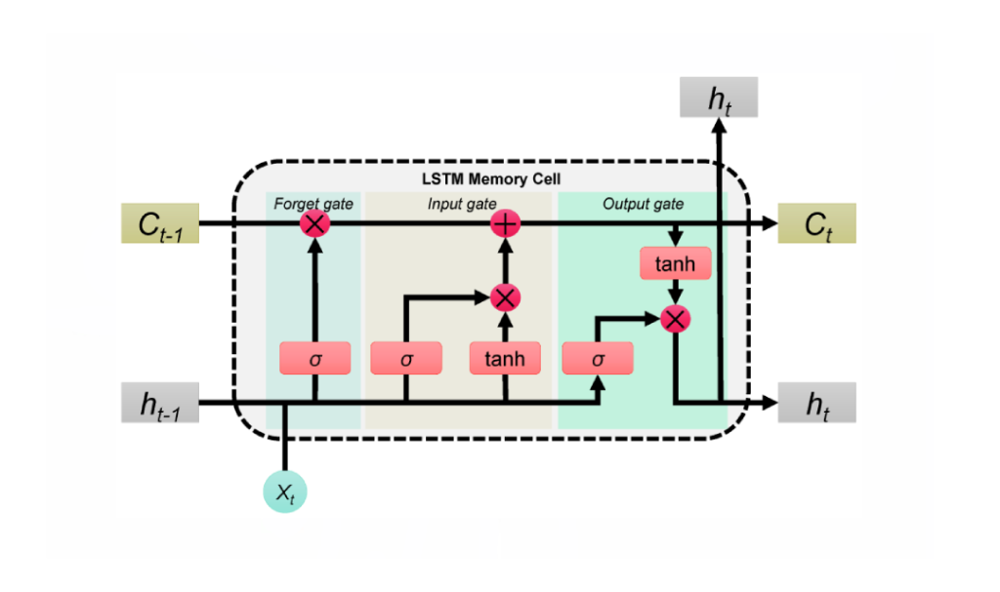
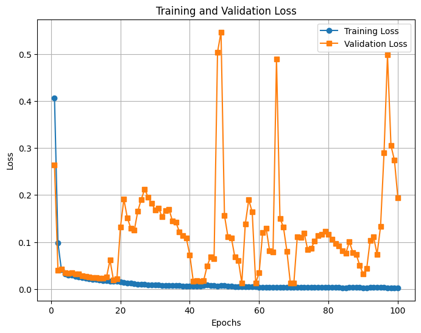

# Toy-script
## Questions
1. Dataset dimensions:
    - `vr002` files are cubes of shape `(128, 111, 140)` i.e., `(I, J, K)`
    - What are I, J, and K?
2. What is the desired mapping to be found?

## Doubts
1. Is there a temporal dimension? if not, why RNNs (i.e., LSTM)?
2. RNNs treat the first dimension as the batch (# of inputs processed simultaneously).

    Current implementation for testing:
    ```
    current_slice = test_cube_X[0][np.newaxis, :, :]  # Extract the first slice (k=0) as (1, I, J)
    ```
    The model will see this as a batch of time series with a size of 1. Whereas, I think it should be sliced on the `I` dimension.
    ```
    predicted_cube = []
    for i in range(1, k_predict + 1):
        prediction = model.predict(current_slice, batch_size=1)
        predicted_cube.append(prediction.squeeze(axis=0))
        current_slice = prediction  # Use the predicted output as the next input
    predicted_cube = np.array(predicted_cube)
    ```
    This is going to only use the first instance in the validation set and then feed the prediction to itself for K x n_cubes times.

3. Hidden_state and cell_states are not passed to the model during testing.
    
    Correct implementation:
    ```
    h = torch.zeros(num_layers, val_batch_size, hidden_size)
    c = torch.zeros(num_layers, val_batch_size, hidden_size)
    for t in range(dim_i):
        with torch.no_grad():
            yhat_t, (h, c) = model(x, h, c)
            x = yhat_t
    ```
    
4. Is normalizing each cube separately and the stacking them a good idea? Aren't the cubes from different CRs?


## Current results using my code

### Loss curves:


### Validation comparison:
<video controls width="600">
  <source src="resources/week_4/plt.mp4" type="video/mp4">
  Your browser does not support the video tag.
</video>

## Future plans
- *PgNN track*:
    1. Debug my code
    2. Train on more solar wind data
    3. Try other RNNs, (SimpleRNN, GRU)
- *PINN track*:
    1. Investigate how a PINN can be trained on this data