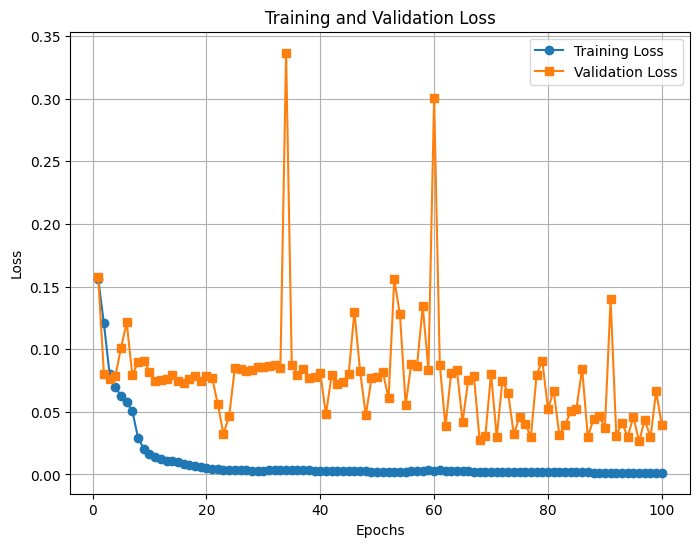

## Experiment configurations

### Model

- Convolutional LSTM
    - `n_layers=1`
    - `hidden_dim=64`
    - `filter_size=3`
- Teacher forcing for training
- No teacher forcing during validation

### Data

- 6 cubes for training, 1 for validation
- Each `x` has a shape of `(sequence_length, n_channels, width, height)` i.e., `(K=140, 1, I=128, J=111)` leading to `(n_cubes, sequence_length, n_channels, width, height)` for the whole `X`
- Min-max normalized the training set for each `K`
- Resized each slice with bicubic interpolation to `(128, 128)` squares -> `(K=140, 1, I=128, J=128)`
- Min-max normalized the validation set using min and max from training set

### Training

- 100 epochs
- Adam optimizer
- `batch_size` of 2
- MSE Loss
- Chose the model with lowest validation loss

### Validation comparison:

<video controls width="600">
  <source src="resources/week_5/pete_sample_1_layer_64_hidden_slice_0.mp4" type="video/mp4">
  Your browser does not support the video tag.
</video>

<video controls width="600">
  <source src="resources/week_5/pete_sample_1_layer_64_hidden_slice_101.mp4" type="video/mp4">
  Your browser does not support the video tag.
</video>

## Next step:

- More data
    - What are `kpo_mas_mas_std_0101, mdi_mas_mas_std_0101, ...`? Which one to use in `/helio/` paths?
    - How can I augment this data? Is it even possible?
    - Generate train/val/test sets and tune the hyperparams on val
- Same experiment for magnetic field `B`?

## Questions:

- In Pete's small sample, 
    - What are the differences between cubes? random different CRs?
    - Was it `kpo_mas_mas_std_0101`, `mdi_mas_mas_std_0101`, or?

- On Predsci website, some explanation for metadata is required.
    - <a href="https://predsci.com/data/runs/cr2240-medium/hmi_masp_mas_std_0201/corona/omas">Example one</a>
    - <a href="https://predsci.com/data/runs/cr2240-medium/hmi_masp_mas_std_0201/helio/vmasip">Example two</a>