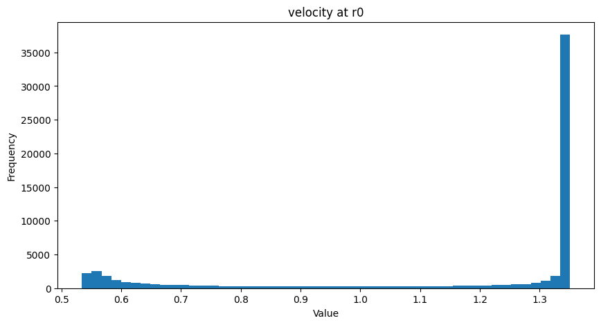
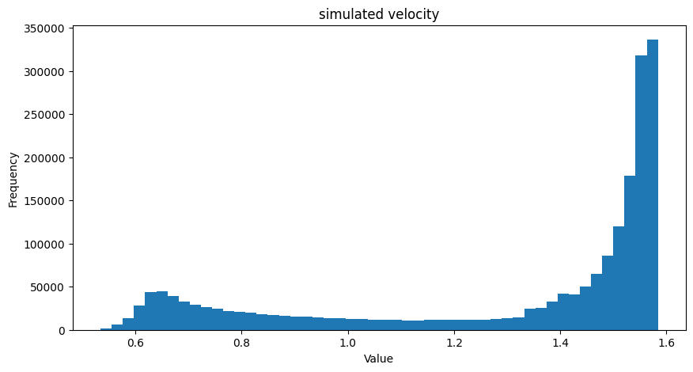
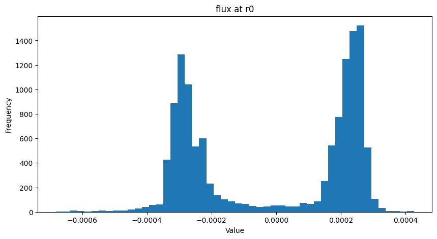
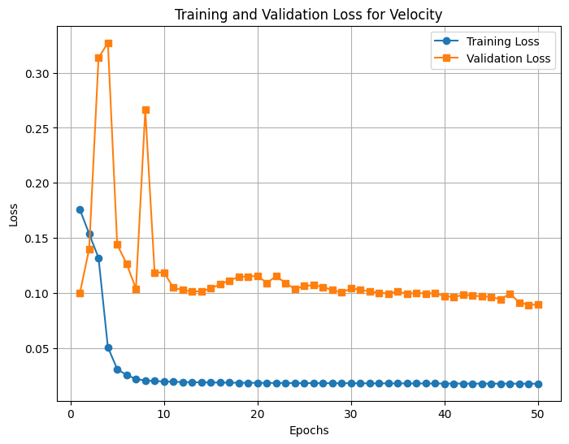
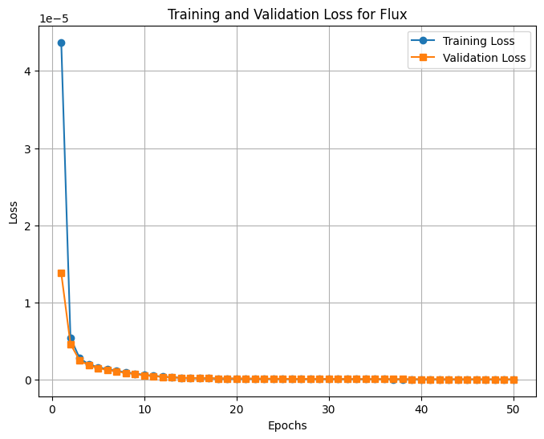

## Last week single legened plots

<video controls width="600">
  <source src="resources/week_6/last_week_pete_sample_1_layer_64_hidden_slice_0.mp4" type="video/mp4">
  Your browser does not support the video tag.
</video>

<video controls width="600">
  <source src="resources/week_6/last_week_pete_sample_1_layer_64_hidden_slice_101.mp4" type="video/mp4">
  Your browser does not support the video tag.
</video>

## Distributions

## Another experiment

- Convolutional LSTM
    - `n_layers=1`
    - `hidden_dim=64`
    - `filter_size=3`
- Teacher forcing for training
- No teacher forcing during validation

### Data

- `predsci/runs/helio/medium`
- 112 cubes for training, 38 for validation
- All available instruments
- Stacked radii 0 as the first slice for each cube
- Min-max normalized the training set globally
- Padded each slice to `(128, 128)` -> `(K=140, 1, I=128, J=128)`
- Min-max normalized the validation set using min and max from training set

### Training

- 50 epochs
- Adam optimizer
- `batch_size` of 8
- MSE Loss
- Chose the model with lowest validation loss

### Validation comparison:

<video controls width="600">
  <source src="resources/week_6/v_psi_web_first_150_cr_1_layer_64_hidden.mp4" type="video/mp4">
  Your browser does not support the video tag.
</video>

### ~~Same experiment for flux (B)~~

<video controls width="600">
  <source src="resources/week_6/b_psi_web_first_150_cr_1_layer_64_hidden.mp4" type="video/mp4">
  Your browser does not support the video tag.
</video>

## Questions

1. Difference between 
    - `hmi_mast_mas_std_`**`0101`** and `hmi_mast_mas_std_`**`0201`**
    - `mdi_mas_mas_std_`**`0101`** and `mdi_mas_mas_std_`**`0201`**

2. With sequential models in use, lets look at the slices in reverse?

## Next step

1. Figure out what is wrong with the *B* experiment.
2. Tweaked U-Net Model for non-sequential prediction
3. Stacked V/B experiments
