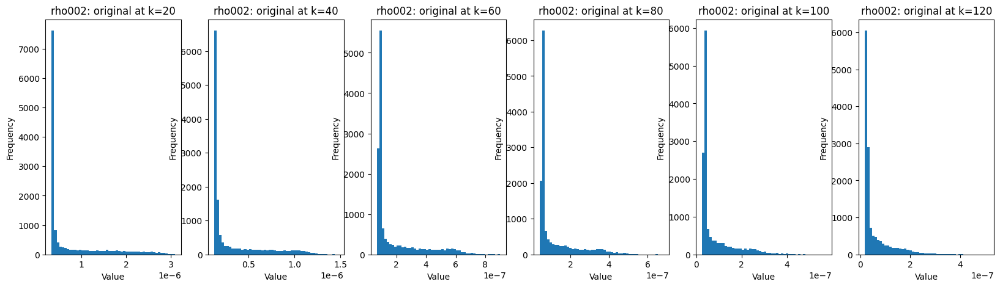
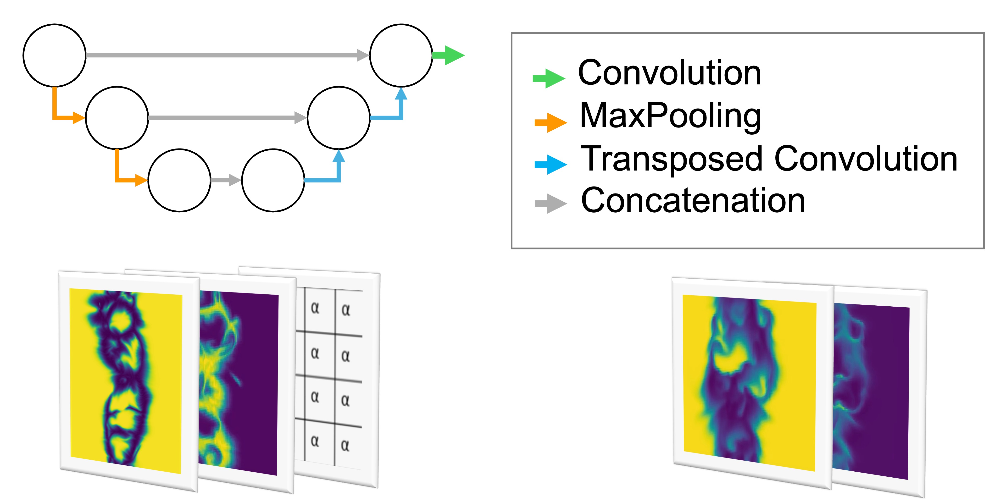
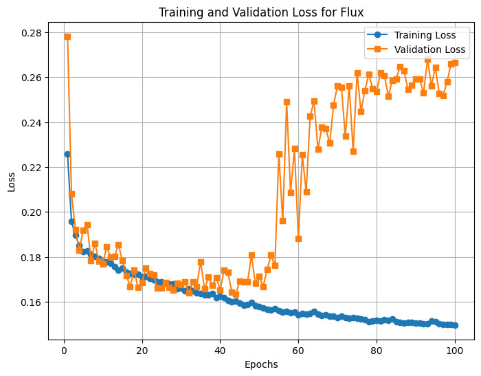
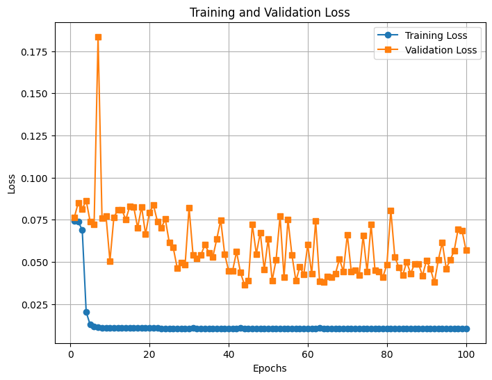
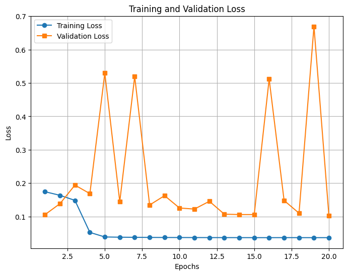
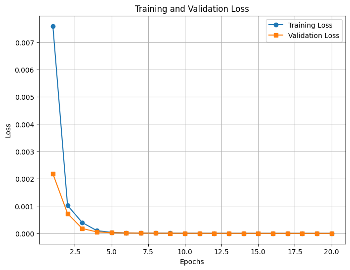
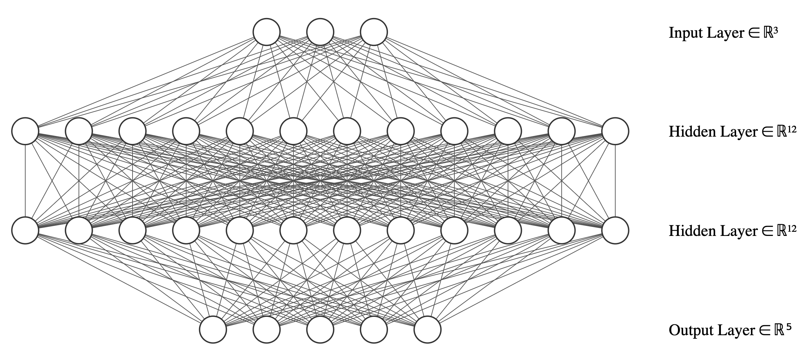
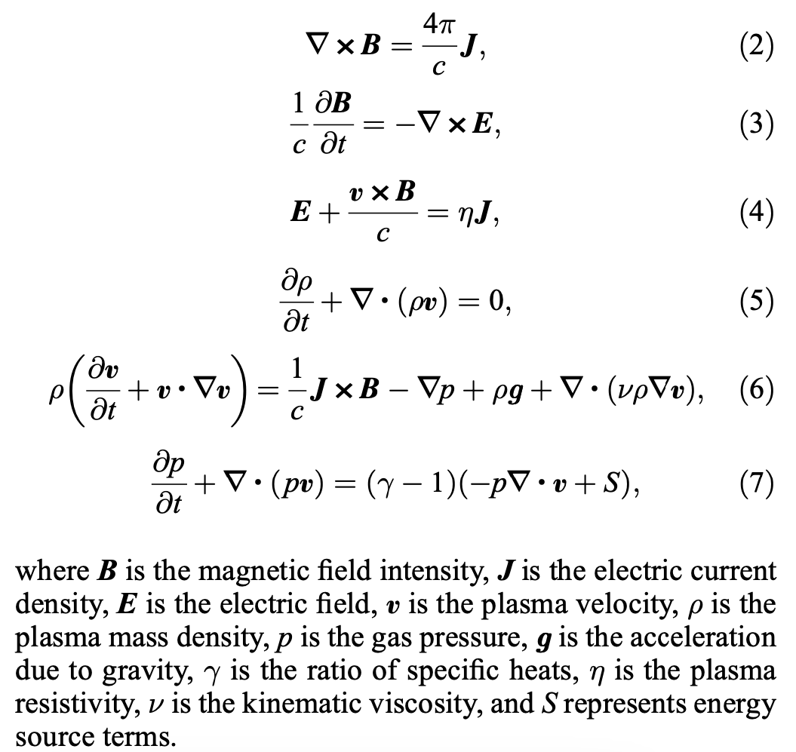
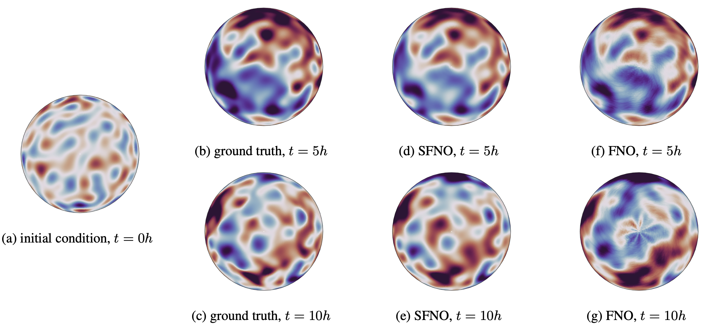

# Four experiments and start of PINNs

## Experiment 1:

- Data:
    - Modality 1: velocity (vr)
    - Modality 2: density (rho)
    - Alpha: k / 140
    - (x, y) pairs
        - ([vr_r0, rho[0], alpha_k], [vr002[k], rho[k]])
        - (3, 128, 128) -> (2, 128, 128)
    - Instrument/simulations: `kpo`
    - 75 crs for training, 25 crs for validation
    - vr: min-max normalized globally
    - rho: min-max normalized globally

- Training:
    - Pruned UNet with [32, 64, 128] channels
    - 100 epochs
    - MSE Loss
    - batch size of 4

- Results:
    - Losses:

    

    - vr validation:

    <video controls width="600">
    <source src="resources/week_7/unet_v.mp4" type="video/mp4">
    Your browser does not support the video tag.
    </video>

    - rho validation:

    <video controls width="600">
    <source src="resources/week_7/unet_rho.mp4" type="video/mp4">
    Your browser does not support the video tag.
    </video>

## Experiment 2:

- Data:
    - Modality 1: velocity (vr)
    - Modality 2: density (rho)
    - Cubes of 2 channels
    - Instrument/simulations: all
    - vr: min-max normalized globally
    - rho: min-max normalized globally
    - 475 crs for training 240 for validation

- Training:
    - ConvLSTM with 1 layers and 128 hidden_dim (more complex than previous model)
    - 100 epochs
    - MSE Loss
    - batch size of 4

- Results:
    - Losses:

    

    - vr validation:

    <video controls width="600">
    <source src="resources/week_7/v_in_v_rho_convlstm.mp4" type="video/mp4">
    Your browser does not support the video tag.
    </video>

    - rho validation:

    <video controls width="600">
    <source src="resources/week_7/rho_in_v_rho_convlstm.mp4" type="video/mp4">
    Your browser does not support the video tag.
    </video>

## Experiment 3:

- Data:
    - Velocity (vr)
    - Instrument/simulations: all
    - vr: min-max normalized globally
    - 112 crs for training 38 for validation

- Training:
    - ConvLSTM with 1 layers and 128 hidden_dim (more complex than previous model)
    - 20 epochs
    - MSE Loss
    - batch size of 4
    - Losses:

    

    - Validation:

    <video controls width="600">
    <source src="resources/week_7/v_convlstm.mp4" type="video/mp4">
    Your browser does not support the video tag.
    </video>

## Experiment 4:

- Data:
    - Density (rho)
    - Instrument/simulations: all
    - rho: min-max normalized globally
    - 112 crs for training 38 for validation

- Training:
    - ConvLSTM with 1 layers and 128 hidden_dim (more complex than previous model)
    - 20 epochs
    - MSE Loss
    - batch size of 4
    - Losses:

    

    - rho validation:

    <video controls width="600">
    <source src="resources/week_7/rho_convlstm.mp4" type="video/mp4">
    Your browser does not support the video tag.
    </video>

## PINNs next?

- So far, everything has been PgNN. These were my PINN practice projects:

    - <a href="https://rezmansouri.github.io/sun-sim/week_1.html" target="_blank">Heat equation experiment</a>

    - <a href="https://rezmansouri.github.io/sun-sim/week_3.html" target="_blank">Navier-Stokes equation experiment</a>

- Using PINNs, what will be my additional loss terms (rules to enforce)?

## Spherical projection paper

<a href="https://arxiv.org/pdf/2306.03838" target="_blank">Spherical Fourier Neural Operators: Learning Stable Dynamics on the Sphere</a>

- FNOs depend on DFT
    - Assume a flat geometry
    - Cause visual and spectral artifacts as well as pronounced dissipa- tion when learning operators in spherical coordinates

- Sphericial FNO is proposed

