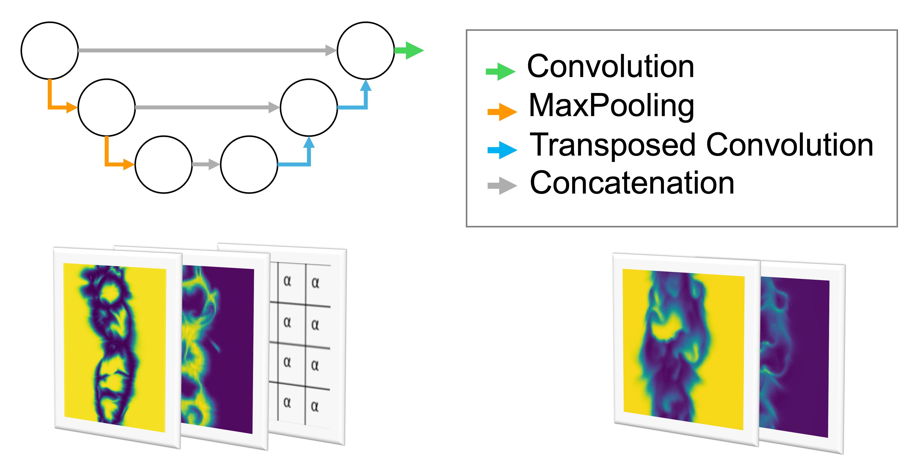
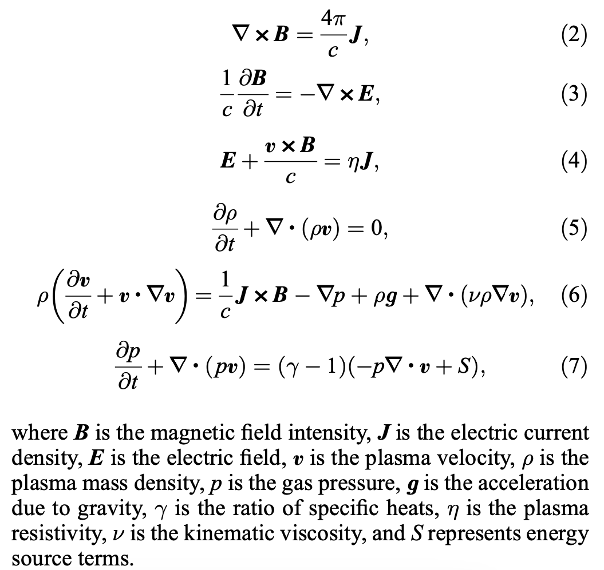

# New approach and Questions

## Previous approaches

- ### ConvLSTM

    <video controls width="600">
    <source src="resources/week_6/v_psi_web_first_150_cr_1_layer_64_hidden.mp4" type="video/mp4">
    Your browser does not support the video tag.
    </video>
    
    - Pros
        - Best performing among others
    - Cons
        - 3D Spatial data treated as 2D Spatiotemporal
        - Compound error

- ### 2D-2D UNet with indicator variable

    

    - Pros
        - Data is treated the right way
    - Cons
        - Worst performance
        - Intuition behind indicator variable (?)

    <video controls width="600">
    <source src="resources/week_7/unet_v.mp4" type="video/mp4">
    Your browser does not support the video tag.
    </video>
    

## New approach

- Model:
    - A 3D encoder
        - Conv3D layers
        - Adaptive average pooling for fixed output size
        - A dense layer in the end with a latent_dim

    - A 2D decoder
        - A dense layer to project the input back to the spatial dimensions
        - ConvTranspose2D layers to upscale the features

- Training/testing strategy:
    - Training:
        1. Feed the bc (i.e., slice 0) with shape (batch_size, channels, depth, height, width) to the encoder.
        2. Decoder will predict slice `d+1`
        3. Append it to the predicted slices
        4. Feed the `cube[:d]` to the encoder
        5. Go to b
        6. Calculate the loss between predicted slices and `cube[1:]` and backpropagate
    - Testing:
        1. Feed the bc (i.e., slice 0) with shape (batch_size, channels, depth, height, width) to the encoder.
        2. Decoder will predict slice `d+1`
        3. Append it to the predicted slices
        4. Feed the `[bc, **predictions]` to the encoder
        5. Go to b
    
    

- Experiment:
    - Data: 
        - velocity files (`vr_r0`, `vr002`)
        - 75 `kpo` crs for training, 25 for testing
        - Globally min-max normalized
        - Batch size of 1 (stochastic)
    - Model:
        - Encoder:
            - Conv3D channels: 1 -> 4 -> 8 -> 16 (3 levels)
            - ReLU in between
            - Latent dim: 512
        - Decoder:
            - Latent dim: 512
            - ConvTranspose2D: 16 -> 8 -> 4 -> 1 (3 levels)
            - ReLU in between
    - 20 epochs, Adam optimizer
    - Results:
    
    

    <video controls width="600">
    <source src="resources/week_8/v.mp4" type="video/mp4">
    Your browser does not support the video tag.
    </video>

## Questions

Current PFSS solutions with 100^3 resolution:
- What are br, bp, bt files?
- Are the dimensions `(p, t, r)`?
    - bp: `(100, 101, 101)`
    - br: `(101, 101, 100)`
    - bt: `(101, 100, 101)`
- Equations to be obeyed?
