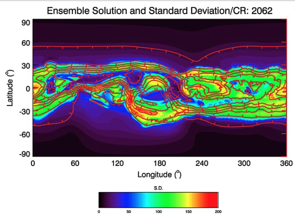
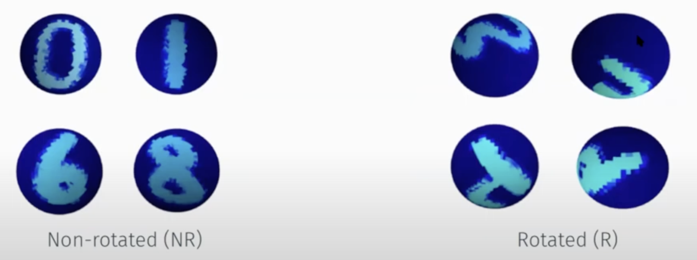
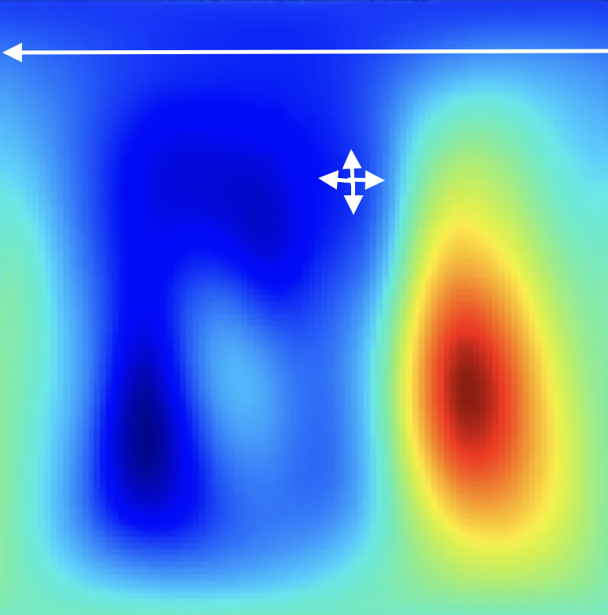
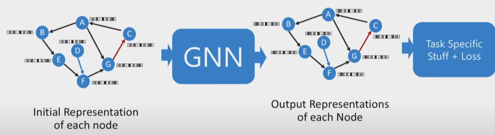
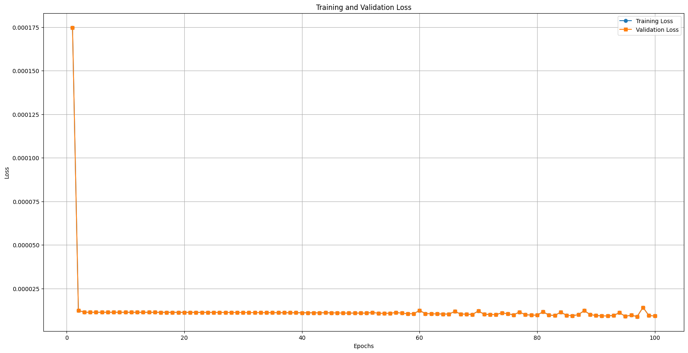

# Correct data representation & Spherical CNNs/GNNs

## Data
### Sphere?
<video controls width="600">
<source src="resources/week_9/spherical_data.mp4" type="video/mp4">
Your browser does not support the video tag.
</video>

### Cylinder?
<video controls width="600">
<source src="resources/week_9/cylindrical_data.mp4" type="video/mp4">
Your browser does not support the video tag.
</video>

## Appopriate approaches
### Spherical CNNs
- Encode spherical symmetries
- Focus on rotation equivariance (is it okay for us?)

### Graph Neural Networks
- Graph representation of slices (k * graphs)

## An experiment
- GraphConv encoder decoder
- slice[i]->128->256->512->256->128->slice[i+1]
- batch_size=1 (stochastic)
- Invariant to radial distance br = br * distance^2
- Min-max normalized

<video controls width="600">
<source src="resources/week_9/br_gnn.mp4" type="video/mp4">
Your browser does not support the video tag.
</video>

## Refs

### Libraries

- <a href="https://github.com/pyg-team/pytorch_geometric">pytorch-geometric</a>
- <a href="https://github.com/google-research/spherical-cnn">spherical-cnns by Google</a>
- <a href="https://www.dgl.ai">Deep Graph</a>
    - Transform the data into a graph
        - Each datapoint is a node
        - Edges are distances between them

### Resources

- <a href="https://www.youtube.com/watch?v=wGqz_qbwxZY">Astro Informatics @ UCL: Geometric Deep learning on the Sphere: Spherical CNNs and Scattering Networks</a>
    - Symmetry is key in physics
        - Rules of physics dont change under spatial/rotation/time transformations. Symmetries conserve.
        - Operator A is equivarent to transformation T if: T(A(f))=A(T(f))
        - We try to encode symmetries into DL models that capture fundamental properties. We impose inductive biases in DL models such as equivarience to symmetry transformation which allow models to be learned in a more principled and effective manner.
        - In some sense, equivariance to a transformation means a pattern need only be learnt once and may be recognised in all transformed scenarios.
    - Spherical CNNs
        - We need to encode the symmetries of the sphere and rotations
        - Why didnt planar CNNs on unrolled projected slices work?
            - Distortion: Greenland vs Africa etc.
        - Create a graph representation of the sphere and apply graph CNNs
            - It does break symmetries and geometric properties of sphere
            - Cannot capture rotational equivariance
        - Discretisation of the sphere does not exist. It wont be invariant to rotations.
            - Fourier approach: access to underlying continuous representation
        - Pointwise activation functions are required (rotatioinally e)
        - Cohen et al. S^2 Conv, Esteves et al. SO(3) Conv, Kondor idk, all 2018
        - Efficient generalised spherical CNNs
            - Group theory is the mathematical study of symmetry
            - Cobb et al. 2021
                - Linear, Non-Linear, Linear
                - Linears are spherical convolutions, Non-linears are spherical activation operators
            - Channel-wise structure etc. like mobilenet are available for efficiency
            - Spherical MNIST benchmark dataset
    - Scattering networks
        - rotationally equivariant spherical CNNs are not scalable to high-resolution data
        - hybrid networks
        - new initial layer
            - scalable
            - Spherical wavelet transform

    - My takeaway:
        - Spherical CNNs focus on rotation equivariance (is it the case for us? i dont think so)

### Some SOT papers

- <a href="https://arxiv.org/abs/1801.10130">Spherical CNNs (2018)</a>
- <a href="https://arxiv.org/abs/2012.15000">DeepSphere: a graph-based spherical CNN (2020)</a>
- <a href="https://arxiv.org/abs/2306.05420">Scaling Spherical CNNs (2023) by Google</a>
- <a href="https://arxiv.org/abs/1901.02039">Spherical CNNs on Unstructured Grids (2019)</a>